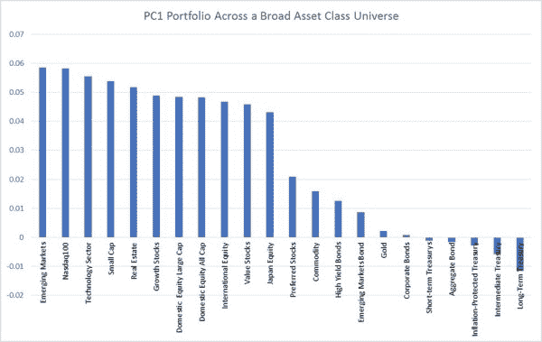

<!--yml

类别：未分类

日期：2024-05-12 17:44:04

-->

# “2D 资产配置”使用 PCA（第一部分）| CSSA

> 来源：[`cssanalytics.wordpress.com/2018/07/23/2d-asset-allocation-using-pca-part-1/#0001-01-01`](https://cssanalytics.wordpress.com/2018/07/23/2d-asset-allocation-using-pca-part-1/#0001-01-01)

资产配置是一个复杂的问题，可以通过无数种不同的方法来解决，这些方法从理论上的均值-方差到启发式的最小相关性，甚至包括“战术策略”。另一个挑战是定义一个合适的资产类别范围，这可能导致即使是经验丰富的从业者也难以理解或欣赏的隐秘偏见。降低维度和假设的数量是最终目标。管理投资组合最简单的方法是回归到 CAPM 世界，其中有一个市场组合，你可以通过杠杆或持有现金来满足你的风险承受要求。但这种方法也需要定义一个“市场组合”，理论上可以定义为可投资资产类别的市值加权混合，但实际上难以定义，并且实时确定也很困难。我们真正想要的是对一系列资产类别中的系统性风险驱动因素有所了解，并识别出一个最能代表这种系统性风险（进攻）的投资组合，以及一个与这种系统性风险负相关（防守）的投资组合。一个简化的方法是使用主成分分析（PCA），通过隔离 PC1 或第一主成分投资组合来确定这一点，该投资组合解释了广泛资产类别中的大部分变异。在大多数情况下，第一主成分将解释资产类别间变异的 60-70%，并代表一个核心的系统性风险因素。如果我们采用一大篮子核心资产类别，我们可以使用 PCA 来识别这个 PC1 投资组合，时间跨度为 1995 年至 2018 年，使用带有指数扩展的 ETF。在这种情况下，我们使用了 Jim Picerno 的优秀新书《Quantitative Investment Portfolio Analytics in R》中提供的 R 代码。

可以看出，这个 PC1 投资组合具有很强的直观合理性：权重最高的是新兴市场、纳斯达克/科技以及小盘股（进攻型）。具有负权重的资产类别与这一核心系统性风险因素呈反向关系，权重最低的依次是长期国债、中期国债、通胀保护国债、综合债券指数和短期国债（防御型）。实际上，“进攻”组合倾向于配置最具攻击性的资产类别，这些资产类别在牛市中可能表现最佳；而“防御”组合则倾向于配置最具防御性的资产类别，这些资产类别在熊市中可能表现最佳。通过一次计算，我们已将资产类别数学上划分为两大类/维度，可用于构建多种不同的简单资产配置方案。在后续的文章中，我们将展示一些如何实现这一点的示例。
