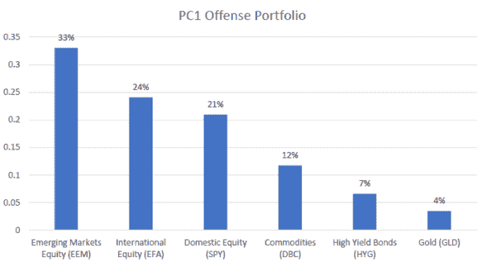
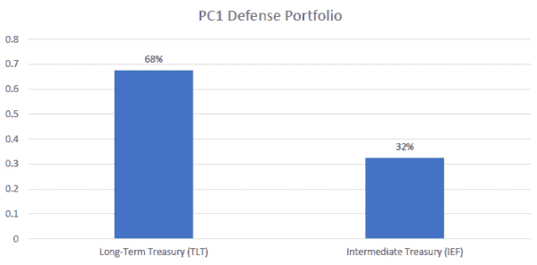
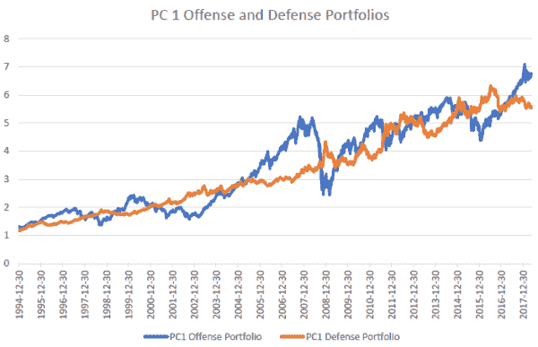
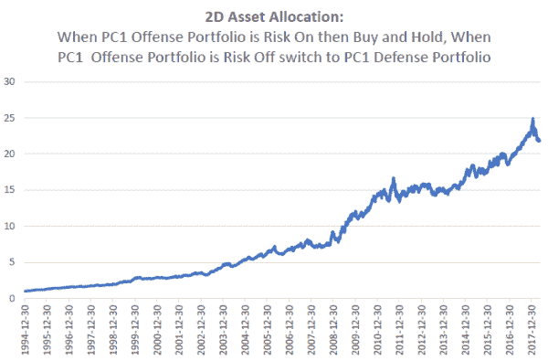

<!--yml

类别：未分类

日期：2024-05-12 17:43:51

-->

# “二维资产配置”使用 PCA（第二部分）| CSSA

> 来源：[`cssanalytics.wordpress.com/2018/08/21/2d-asset-allocation-using-pca-part-2/#0001-01-01`](https://cssanalytics.wordpress.com/2018/08/21/2d-asset-allocation-using-pca-part-2/#0001-01-01)

在上一篇文章中，我们展示了如何使用 PCA 通过关注第一主成分或“PC1”来创建进攻型和防御型投资组合。旋转完成后，可以为每个主成分推导出权重或投资组合。博客读者 Dr. Rufus Rankin 撰写了一篇关于使用 PCA 进行资产配置的优秀入门文章。该书的链接是[这里](https://amzn.to/2NH5XPz)。我们可以通过将正负权重分离，将代表广泛系统性风险的 PC1 投资组合分为两个维度——进攻（风险偏好）和防御（风险规避）。要形成每个投资组合，只需将每个权重的绝对值除以进攻和防御投资组合中权重的绝对值之和。在这个例子中，为了简单起见，我们将使用 8 个核心资产类别——国内股票、新兴市场股票、国际股票、商品、高收益债券、黄金、中期国债、长期国债。以下是使用 1995-2018 年样本内期间各种 ETF 及其指数扩展的 PC1 进攻型投资组合：

该投资组合显示，一些较为激进的资产类别，如新兴市场，权重最高，而国际和国内股票的权重几乎相等。总体而言，股票在进攻型投资组合中权重最高，这是合乎逻辑的。商品位居第二，而高收益债券和黄金等资产的权重较小。总体来看，这个投资组合是合理的：在大多数情况下，当市场下跌且系统性风险非常高时，所有这些资产类别都有下跌的趋势。然而，在牛市期间，这些资产类别往往表现良好。相比之下，当我们查看 PC1 防御型投资组合时，它看起来与进攻型投资组合截然相反：

PC1 防御型投资组合具有高久期投资组合，偏向于长期国债，在历史上经济衰退期或其他系统性风险高涨的时期表现相当不错。下图显示了 PC1 进攻型和防御型投资组合随时间的性能。

从图中我们可以清楚地看到 PC1 进攻和防御组合之间的负相关性。显然，两者在不同时间表现良好，正如我们所预期。一个简单的战术模型是，在系统性风险较低时持有 PC1 进攻组合，在风险较高时持有 PC1 防御组合。为此，我们可以简单地使用 PC1 进攻组合的 200 天简单移动平均策略（通过使用 PC1 的权重并每月重新平衡该组合来生成权益曲线），并在风险来临时持有 PC1 进攻组合——权益曲线高于其 200 天 sma——在风险消退时持有 PC1 防御组合——PC1 进攻组合的权益曲线低于其 200 天 sma。我们可以给这个简单策略起个名字——“2D 资产配置”——它代表了我们将资产类别范围划分为进攻和防御两个维度的做法。该策略的表现如下所示：

这一简单策略的表现相当不错，甚至在 2015 年这一传统动量/趋势跟踪策略艰难时期也能表现良好。以下是一张显示摘要统计数据的表格。理想的战术策略应在整个市场周期中优于其基础进攻/防御组件的买入并持有版本。显然，2D 资产配置策略远优于单独的任一组件。

该策略最佳之处在于，它绝非“曲线拟合”，因为 200sma 是一个久经考验的策略，并非 PC1 进攻组合中的最佳策略。利用 PCA 降低维度并构建此组合是一种成熟的统计实践。唯一需要注意的是，该组合是在“样本内”推导出来的，这虽不理想，但与传统系统开发者通过回测创建交易策略的起点并无二致。或许更好的做法是采用滚动或锚定 PCA 分析，以逐步推进的方式推导出这两个组合。在此案例中，资产类别范围的设计旨在涵盖主要资产类别，而 PCA 的优势在于，你可以使用几乎任何资产类别范围，而不会因选择任意子集而引入不当偏差。无论哪种情况，这都是战术资产配置得以极大简化的一个良好例证。对策略的改进可能包括为实现多元化目的而持有 PC1 防御的最低配置，或可能在 PC1 进攻和防御组合中运用动量来超配/低配不同持仓。可能性无穷无尽。

本材料仅供信息参考之用。它并非旨在作为个性化投资建议的替代品，也不是对任何特定证券、策略或投资产品的推荐或招揽。所表达的观点基于本材料撰写时的经济或市场状况。经济和市场波动不定。实际的经济或市场事件可能与预期不同。所提供的事实来自被认为可靠的来源，然而，无法保证此类信息的准确性或完整性，并且此处呈现的某些信息可能已从其原始来源进行了浓缩或摘要。
