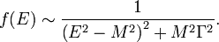

<!--yml

类别：未分类

日期：2024-05-12 18:24:54

-->

# (EV) 期望值 | CSSA

> 来源：[`cssanalytics.wordpress.com/2010/05/28/ev-expected-value/#0001-01-01`](https://cssanalytics.wordpress.com/2010/05/28/ev-expected-value/#0001-01-01)

每个严肃的扑克玩家都知道一个计算，因为它对决策至关重要，那就是 EV 或期望值。其对交易的应用显而易见（尽管金融市场中的肥尾效应使得真正估计 EV 变得困难）：

EV = W% x 你有望赢得的金额 + L% x 你有望损失的金额

其中 w%代表胜率，l%代表败率或（1-w%）

关于 EV，有几个相关的原则：

1) 任何一手牌的结果都被视为无关紧要，因为专业人士试图在长期内最大化其期望 EV。即使你有 90%的胜算，且胜负已知，仍可能因运气不佳而连续输掉多次。这是作为赢家的必经之路。应对这种情况的最佳方式不是微观管理当前的权益，而是专注于最大化长期 EV，不担忧结果。交易者亦是如此——担心任何一笔交易都无济于事，关键在于做出正确决策并从始至终执行。除此之外，你无能为力。

2) 由于大数定律，EV 将趋向于公平价值——但这可能需要 30-50 个情况，即使使用固定的 52 张牌。相比之下，交易策略的总体均值并不真正为人所知，具有高度的确定性，因此你需要更大的样本量来趋近于公平价值，假设你已正确估计了均值。这要求你进行随机抽样，并跟踪新样本与抽样分布的对比，以确保你拥有正确的 EV 估计以及 EV 的标准差。

3) 顶尖玩家将 EV 估计为依赖于多种条件的条件值——类似于 Rob Hanna 在 Quantifiable Edges 所做的[`quantifiableedges.blogspot.com/`](http://quantifiableedges.blogspot.com/)。这种条件估计既是艺术也是科学，这也是为什么 Rob 倾向于逐案评估。一个好的 EV 估计的核心在于，大多数情况下你采用基准/基本情况估计，并仅在有强有力的缓解因素时进行调整——也许你正在尝试完成同花或顺子，并且被提供略微负的 EV 以看到最后一张牌。在大多数情况下，这将是弃牌，但在无限制德州扑克中面对一个非常弱的玩家时，这是一个高 EV 的情况，因为如果你幸运地完成了手牌，你可能会获得一大笔钱。因此，这有点像一个具有“期权价值”的情况。

建议的电动汽车应用：电动汽车可与蒙特卡洛模拟结合使用，以创建比回测更真实的样本外权益曲线。这是因为数据历史只是众多可能结果中的一个实现，而明天的市场只会回响过去。交易发生的顺序以及幸运交易或不幸交易的程度塑造了过去展现的独特模式。通过调整基准情况下的电动汽车价值，以适应最常影响价值的制度/环境类型，可以更准确地计算电动汽车。因此，您可以根据市场环境创建您可以预期的模拟。鉴于金融市场分布的性质，电动汽车仍然是短暂的，因此有许多可能的途径来追求更稳健的方法。这是一个来自量子物理学的公式，称为相对论布赖特-维格纳分布，它是通常用于处理“肥尾”的柯西分布的更适当版本。对于那些认真的极客来说，有一些有趣的特性/应用值得探索。
