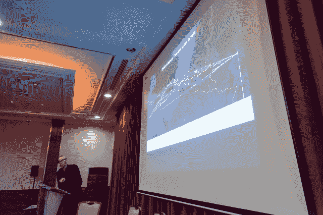
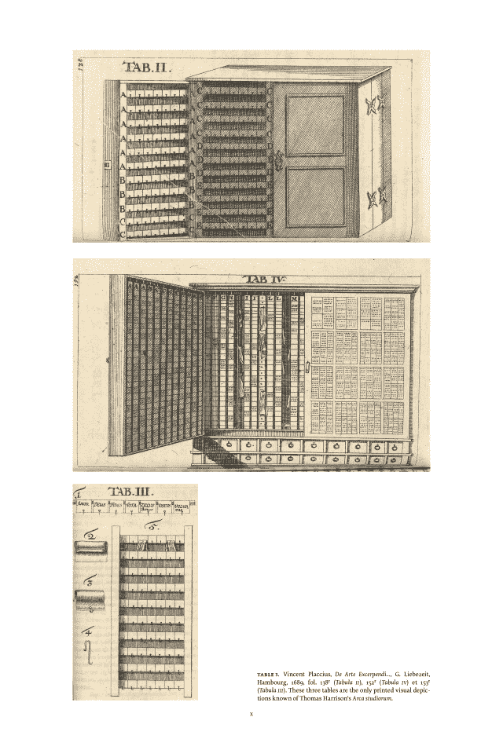

<!--yml

分类：未分类

日期：2024-05-18 14:08:31

-->

# “我会回来的” – Mahwah 的狙击手与朋友们

> 来源：[`sniperinmahwah.wordpress.com/2018/03/21/i-will-be-back/#0001-01-01`](https://sniperinmahwah.wordpress.com/2018/03/21/i-will-be-back/#0001-01-01)

FOW 大会 – 阿姆斯特丹 – 3 月 7 日

大家好。正如两周前在 Fow Trading Amsterdam 参加我（过于冗长）的演讲的几位朋友（你好 Pedro）所指出的，这个博客已经长时间异常沉默。并非我没有有趣的故事可写（我有太多要分享的），只是这个学年过得飞快。现在课程结束了，我有几个月的时间进行研究，发布我准备的所有草稿，撰写一本关于高频交易的新书《塔之战》（标题非合同约定）——我甚至还没写下一行……——，并完成一个我未来三四年想要进行的一项更广泛研究/书籍的提案。这个提案将在下周一完成，这样下周我就能重新启动这个博客（从我 FOW 演讲的更新和扩展版本开始——幻灯片将提供）。

在此期间，如果你想阅读，这里有一篇我两年前为一本非常著名的旧词典的新版所写的英文序言，[《皮埃尔·培尔的历史与批判词典》](https://www.lesbelleslettres.com/livre/508-dictionnaire-historique-et-critique)。内容涉及数据、数据中心和编码、排版和正则表达式等。正是多年前我在研究这个*Arca studiorum*数据中心（下图）时，我意识到交换现在发生在数据中心……于是我开始调查所谓的高频交易。这篇文字[在这里](https://sniperinmahwah.wordpress.com/wp-content/uploads/2018/03/pierre_bayle_dictionary_english.pdf)。希望你们会喜欢。下周见，我们将讨论在芝加哥快速飞翔的金丝雀。

