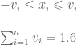
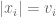
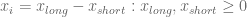
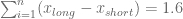
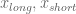
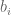
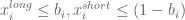

<!--yml

类别：未分类

日期：2024-05-18 14:45:25

-->

# 130/30 投资组合构建 | 系统投资者

> 来源：[`systematicinvestor.wordpress.com/2011/10/18/13030-porfolio-construction/#0001-01-01`](https://systematicinvestor.wordpress.com/2011/10/18/13030-porfolio-construction/#0001-01-01)

[130/30 基金](http://en.wikipedia.org/wiki/130-30_fund)几年前备受关注。[130/30 基金](http://mutualfunds.about.com/od/typesoffunds/a/130_30_funds.htm)是一种多空投资组合，每投资 100 美元，就有 130 美元用于多头，30 美元用于空头。从投资组合构建的角度来看，这个简单的想法实施起来并不简单。

让我们继续从[资产配置简介](https://systematicinvestor.wordpress.com/2011/10/13/introduction-to-asset-allocation/)文章的讨论，并考察允许空头头寸对有效边界的影响。

```

# load Systematic Investor Toolbox
setInternet2(TRUE)
source(gzcon(url('https://github.com/systematicinvestor/SIT/raw/master/sit.gz', 'rb')))

#--------------------------------------------------------------------------
# Create Efficient Frontier
#--------------------------------------------------------------------------
ia = aa.test.create.ia()
n = ia$n

# -0.5 <= x.i <= 0.8 
constraints = new.constraints(n, lb = -0.5, ub = 0.8)

# SUM x.i = 1
constraints = add.constraints(rep(1, n), 1, type = '=', constraints)

# create efficient frontier(s)
ef.risk = portopt(ia, constraints, 50, 'Risk')
ef.mad = portopt(ia, constraints, 50, 'MAD', min.mad.portfolio)

# Plot multiple Efficient Frontiers & Transition Maps
layout( matrix(1:4, nrow = 2) )
plot.ef(ia, list(ef.risk, ef.mad), portfolio.risk, F)
plot.ef(ia, list(ef.risk, ef.mad), portfolio.mad, F)

plot.transition.map(ef.risk)
plot.transition.map(ef.mad)

```


观察转换图，随着投资组合的风险和回报增加，杠杆的使用也随之增加。在较低风险时，优化器希望将 150%分配给多头，50%分配给空头；而在较高风险时，优化器希望将 300%分配给多头，200%分配给空头。

这是一个好的起点，但为了我们的目的，我们希望有效边界上的所有投资组合都具有 130%的多头分配和 30%的空头分配。解决这个问题的一个方案在[《资产配置与风险评估，具有总暴露约束的大规模投资组合》](http://papers.ssrn.com/sol3/papers.cfm?abstract_id=1307423)（第 8 页的注释 3）中提到

构建 130/30 投资组合的第一种方法是注意到



如果不等式约束是**有界的**，那么，且总投资组合权重等于 1.6（1.3 来自多头分配的贡献，0.3 来自空头分配的贡献）

```

#--------------------------------------------------------------------------
# Create 130:30
# -v.i <= x.i <= v.i, v.i>0, SUM(v.i) = 1.6
#--------------------------------------------------------------------------

# -0.5 <= x.i <= 0.8 
constraints = new.constraints(n, lb = -0.5, ub = 0.8)

# SUM x.i = 1
constraints = add.constraints(rep(1, n), 1, type = '=', constraints)		

# adjust prior constraints, add v.i
constraints = add.variables(n, constraints)

# -v.i <= x.i <= v.i
#   x.i + v.i >= 0
constraints = add.constraints(rbind(diag(n), diag(n)), rep(0, n), type = '>=', constraints)

#   x.i - v.i <= 0
constraints = add.constraints(rbind(diag(n), -diag(n)), rep(0, n), type = '<=', constraints)

# SUM(v.i) = 1.6
constraints = add.constraints(c(rep(0, n), rep(1, n)), 1.6, type = '=', constraints)

# create efficient frontier(s)
ef.risk = portopt(ia, constraints, 50, 'Risk')
	# keep only portfolio weights
	ef.risk$weight = ef.risk$weight[,(1:n)]			

ef.mad = portopt(ia, constraints, 50, 'MAD', min.mad.portfolio)
	ef.mad$weight = ef.mad$weight[,(1:n)]

# Plot multiple Efficient Frontiers & Transition Maps
layout( matrix(1:4, nrow = 2) )
plot.ef(ia, list(ef.risk, ef.mad), portfolio.risk, F)	
plot.ef(ia, list(ef.risk, ef.mad), portfolio.mad, F)	

plot.transition.map(ef.risk)
plot.transition.map(ef.mad)

```


观察转换图，在有效边界上的所有投资组合中，杠杆的使用保持不变，即 130%分配给多头，30%分配给空头。

构建 130/30 投资组合的另一种方法是分割



并添加约束。如果互斥（对于每个 i，只有一个大于 0），则总投资组合权重等于 1.6（1.3 来自长期投资分配的贡献和 0.3 来自短期投资分配的贡献）

```

#--------------------------------------------------------------------------
# Create 130:30
# Split x into x.long and x.short, x.long and x.short >= 0
# SUM(x.long) - SUM(x.short) = 1.6
#--------------------------------------------------------------------------
# Split Input Assumptions for x into x.long and x.short 
ia.ls = aa.test.ia.add.short(ia)

# x.long and x.short >= 0
# x.long <= 0.8 
# x.short <= 0.5 
constraints = new.constraints(2*n, lb = 0, ub = c(rep(0.8,n),rep(0.5,n)))

# SUM (x.long - x.short) = 1
constraints = add.constraints(c(rep(1,n), -rep(1,n)), 1, type = '=', constraints)		

# SUM (x.long + x.short) = 1.6
constraints = add.constraints(c(rep(1,n), rep(1,n)), 1.6, type = '=', constraints)		

# create efficient frontier(s)
ef.risk = portopt(ia.ls, constraints, 50, 'Risk')
	# compute x
	ef.risk$weight = ef.risk$weight[, 1:n] - ef.risk$weight[, (n+1):(2*n)]

ef.mad = portopt(ia.ls, constraints, 50, 'MAD', min.mad.portfolio)
	ef.mad$weight = ef.mad$weight[, 1:n] - ef.mad$weight[, (n+1):(2*n)]

# Plot multiple Efficient Frontiers & Transition Maps
layout( matrix(1:4, nrow = 2) )
plot.ef(ia, list(ef.risk, ef.mad), portfolio.risk, F)	
plot.ef(ia, list(ef.risk, ef.mad), portfolio.mad, F)	

plot.transition.map(ef.risk)
plot.transition.map(ef.mad)

```


观察转换图，使用杠杆在所有有效边界上的投资组合中对于 130%的长期投资分配和 30%的短期投资分配是恒定的。

然而，**重要**的是要注意到，上述两种方法只有在协方差矩阵具有足够的波动性且优化器使用额外杠杆来生成最优投资组合时才有效。为了说明这一点，让我们设想我们想要构建一个 200/100 投资组合：200%的长期投资分配和 100%的短期投资分配。创建新的有效边界所需的唯一更改是将上述 1.6 约束替换为 3（3 = 200%的长期投资分配加上 100%的短期投资分配）


观察转换图，在这种情况下，优化器在较低风险区域并未使用所有杠杆，因为在较低杠杆水平存在最优投资组合。如果我们查看较低风险区域的，它们并非互斥，均大于 0。

为了强制使互斥（对于每个 i，只有一个大于 0），我将添加二进制变量。二进制变量只能取 0 或 1 值。这里是额外的约束：



```

#--------------------------------------------------------------------------
# Create 200:100 using binary[0/1] variables and Branch and Bound algorithm
# Split x into x.long and x.short, x.long and x.short >= 0
# SUM(x.long) - SUM(x.short) = 3
#
# Solve using branch and bound: add a binary var b.i, x.long.i < b.i, x.short.i < (1-b.i)
#--------------------------------------------------------------------------

# x.long and x.short >= 0
# x.long <= 0.8 
# x.short <= 0.5 
constraints = new.constraints(2*n, lb = 0, ub = c(rep(0.8,n),rep(0.5,n)))

# SUM (x.long - x.short) = 1
constraints = add.constraints(c(rep(1,n), -rep(1,n)), 1, type = '=', constraints)		

# SUM (x.long + x.short) = 3
constraints = add.constraints(c(rep(1,n), rep(1,n)), 3, type = '=', constraints)		

# NEW add binary constraint	
# adjust prior constraints: add b.i
constraints = add.variables(n, constraints)

# index of binary variables b.i
constraints$binary.index = (2*n+1):(3*n)

# binary variable b.i, x.long.i < b.i, x.short.i < (1-b.i)
# x.long.i < b.i
constraints = add.constraints(rbind(diag(n), 0*diag(n), -diag(n)), rep(0, n), type = '<=', constraints)

# x.short.i < (1-b.i)
constraints = add.constraints(rbind(0*diag(n), diag(n), diag(n)), rep(1, n), type = '<=', constraints)

# create efficient frontier(s)
ef.risk = portopt(ia.ls, constraints, 50, 'Risk')
	# compute x
	ef.risk$weight = ef.risk$weight[, 1:n] - ef.risk$weight[, (n+1):(2*n)]

ef.mad = portopt(ia.ls, constraints, 50, 'MAD', min.mad.portfolio)
	ef.mad$weight = ef.mad$weight[, 1:n] - ef.mad$weight[, (n+1):(2*n)]		

# Plot multiple Efficient Frontiers & Transition Maps
layout( matrix(1:4, nrow = 2) )
plot.ef(ia, list(ef.risk, ef.mad), portfolio.risk, F)	
plot.ef(ia, list(ef.risk, ef.mad), portfolio.mad, F)	

plot.transition.map(ef.risk)
plot.transition.map(ef.mad)

```


最后，观察转换图，使用杠杆在所有有效边界上的投资组合中对于 200%的长期投资分配和 100%的短期投资分配是恒定的。

关于二进制变量的技术说明。来自[lpSolve](http://cran.r-project.org/web/packages/lpSolve/index.html)库的线性求解器内部实现了二进制变量。而来自[quadprog](http://cran.r-project.org/web/packages/quadprog/index.html)库的二次求解器则不处理二进制变量。为了向二次求解器中添加二进制变量，我采用了来自[Matlab 解决混合整数二次规划问题的函数，作者 Alberto Bemporad, Domenico Mignone](http://www.aut.ee.ethz.ch/~hybrid/miqp/)的二进制分支定界算法。

要查看此示例的完整源代码，请查看[github 上 SIT 项目中 aa.test.r 文件的 aa.long.short.test()函数](https://github.com/systematicinvestor/SIT/blob/master/R/aa.test.r)。
