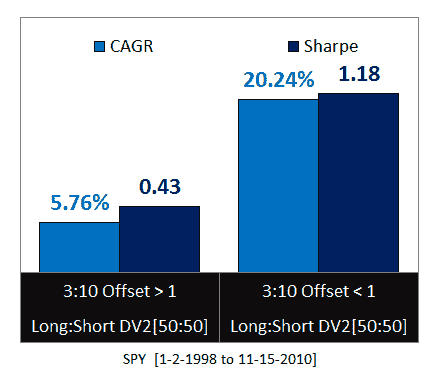
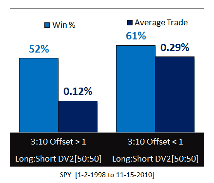

<!--yml

分类：未分类

日期：2024-05-12 18:15:48

-->

# 3/10 偏移 HV 作为均值回归过滤器 | CSSA

> 来源：[`cssanalytics.wordpress.com/2010/11/18/310-offset-hv-as-a-mean-reversion-filter/#0001-01-01`](https://cssanalytics.wordpress.com/2010/11/18/310-offset-hv-as-a-mean-reversion-filter/#0001-01-01)

我始终在寻找新的有趣想法，以改进传统系统或指标的边缘。一个宝贵的想法来源是订阅 Quantifiable Edges，在那里我有机会每周回顾 Rob Hanna 如何分类当今市场上最相关的情况。该博客经常展示在夜间信件中发布的研究：[`quantifiableedges.blogspot.com/2010/10/rare-consolidation.html`](http://quantifiableedges.blogspot.com/2010/10/rare-consolidation.html)。

在此案例中，我旨在探讨如何将“3/10 偏移 HV”用作振荡器交易的过滤器。我推荐以下链接以深入了解该指标：[`quantifiableedges.blogspot.com/2010/10/volatility-contraction-study-in-memory.html`](http://quantifiableedges.blogspot.com/2010/10/volatility-contraction-study-in-memory.html)。简而言之，3/10 偏移衡量的是当前 3 日波动率与 3 天前 10 日波动率的关系。实质上，它是一种衡量短期波动率扩张/收缩相对于非重叠中期波动率指标的方法。该过滤器的目的是识别有利于突破的条件，尤其是那些日内或开盘时发生的突破。我的疑问是，波动率的收缩或扩张是否有利于均值回归交易。我决定测试 3/10 偏移对“DV2”指标的影响。波动率的扩张将由 3/10 偏移值大于 1 表示，而收缩则发生在小于 1 时。以下是结果，如您所见，3/10 偏移是一个很好的过滤器，但其作用方式可能与您的预期不同：

显然，与 3/10 偏移量相关的范围收缩对于均值回归交易更为有利，这与直觉相反。通常，高波动性更适合使用长期历史波动率（HV）度量的均值回归，但似乎对于短期相对度量而言，相反的情况更可取。在审查了几个图表示例后，可以看出，低 3/10 偏移量 HV 结合超买/超卖振荡器读数表现为非常浅的回调或反弹。当与长期趋势相结合时，这些交易最有可能成功且风险较低。正是那些异常严重的深度突破或下跌，对浅层均值回归交易构成了最大的问题。上述研究表明，有必要从多个维度考虑均值回归：1) 浅层回调/反弹 2) 在任一方向上过度拉伸的中等条件 3) 实际上属于尾部事件的极端突破和下跌。优化均值回归策略的性能需要理解每种情况下的背景和概率。最后，关于使用 3/10 偏移量作为日内过滤突破的手段，突破的方向很可能会遵循 DV2 振荡器所暗示的方向。
