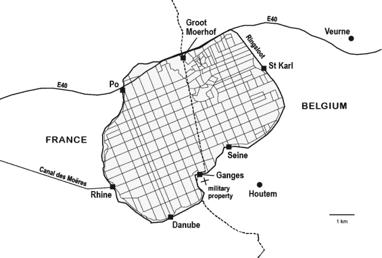

<!--yml

分类：未分类

日期：2024-05-18 14:06:41

-->

# 4 – Les Moëres – 英文版 – Sniper In Mahwah & 朋友们

> 来源：[`sniperinmahwah.wordpress.com/2019/03/26/4-les-moeres-english-version/#0001-01-01`](https://sniperinmahwah.wordpress.com/2019/03/26/4-les-moeres-english-version/#0001-01-01)

2018 年 9 月 19 日，我曾写道，我将在 2592000000000 微秒后回到这里，但一如既往，我迟到了。无所谓了……对于人类来说，微秒、纳秒或阿托秒都无关紧要。我甚至忘了写一篇简短的博客文章来宣布我的新书《4》关于高频交易的发布，这本书是献给为高频交易而建的最新无线网络的（这是我在本博客上发表的现已著名的[*HFT in my backyard*](https://sniperinmahwah.wordpress.com/2014/09/22/hft-in-my-backyard-part-i/)系列的扩展版），该书已于一月发行，但我猜大多数本博客的读者都在[Twitter](https://twitter.com/SniperInMahwah)上关注我。无论如何，我忙于新书发布（效果相当惊人，超出了预期——可以查看这里汇编的一些媒体评论[https://quantreg.com/2019/02/21/4-by-alexandre-laumonier-reviews/]，感谢 Marcos），接受采访，为德法电视台 Arte 拍摄关于高频交易的电影等，最重要的是我自己的业务（一家[图书公司](http://www.zones-sensibles.org/news/)）需要我管理（成功固然好，但耗费时间）。我本想写一篇关于我之前关于高频交易书籍的文章，以及我为何试图研究/理解高频交易和市场微观结构这个小领域，但那将留待以后。

在此期间，我想分享的是：1/ 一本精美且优雅的法语比利时杂志*《Wilfried》*昨日发布了新一期，其中你可以找到（用法语）我的新书前 15 页（略有改编），这些页面装饰着一位才华横溢的摄影师使用无人机在本文提到的特殊区域拍摄的非常精美的照片（对于阅读此博客的读者来说，这个区域是 2012 年 12 月由芝加哥的一家高频交易公司购买的 Houtem 附近的无线电塔周围地区——这个地区被称为“Les Moëres”，这也是本书第一章的标题）；2/ 由于我正在与英语出版商讨论这本书的英文翻译（似乎很多人想阅读它），我委托翻译了这些前几页，以便美国/英国的出版商可以“预览”这本书。我不明白为什么我不能与这个博客的读者以及我亲爱的 Twitter 粉丝分享这个翻译。因此，这里提供的是“4”开头的英文版本。非常感谢我的翻译者[Daniel Levin Becker](https://en.wikipedia.org/wiki/Daniel_Levin_Becker)，以及为*《Wilfried》*拍摄 Les Moëres 的摄影师[Jelle Vermeersch](http://www.jellevermeersch.be)，他允许我在这里复制一些他拍摄的非常精美的照片（点击可放大）。原版法语书中没有照片，除了那张黑白照片，但我认为对于这个在线版本，除了 Jelle 的照片外，一些历史文献也很有趣（如果你喜欢圩田并阅读法语，可以查看比利时作家[Chris de Stoop](http://www.chrisdestoop.be)在同一期*《Wilfried》*中的精彩文章，以及他的书*《Dit is mijn hof/Ceci est ma ferme》*）。

这本书的这一部分/开头全是关于流动性、直线、土地占用、战争、宗教、军事占领、无线电网络，但与高频交易无关（这就是我喜欢它的原因:-)……至少直到 2012 年 12 月。我希望你会喜欢它——深呼吸，它很长。祝阅读愉快。

比利时的一座巨型天线塔。照片© Jelle Vermeersch，发表于“Wilfried”

在退休前几个月，拍卖师肯定没有想到会迎来他职业生涯中最激烈的竞标战。

在 2012 年 12 月 19 日那个灰蒙蒙的早晨，在西弗拉芒省联邦办公室所在的新建筑内的一间房间里，编号为 38025/838 SV 的公共财产，被描述为“*带有通信塔（高度 243.5 米）和八个锚点的退役军事区域*”，占地面积为 1 公顷 31 公亩 66 公厘，位于 Houtem 的 Héron 街 1 号，Les Moëres 地区（荷兰语中的 De Moeren），由其所有者比利时国防部以 250,000 欧元的价格进行拍卖。

上午 10 点整，没有丝毫延迟，十一人围坐在一张大长方形桌子旁。拍卖师、他的秘书以及一位来自国防部的代表坐在桌子的一端，而对面则坐着三组不同的人，彼此怒目而视：一位美国人带着两名律师；另外两名律师代表一家比利时著名律所，为潜在买家工作；还有两名工程师，他们整个上午都将保持沉默——他们来这里不是为了购买，而是为了查明谁将胜出，这对法国、加拿大、荷兰和美国的一些人来说至关重要。

尽管现场有一家高端律师事务所——考虑到“前军事财产中包含一座高达 243.5 米的通信塔”的破败状况，这种情况实属罕见，因为国防部希望摆脱这一资产——会议还是平静地开始了。拍卖师核实了参与者已按规定缴纳了 1000 欧元的注册费，并确保他们手中都持有关于该财产的行政文件——包括地籍调查，其中军事财产以十字形状出现——然后设定了 5000 欧元的出价增量（或称最小加价），拍卖随即开始。

本应只是走过场的事情却演变成了一个漫长的上午，拍卖师在这过程中被彻底考验了一番。仅仅二十分钟后，最高出价已达 70 万欧元，这让国防部欣喜若狂（他们私下里认为，任何超过 40 万欧元的成交都会让他们大赚一笔），但却让拍卖师感到不安。他决定将出价增量提高到 10000 欧元，以加快拍卖进程，随后最高出价迅速达到 100 万欧元，然后是 110 万欧元，120 万欧元，130 万欧元，140 万欧元……一小时后，当出价达到 200 万欧元时，越来越紧张的拍卖师宣布休会，躲进洗手间整理情绪。历史没有记录下他在镜中看到自己困惑的面孔时心里想的是什么。“在卖方这边，没人知道发生了什么，”一位目击者回忆道，他自己也因为这笔钱在其他情况下可能由他出价而更加惊讶。

那一年，比利时王国为了追求流动资产，已经出售了多处非军事化设施，总价值达 1200 万欧元：一座旧掩体，以 350 欧元的价格卖给了一位农民，他很高兴能够拆除它，因为它矗立在他的田地中央；一座为保卫安特卫普市而建的前堡垒，以 287,000 欧元的价格被活跃在全球各大港口的物流公司 Katoen Natie 的富有 CEO 购买；一座前军事医院，以 400 万欧元的价格被布鲁日市购买，计划改造成社会住房。加上这 1200 万，2012 年 12 月 19 日，“包含一座 243.5 米高通信塔的前军事财产”的出售结果也加入了这一行列。在比利时国家代表目瞪口呆的注视下，经过三个半小时的激烈争夺，最终以 500 万欧元的价格成交，这是该部 2012 年最成功的一笔交易。

当那些沉默的工程师匆匆离开联邦大楼的房间时（他们的车不幸停在了警察局前，早已超时），一位代表胜诉方的律师被一位代表败诉方的同事接近。败诉者递给胜诉者一张名片：“*如果我们能安排，这是我的电话号码*。”2013 年 1 月 9 日，该部公开了财产转让契约，但没有透露新业主的名字——“机密信息”，据该部新闻办公室称。

早在那天早上公开拍卖开始之前，参与者们就已经去参观了该物业，这是国防部提前安排的绕道，以便所有人都能注意到基础设施的衰败状况。在灰蒙蒙的天空下，他们驱车前往胡特姆，距离北海沙丘 9 公里，距离法比边境 400 米，位于莫埃尔地区。一个富有想象力的词源追溯“莫埃尔”一词源于“莫里尼”，即居住在那里的古代凯尔特部落后裔的名字，他们居住在被称为“波尔斯”的石堆上的高脚木屋中。这些史前湖畔城市可能是该地区最早的人类居住形式，该地区的后续历史因长期与流动性不平等的斗争而著称。

在新石器时代，Les Moëres 是 Aa 三角洲（一条发源于法国圣奥梅尔以南的河流）的一部分，这个巨大的海湾从加来延伸到尼乌波特。只有少数陆地岛屿露出水面，莫里尼人在这些岛屿上建立了他们的水上房屋。当恺撒的军队到达莫里尼亚时，该地区只是一大片恶臭的沼泽，远非理想的军事占领地。然而，根据他的《高卢战记》，恺撒在与莫里尼人的战斗中遇到了巨大的困难：“*在所有民族中，比利时人最勇敢*”，他写道，这个说法至今仍被这片平原地区的居民喜欢引用，尽管实际上“勇敢”这个词意在突出当地“野蛮人”的粗鲁。经过长时间的战斗，罗马人最终征服了莫里尼人，但没有在这个不适宜居住的地区定居。他们更感兴趣的是更南边的滨海布洛涅港，他们计划从那里入侵英格兰。也有可能他们决定保持沼泽的原状，因为当它们被海水淹没（这种情况经常发生）时，它们形成了一道天然的不可逾越的屏障，从而保护了领土免受撒克逊人的定期入侵。

尽管如此，年复一年，通过有效的排水系统，Les Moëres 有时能够进行耕种，至少直到四世纪，当时由于气候剧变，Aa 三角洲完全被淹没。随后，海湾变成了一个巨大的沉积盆地，泥炭和黏土开始出现。一个世纪后，罗马帝国崩溃时，一些传教士试图使 Morinia 基督教化，但没有取得真正的成功。直到六世纪，基督徒才终于以可持续的方式占领了这片泥泞的土地，开始了缓慢而复杂的水控制过程。

第一批负责排干沼泽的人可能是圣奥古斯丁-莱斯-泰鲁阿讷修道院的僧侣，该修道院成立于 544 年，距离圣奥梅尔几公里。一份教皇诏书确认，任何 *terra nova*，法律上定义为“通过人力从海潮和洪水的冲击中减去的土地”，将自动属于修道院。值得注意的是，后来殖民法国北部的本笃会来自英格兰的芬兰地区，这是一个沼泽地区，僧侣们曾尝试过各种排水技术来排干水分。得益于这种专业知识，Aa 三角洲开始缓慢地干燥，某些河流被运河化，新石器时代的 *pols* 变成了 *polders*。但恶劣的天气和洪水定期破坏僧侣们的劳动：有时整个地区，经过围垦和耕种，一夜之间就发现自己被水淹没了。

尽管迅速的基督教化带来了新的空间利用方式，并建造了多个参与排干土地的修道院，但排干如此大量的水是一项艰巨的工作——一个无底洞。由于每块*新地*或*被占耕地*都成为僧侣的财产，该地区的一些居民被迫继续生活在充满瘟疫水域的景观中，有时这些水域会导致致命的疟疾或热病流行。在不受本笃会和随后西多会影响的地区，每个社区都尽力将水患问题推给邻居，直到最终面对疾病，所有人都决定在远离居住区的地方形成人工低地湖泊，称为“Moëres”，源自荷兰语*moer*，意为“沼泽”。直到 10 世纪佛兰德斯家族的登基，土地排水的无序管理才告结束。在 12 世纪，阿尔萨斯家族的菲利普决定排干从加来至尼乌波特的整个海岸，随后将其分为四个部分，称为*wateringues*。这一巨大的建设工程仍未完全达到其目标：洪水、春潮、暴风雨、流行病、军事冲突和饥荒削弱了这一事业。自然是一片充满敌意的土地，需要不断地与之斗争和改造。

另一方面，第四个*wateringue*，即现在的 Les Moëres，并未取得任何显著进展。当时欧洲最富有的修道院之一，[Ten Duinen Abbey](https://www.tenduinen.be/en)（沙丘修道院），成立于 1107 年，先是本笃会，后为西多会，位于沼泽以北几公里处，在 13 世纪在财务和知识上达到了辉煌的顶峰。它拥有从敦刻尔克到荷兰沿海岸线的数千公顷广阔领地，并建造了许多谷仓和其他附属建筑。但西多会对于 Les Moëres 并不太关心，尽管当时它也是他们的财产之一。他们只是在沼泽中伸出的土地上，即该地区最高点，建立了一个农场，名为 Groot Moerhof，以便利用第四世纪当第四纪森林被水淹没时在沼泽湖周围形成的泥炭。实际上，这种开采只是使情况变得更糟：提取泥炭需要扩大沼泽，而水变得越来越侵入性，相应地减少了周围的耕种面积。

修道院曾享有极大的繁荣，但僧侣们让当地人在 Les Moëres 的停滞水域中浸泡，这片水域被沙丘保护，免受海水侵袭，已变成海拔在 2 至 4 米之间的内陆湖，湖水无法流出。*其他条件不变*，沙丘修道院也必须与自然抗争以求生存：除了百年战争和加尔文主义者的攻击外，它还频繁遭受洪水侵袭，这些洪水逐渐侵占了已占领的土地，减少了僧侣们的财政收入。西多会僧侣越来越少，当新教徒在 1578 年最终焚毁修道院时，只剩下大约二十人。由于无法继续资助加固堤坝所需的维护费用，这些堤坝将他们与大海隔开，僧侣们最终被沙丘吞没。少数留在社区的人在他们拥有的一座修道院谷仓中避难，距离被淤塞的修道院几公里。西多会对 Les Moëres 周围土地的占领结束后，情况再次恶化，僧侣们曾经排出的水再次流入内陆湖，而不是流入大海。

后来，由于一位杰出的画家、建筑师、工程师和经济学家所进行的巨大工程，Les Moëres 的围垦工作几乎完成。[文策斯劳斯·科贝格](https://nl.wikipedia.org/wiki/Wenceslas_Cobergher)出生于 1550 年的安特卫普，他前半生在意大利度过，直到 1604 年左右，统治南尼德兰的阿尔伯特和伊莎贝拉安排他返回布鲁塞尔。被大公任命为首席工程师后，他在布鲁塞尔及其周边建造了几座教堂并绘制了一些画布，同时也涉足“经济学”领域。他是欧洲这一地区第一座慈善山的负责人，该山于 1618 年在阿尔伯特和伊莎贝拉的命令下在布鲁塞尔开放，他为此撰写了一篇名为[*Apologia ofte Bescherm-redenen tegen het kekelen van de onredelijcke vyanden, ende oock de tegenraeders, van de Berghen van*](https://books.google.be/books?id=NPhGAAAAcAAJ&pg=PA1#v=onepage&q&f=false) *[Bermherticheyt](https://books.google.be/books?id=NPhGAAAAcAAJ&pg=PA1#v=onepage&q&f=false) *(“Apology or defense against criticism by the unreasonable enemies and adversaries of the Mounts of Piety”)的诗文辩护。慈善山是由意大利方济各会士在 15 世纪下半叶创建的，旨在对抗伦巴第放贷者和犹太银行家的高利贷行为，后者以 30%至 40%的利率放贷，而慈善山这种半公共机构仅收取 15%的利息。科贝格随后在荷兰创建了十多座慈善山，但与大公一样，他不得不面对来自伦巴第放贷者的反对，这些放贷者得到了某些神学家的支持，以及布鲁塞尔市政府的反对，后者对这些新慈善山及其工作人员所享有的财政特权并不太友好。尽管如此，“勤奋的科贝格”还是得到了耶稣会士[莱昂纳多·莱修斯](https://en.wikipedia.org/wiki/Leonardus_Lessius)的大力支持，莱修斯是一位杰出的但未得到公正认可的现代经济学思想家，他在 1605 年发表的巨著《De iustitia et iure》中为这些公共机构辩护：“*我们必须努力工作，尽一切可能在我们城市的每个角落建立这样的慈善山——在压制那些通过控制市场耗尽人们资源的放贷者之后*。”对于莱修斯来说，他并不反对市场本身，“经济救赎”将通过这些“金钱之山”等方式实现，这些机构以合理的利率放贷，并参与更公平的财富分配。“*Bono publico nati sumus*，”耶稣会士断言：我们生而为公共利益。正是严格遵守这一原则，几年后，科贝格重新担任工程师的角色，承担起 Les Moëres 这一同时具有技术和经济性质的项目。

起初，必须处理与土地权相关的某些法律纠纷；在其他问题中，尽管沙丘的西多会修士们已被淤积，但他们援引了莫埃尔地区一部分的古老捕鱼权。其他人前来索取土地，但大公们单方面决定占用这片沼泽，并宣布未来*新土地*的五分之三归他们所有（包括风、水和捕鱼权），剩下的五分之二留给科贝格自行处理。工程师科贝格忠于经济学家科贝格，证明他比西多会修士更为慷慨：为了防止富有的企业家在土地变得肥沃后前来购买——正如预期的那样——他确保那些参与排水工程的人在建设期间及之后六个月内免税，这一税收优惠有可能以吸引贫困工人群体的方式续期，他们随后将占据这些新土地。

工程始于 1619 年。科贝格首先围绕湖泊建立了一道堤坝，形成了一个 30 平方公里的椭圆。沿着这道堤坝，他挖掘了一条 3 米深、20 公里长的运河：环沟，或称“环形运河”。这条环沟随后与另一条 10 公里长的运河（“莫埃尔运河”）相连，一直延伸到敦刻尔克，在那里，低潮时，莫埃尔的水可以通过一个锁流入北海。经过三年艰苦卓绝的努力完成这一阶段后，科贝格转向了最艰巨的任务：从湖泊中抽取水并将其输送到环沟。在这里，他决定利用风力对抗水力：他在环形运河沿线建造了 23 座风车，每座都配备了一个螺旋形状的垂直螺杆（称为阿基米德螺旋），以便风力能够将莫埃尔的水提升起来。“*当这些同时用于磨小麦的机器开始运转，我们看到水流如注涌入环沟，同时莫埃尔的水位下降，年底时，多处土地显露出来，整个地区都充满了普遍的热情*，”当地历史学家路易·夸雷-雷伯恩在 1892 年报道说。似乎流动性已被战胜。

然而，1622 年底，与土地和水管理相关的新争议浮现。由于科贝赫所做的工作，紧邻莱斯穆埃尔湖（位于湖的南侧）的*沃特宁格*管理员们无法再妥善排水。他们将此案诉诸法庭，但很快被驳回。不久之后，最近的新围垦地遭到了来自维尔讷村（这次位于湖的北侧）的镇顾问们的实质性攻击。在邓恩修道院的同意下，他们无疑视此为复仇良机，破坏了环绕 RingSloot 的一段堤坝，并盗走了科贝赫工人们用来覆盖磨坊的芦苇。在这种紧张的氛围和极其不利的天气下，风车至少六个月无法运转，科贝赫无法完成他的伟大工程：沼泽的浅滩中积水停滞。为了避免“*携妻带子急速走向明显的毁灭*”，在“*通过勤劳和非凡的劳动*”克服了“*许多困难，付出了巨大的个人代价和生命风险*”之后，他请求延期完成工作，并确保任何再次密谋反对他企业的人将被绳之以法。

到了 1626 年底，近五千年来，莱斯穆埃尔首次不再有流动性。为了消除最后的水分，科贝赫将 30 平方公里的新围垦地分割成 114 个*卡维尔*，这些矩形的“农业架子”尺寸为 220×109 米，通过地下陶瓷排水系统进行消毒，并被次级渠道环绕，将水从浅滩引向 RingSloot。油菜开始在运河周围 28 公里范围内生长。正如计划的那样，工程师占据了为他预留的空间，但很快出售了他的土地财产：科贝赫，显然比西多会更热情好客，还为购买这些新土地的人谈判了一系列“特权”，特别是免税和确保不会被用于军事用途。此外，由于维护 RingSloot 对于莱斯穆埃尔持续排水至关重要——居民的生活和工作依赖于此——他确保了村庄拥有一个公共管理机构，市民可以集体管理事务。

唉，在科贝格去世十二年后，正值三十年战争期间，敦刻尔克遭到了围攻。接管该城的西班牙人决定关闭水闸，破坏运河堤坝，以建立一道水上防线，一夜之间，莱斯莫尔湖被淹没。所有住宅和农场都被摧毁。只有教堂幸存下来，其十字架顶的钟楼矗立在水面上，成为集体繁荣消失后唯一可见的痕迹。再次完全排干湖水需要再过两个世纪。更近期的技术——蒸汽机，使得风车即使在无风的情况下也能保持运转。这些水泵随后以河流命名（波河、莱茵河、多瑙河、塔霍河、恒河、塞纳河……）。莱斯莫尔湖的原始状态是荒野、沼泽和恶臭的。它的第二个状态——干燥、宜人，经过数世纪不懈的人类努力和工程塑造——吸引了许多农民，他们往往来自远方。但水会再次回归：在第一次世界大战期间，法国人效仿西班牙人，淹没了莱斯莫尔湖，以阻止德国军队通过比利时进入其领土。受到这次经验的鼓舞，德国人在第二次世界大战中预料到了这一策略，并自行淹没了圩田，以减缓法军的推进。圩田已成为其自身的军事设施——一种液态的设施。

由文策斯劳斯·科贝格设计的莱斯莫尔湖。书中附有图纸。

“*乍看之下，莱斯莫尔湖的景象似乎单调而荒凉*，”夸雷-雷伯恩写道，“*但渐渐地，尽管其单调，仍能在这片风景中察觉到一种独特的魅力*。”2012 年 12 月 19 日，当国防部出售的军事地产的潜在买家们抵达法比边境附近时，天空与大地一样灰暗。四方形田地的地形由粘土和泥泞的灰色沙子构成，地面被开凿成绿色直线的运河，而在冬季，当田野裸露时，整个景象融为一体，化为一片灰白色的地平线。这片土地完全平坦，一望无际，其平坦性因来自北海的高积云而得到加强。这是一种令人惊讶的氛围，激起一种奇怪的感觉，仿佛置身于一个网状的虚无之地，从那里可能的地平线似乎辐射出来，一个时间似乎停滞的地方。圩田的统一性因农业地块的网格、水力网络和道路的完美直线而得到加强——这一模式象征着一些人视为现代性标志的正直，即人类理性思维战胜自然界的变迁。

莱斯莫尔湖中的直线路和运河。照片由© Jelle Wilfried 发表于“Wilfried”

曾经与教堂钟楼并列为该地区最高建筑的风车，如今已全部消失，仅剩以莱茵河命名的那座。Ringsloot 的北段现已接入另一网络——连接 Veurne 与 Dunkirk 的 E40 高速公路。从比利时出发，驶离高速公路，经过 2017 年安装了一个巨大阿基米德螺旋的环岛（不远处还有一个小型[泵博物馆](http://minedhistoires.org/2012/04/16/letrange-musee-des-pompes-de-ghyvelde/)，同样是对工程师的致敬），你将抵达一条被称为“极限之路”的支路。

“极限之路”在 Les Moëres。照片由© Jelle Wilfried 在“Wilfried”中发表。

沿着这条笔直的道路缓缓前行，随着远离高速公路，Les Moëres 单调的地平线在静默中逐渐展开，不时被起飞的白鹭打破宁静。在这条 5 公里直线的尽头，穿越 Ringsloot 并让“八角形之路”留在右侧（那里已由电动水泵取代了恒河磨坊），有一片田野，从中传出一种奇异、难以名状的声音：一种持续的、近乎电力的振动，一种与风声迥异的哨声。你只需跟随这异常的声波穿越田野，便可抵达 Houtem 小村的 1 rue du Héron，那里有一处由国防部出售的前军事地产。除了一个小型维修棚外，这片地产实际上只是一条直线：一座高达 243.5 米的纤细通信塔，其垂直性与周围地平线的水平性形成鲜明对比，这座铁制巨柱如此细长，以至于在白天，由于当地常有的雾气，往往难以从远处辨认。

Les Moëres 中的一条垂直直线。书中唯一包含 Houtem 塔的照片。照片© Alexandre Laumonier

“这有点像我们自己的埃菲尔铁塔！”一位 Houtem 居民解释道，回忆起他的叔祖父曾冒险攀爬这座结构以观赏比利时海岸壮丽的日落，尽管塔底设有警示牌（“注意：未经指挥官事先批准，禁止攀爬此塔”），且这样的攀登既漫长（超过一小时）又危险，除非攀登者系着“生命线”——直达塔顶的垂直绳索。

日落时的 Les Moëres。照片由© Jelle Wilfried 在“Wilfried”中发表。

这座塔，尽管其基座位于海平面以上 2 米，却是比利时第四高的建筑，它之所以屹立不倒，全靠 48 根拉索，这些紧绷的缆绳连接着塔身与田野中央八个通过 15 米深混凝土桩稳固固定的锚点。鉴于地面的液态特性，这些拉索不可或缺。得益于拉索的张力，这座 243.5 米高的铁质单体——其圆形基座置于混凝土块上，直径仅 20 厘米——优雅地伸向天空，一条巨大的垂直线延伸了圩田的水平线，在只有风与拉索摩擦产生的独特电振声打破的静谧中。

莱斯莫埃尔斯的拉索。照片由© Jelle Wilfried 发表于“Wilfried”

这片圩田历经从凯撒到二战的各种战役，涉及可见的陆地军事占领，其中水网和直线发挥了至关重要的作用。自 2012 年起，一场新的战斗将在空中以不那么显眼的方式展开，涉及寻找直线的其他网络，以及另一种流动性，这要归功于四十年前因地缘政治原因占据了一块呈十字形划定地界的土地的新住户：美国军队。

军事战斗的结果只有在被分享时才具有信息价值。早在公元前 458 年，埃斯库罗斯在其悲剧《*阿伽门农*》中描述了如何利用通信网络，在一夜之间将特洛伊战争的胜利者之名传达给直线距离四百公里外的迈锡尼居民：“*从伊达山顶至火神赫菲斯托斯，/发出信号；接着，信号不断传递，/烽火台间的信使火焰疾驰。/从伊达山至勒莫诺斯岛的悬崖，/那赫尔墨斯所爱之地；继而向高耸的阿索斯山，/宙斯的宝座，广袤的火焰闪耀。/随后，这移动的光芒，欢欣于其力量，/从松木堆中升起，奋力前行，/如同一颗奇异的新星，金光闪耀，/继续前行，抵达马基斯图斯山的瞭望高地*。”[3]对地点的精确描述使得[绘制](https://oklo.org/2014/11/28/optical-data-transmission/)这条路线变得容易，该路线利用了简单的火焰生成的光信号——在计算意义上相当于一个比特——在多个山丘上，从远处可以看到信号（伊达山、阿索斯山、西塞隆山等），使得信息从一个高点跳跃到下一个高点，直至到达最终目的地。广播中继站的海拔高度对于高速空中网络的设置至关重要，正是出于同样的原因，美军在莱斯莫埃雷斯建立了一座高耸的通信塔：它需要能够跨越海洋传递信息。

根据美国国务院和比利时王国的档案记载，1963 年 4 月 19 日，双方签署了一项名为“[美利坚合众国政府与比利时王国政府关于某些通信设施的协议](https://books.google.be/books?id=zYZNAQAAMAAJ&pg=PA415&lpg=PA415&dq=Agreement+Between+the+Government+of+the+United+States+and+the+Government+of+Belgium+Concerning+Certain+Communications+Facilities&source=bl&ots=k27J4ABPHR&sig=ACfU3U2Sfdzgt1eYhRRvXzh7ywrrdzN31w&hl=fr&sa=X&ved=2ahUKEwiu-N_FuZ_hAhWRsKQKHc9_Ax8Q6AEwAXoECAYQAQ#v=onepage&q=Agreement%20Between%20the%20Government%20of%20the%20United%20States%20and%20the%20Government%20of%20Belgium%20Concerning%20Certain%20Communications%20Facilities&f=false)”，其第一条规定：“*比利时政府授权、批准并确认美国政府在弗洛贝克及其他地点建立、运营和维护通信设施*。”（弗洛贝克，比利时中部一座迷人的高地城市，几年后将成为美国通信设施的神经中枢。）比利时同意以“*不高于比利时武装部队支付的费用*”协助美国项目，设备仍归美国所有，作为回报，美国“可在授权频率和信号强度内无间断地运营电信设施”。

然而，美国的通信网络投入运营的时间比预期要长。根据 1973 年 4 月 6 日下午 6 点从布鲁塞尔发往华盛顿国务院的电报（该电报于 2005 年解密，2011 年由维基解密公开），原定于 1973 年 5 月完成的这些设施安装，由于与生产无线电设备的 Philco 公司重新谈判合同而无法如期履行。电报还指出，尽管一些站点已接近完工，但另一个站点因需要进行额外的土壤密度研究并开始挖掘工作而严重滞后。驻布鲁塞尔的士兵也证实，他们在比利时以外的英国其他站点遇到了问题，并建议将启动日期推迟到 1974 年初。我们从这份电报中得知，各种军事设施占据了比利时的土地，包括韦斯特罗斯贝克、弗洛贝克、勒绍瓦、本-阿因和胡特姆，所有这些地方都配备了通信塔。比利时对美国来说并不具有重大的战略意义——至少在当时还不是——但这种占领可以解释为，比利时位于两个更为敏感的国家之间：西边的英国和东边的德国。

美国项目不仅限于这三个国家，它以国防通信系统（DCS）的名义扩展至全球各地，这是一个雄心勃勃的计划，由冷战紧张局势所推动，其主要目标是通过无线电波建立从美国到日本，途经旧大陆、中东、波斯湾国家、印度及其周边国家，以及通过格陵兰和冰岛连接美国与英国的本地或全球通信网络，以满足美国海军陆战队、陆军和空军的需要。在欧洲，自 1952 年以来，美国空军指挥中心就设在著名的德国拉姆施泰因基地。从这个据点出发，美军建立了多个网络，向西延伸至比利时和英国（美国可以利用英国皇家空军[RAF]在二战期间建造的塔楼），同时也向南扩展，覆盖西班牙、葡萄牙、意大利和希腊，直至土耳其，在那里，部队在埃斯库罗斯在其悲剧中提到的同一座山脉上安装了一座塔。

当 1966 年 3 月 7 日，在戴高乐将军的推动下，法国宣布有意退出北大西洋公约组织（NATO）的统一军事指挥时，通信基础设施的部署方向发生了变化。次年，NATO 总部迁至布鲁塞尔；美国将三十多个空军、陆军和海军基地移交给比利时和德国；新的军事指挥中心，即欧洲盟军最高司令部（SHAPE），在比利时蒙斯村附近建立，至今仍在那里。当时拥有自己的通信网络 Ace High 的组织，通过 82 个中继站连接土耳其至挪威，途经希腊、意大利、法国和英国，也被禁止进入法国领土。因此，NATO 被迫使用一条新的网络，即“*替代路线*”，该路线绕过法国向东，途经瑞士、德国和比利时，利用美国自 1963 年比利时-美国协议以来在平坦国家建立的军事设施。这就是位于 Les Moëres 的塔楼如何在 1973 年底可能完工后，同时服务于美国国防通信系统和 NATO 的 Ace High，美国军队确保将结构建在距离法比边境 300 米处，以避免如果杆子着火并倒向边境错误一侧可能引发的任何外交事件。

根据 1989 年发表的名为 *美国欧洲军事部队和设施* 的目录，莱斯莫尔塔是 DCS 和 Ace High 用于对流通信的。这些连接使用被对流层（最接近地球的大气层）反射的超高频波（介于 300 MHz 和 3 GHz 之间），允许无线电信号中的编码信息在两个中继站之间传播长达 300 公里。因此，它们更多地被用于连接各大洲，而不仅仅是用于“地球”的网络。根据一位曾在欧洲网络维护工作中的美国空军中士的说法，霍特姆的对流层天线在确保在 1983 年 10 月由伊斯兰圣战组织实施的自杀爆炸袭击中受害的士兵回到欧洲的行动中起到了关键作用，这次袭击严重影响了驻扎在贝鲁特的美国部队。

但是 *美国欧洲军事部队和设施* 也提到，该塔主要用于其他类型的无线电连接。它似乎甚至构成了一个可信的案例研究，就像它建成三年后发表的三篇文章所证明的那样：“利用多样性最小化长距离微波路径上导流的影响”（1975 年）、“霍特姆-斯温盖特链路的延迟线要求”（1976 年）和“穿越英吉利海峡 5 GHz 微波链路的信号水平分布和衰落事件分析”（1979 年）。最后一篇文章由美国商务部发表，该部被美国空军授权使用微波进行“点对点”连接测试。与超高频波不同，微波（从 1 到 300 GHz）无法到达对流层的高度。它们需要两个放置在“视线”形成的碟状天线，或者两个绝对必须彼此可见的碟状天线，因为两个中继之间的最佳信号传播是水平的——或者更准确地说是测地线的，地球是一个球体。由于地球的曲率几乎不允许每个“跳跃”或两个抛物面之间的距离超过 100 公里，“赫兹波束”用于“洲际”，而不是全球网络。

在 Les Moëres 地区，关于这座塔的三篇文章告诉我们，它建于离海岸几公里处，以便美国军队能在 Houtem 和英格兰的 Swingate 之间建立一条 88 公里长的点对点微波路径。在 20 世纪 60 年代，当这个无线电跳跃建立时，位于多佛以北的 Swingate 村被著名的“三姐妹”所主导：这三座仅 111 米高的桅杆，由英国皇家空军在 1936 年至 1938 年间竖立，用于追踪靠近英国海岸的德国战斗机。三姐妹本身是 Chain Home 的一部分，这是一个用于监控外国飞机存在的庞大雷达系统。其中一座桅杆因面临倒塌风险，于 2010 年被拆除，但两年后，当比利时政府考虑出售 Houtem 塔时，剩下的两座桅杆被列为“历史纪念碑”，以表彰它们在二战期间的服务（战后，这两座英国桅杆也被北约网络 Ace High 使用，直到 20 世纪 80 年代）。

书中作为书签包含的部分地图（包括 Houtem-Swingate 跳跃）。图形设计由 Alexandre Laumonier & Joost Grootens Studio 完成。

在 Les Moëres 的水平地貌中建造一座完全垂直的塔，对于美国军队来说，是为了拥有一条穿越北海的跳跃路径，这是必要的。这使得 DCS 网络能够从英格兰中部延伸到德国，途经 1963 年协议中指定的“比利时”军事财产。根据一份解密的美国空军公报，国防通信系统从 1979 年开始过渡到数字欧洲骨干网（DEB），该网络取代了“意大利、德国、比利时、荷兰和英国现有的模拟微波设备，采用数字微波和批量加密设备。这一升级涉及建筑物，或扩建设施和塔楼”。公报中提到的 DEB 第三阶段于 1988 年开始，特别关注英格兰和比利时，特别是 Houtem-Swingate 连接，目的是“形成一个四重多样性视线数字通信系统，并[提供]穿越英吉利海峡的连接”。

十年后，Houtem 地产最后一次出现在美国国防部的一份报告中，即《*基地结构报告。1999 财年*》，该报告调查了美国在全球范围内的所有军事资产。报告中提到了一个“*Houtem 无线电中继站点*”，标记为“*活跃*”，尽管报告暗示该站点已不再是真正的优先事项，甚至可能已不再使用。据估计，考虑到基础设施的过时状态和现行的新标准，真正翻修这座塔楼的预算将达到 120 万欧元——按面积计算，这是当时美国在比利时建立的物业中最高的修复成本之一。因此，美国放弃了 Houtem，直到 2006 年 1 月 20 日的公报中，国防部“*宣布决定停用并将三个微波无线电中继站点归还给比利时：Houtem、Westrozebeke 和 Flobecq。关闭这些站点将根据当前年度运营和维护成本与年度替代商业通信成本的比较，预计每年节省 84,000 美元。这些行动将使更多资源能够集中于美国空军欧洲（USAFE）的其他任务需求。由于 1996 年安装的无线电中继系统提供的服务将被更高容量、更低成本的商业通信服务取代，美国不再需要这些站点*”。虽然没有明确说明，但军方明确表示，其通信将不再通过空中传输，而是通过地下传输，这要归功于比无线电波更新的技术：光纤，其带宽是无线电波的两倍。

美国军队转向电缆，标志着在比利时对无线基础设施长期投资的结束，本应标志着铁质巨石的最终拆除——如果不是其他美国人出乎意料地在 2012 年 12 月出现在 Houtem 的话。Wenceslas Cobergher 将 Les Moëres 的新土地塑造成一个共享的经济空间，在那里，“*公共利益*”，这个 Leonardus Lessius 所珍视的概念，以及一种“共同体”形式可能会战胜那些试图“*主导市场*”的人。几个世纪后，一家芝加哥公司收购了 Houtem 塔，并拒绝与任何人共享，这表明占领已成为那些试图通过使用巨大的塔楼来主导景观从而掌握市场的人的私人事务。一种新的关于流动性的战斗现在将在 Les Moëres 中占据主导地位，在这种战斗中，芝加哥公司发出的波将在北海的雾中与同样渴望速度和有时流动性的竞争对手的波相交——这是一种新的空间占领方式：空中、几乎看不见且无声。

^([1])参见 Sylvain Piron 所著《*世界占领*》（布鲁塞尔：敏感区出版社，2018 年）。

^([2])参见 Wim Decock，*“美德市场”：与 Leonardus Lessius 一起思考法律与经济学*（布鲁塞尔：Zones sensibles，2019 年）。

[3]由 E. D. A. Morshead 翻译（1881 年）。

莱斯穆尔。照片© Jelle Vermeersch
