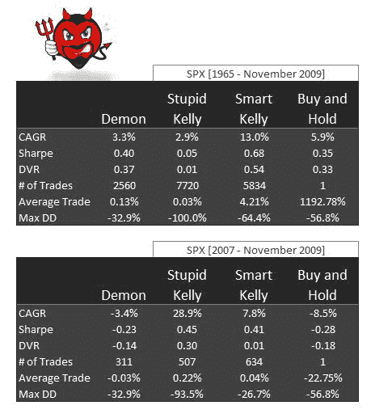

<!--yml

category: 未分类

date: 2024-05-12 18:17:03

-->

# 凯利和香农策略与买入持有的比较 | CSSA

> 来源：[`cssanalytics.wordpress.com/2009/12/03/a-comparison-of-kelly-and-shannon-strategies-vs-buy-and-hold/#0001-01-01`](https://cssanalytics.wordpress.com/2009/12/03/a-comparison-of-kelly-and-shannon-strategies-vs-buy-and-hold/#0001-01-01)

要更深入地了解上一篇文章，我们将看看“恶魔”策略的实际表现。我们还将介绍埃德·索普在论文中提出的凯利方法论的概念。对大多数人来说，这里面的数学有点复杂，但对于勇敢和勤奋的人来说，这里是链接[`www.bjmath.com/bjmath/thorp/paper.htm`](http://www.bjmath.com/bjmath/thorp/paper.htm)。本文由我的研究助理亨利·比（Henry Bee）编写，除了精通数字外，他还是一位出色的交易员/作家。你可以在 Seeking Alpha 上查看他的博客，获取一些基本见解和交易想法。

首先我们有恶魔投资组合，其中我们使用 1%/-1%作为再平衡的阈值。这些水平是为了使其更加现实，而不是一个思想实验——显然，每日再平衡无法承受交易成本。我们做出了关于交易成本的假设，这些假设与机构执行一致。每天，如果投资组合的绝对值大于或等于 1%，恶魔就会重新平衡到相等的权重。愚蠢的凯利方法是根据过去 3 年的预期收益和方差假设得出的。就像典型的懒散的零售投资者一样——愚蠢的凯利假设过去 3 年发生的事情将在未来重复发生——因此，如果我们经历了糟糕的 3 年期间，现在是进入防空洞的时候了，如果过去 3 年每个人都在赚钱，那么现在是把卡车开到市场上的时候了。下注大小是使用论文中提到的公式确定的。这个下注大小受到了 2 倍杠杆的限制——这是一种相当典型的调整，旨在防止过度估计偏见——在市场上，我们对未来收益分配没有任何确定性（不像游戏机会）。智能凯利方法是使用前瞻性数据（如贝塔、国库券收益率和其他输入）来推导股权风险溢价的。风险假设包括隐含波动率或方差（历史数据在早期日期使用）。让我们看一下结果：

“恶魔”投资组合在风险调整基础上优于买入并持有，并且在近年来开始改善与买入并持有的比较。令人印象深刻的是，在“未回归均值时代”的 1965 年至 2000 年期间，它仍然表现得相当不错。这是因为它利用了布朗运动而不是纯粹的回归假设。尽管在这些数据中看不出来，“恶魔”投资组合与买入并持有的滚动夏普比率实际上在最后一个十年之前是表现不佳的。我认为，最近的表现加速主要归因于市场上更大的随机性，仅部分归因于增加的均值回归。在 1982 年至 1999 年的大牛市期间，“愚蠢”的凯利投资组合是最差的方法，并且仅在这段时期之中取得了显著进展。不出所料，那是零售投资者实际上赚钱的少数时期之一。相比之下，使用前瞻性数据并且是长期逆势的“聪明”的凯利投资组合在绝对基础和风险调整基础上表现最佳。显然，将“聪明”的凯利投资组合与香农的“恶魔”投资组合结合起来，是利用“学术”概念的一个好方法，即：1）市场是有效的，并且表现出布朗运动模式（随机性）；2）股票市场存在“风险溢价”——投资者必须得到补偿以承担风险。因此，负的长期历史回报率、高预期方差和高长期债券收益率意味着投资者需要更高的溢价（回报）来投资。因此，尽管我们使用各种技术分析和基本分析方法试图击败市场，但有时在这些疯狂的教授们一直是对的情况下，有备用方案也是不错的！
