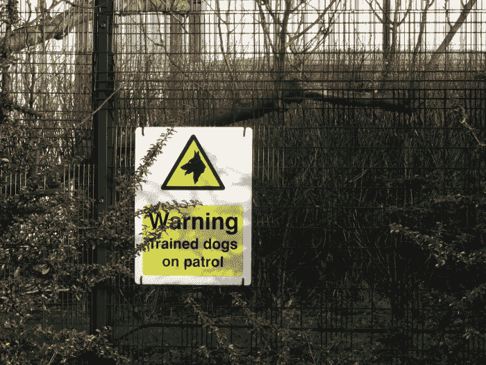
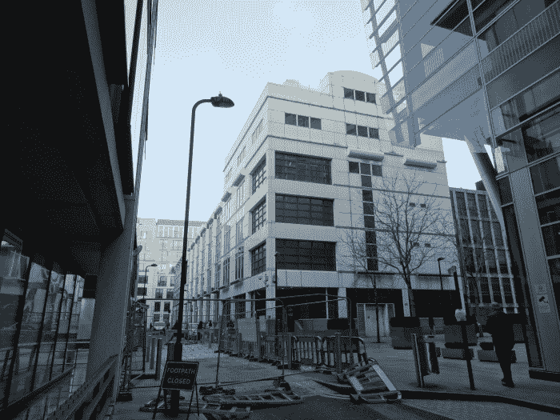

<!--yml

category: 未分类

date: 2024-05-18 14:17:20

-->

# 一个穿越微波的旅程 – Sniper In Mahwah & 朋友们

> 来源：[`sniperinmahwah.wordpress.com/2015/01/05/a-journey-through-microwaves/#0001-01-01`](https://sniperinmahwah.wordpress.com/2015/01/05/a-journey-through-microwaves/#0001-01-01)

我正在完成撰写和修订“我的后院的高频交易 | 第五部分”。 这个长篇（关于信息传输的过去和未来）应该会在今晚或明天上线。 与此同时，这是关于一个名为“The Nor”的项目的快速说明，“*一次对妄想症、电磁学和基础设施的调查*”。 十一月初，我收到了一位英国艺术家 [詹姆斯·布里德尔](http://shorttermmemoryloss.com) 的联系。 詹姆斯正在进行一个名为 [MIRRORCITY](http://mirrorcity.southbankcentre.co.uk) 的展览会的 [一部分](http://mirrorcity.southbankcentre.co.uk/james-bridle-onlineoffline-residency) 的项目，该展览会位于伦敦海沃德画廊。 他想更多地了解伦敦大都会区高频交易公司使用的微波网络 - *即* 斯劳基尼克斯数据中心与巴西尔登纽约证券交易所设施之间的网络。 这个区域在我的 [地图](http://www.theatre-operations.com/HFT_EU_09.22.2014.kmz) 上看起来像这样：

伦敦地铁区| 斯劳—巴西尔登

詹姆斯写道：“*我目前正在为伦敦海沃德画廊的一项新委托工作，作为即将举行的展览的一部分。 计划 - 这更像是一个驻地，而不是展示的一部分 - 是步行并记录各种物理网络和通信监视站点。 其中两个特别是伦敦的闭路电视网络和自动车辆监视，以及该市周围的空中交通管制系统和机场。 受到你的工作的启发，我考虑将微波网络作为另一个‘电路’包括在内 - 我想我会尝试从斯劳到伦敦市，再到巴西尔登走完整个路线*。” 我告诉这位艺术家他可以比我做得更好关于伦敦地铁区（我的地图的这一部分真的很不完整，因为我更喜欢搜索在土豆田中迷失的高塔而不是调查伦敦中使用的毫米波 - 毕竟这个城市不在我家附近）。 我建议詹姆斯使用 Ofcom 的 [网站](http://spectruminfo.ofcom.org.uk/spectrumInfo/licences) 查找更多伦敦位置，看起来他真的做到了，因为他昨天发布了这篇题为 “[低延迟](http://shorttermmemoryloss.com/nor/2015/01/04/low-latency/) ”或“*穿越微波的旅程*” 的故事。

这是一次惊人的探险（它让我想起了我在土豆地里度过的时光）。 “*2014 年 12 月 17 日星期三和 12 月 29 日星期一”，*James Bridle 骑自行车进行了“*两次探险，第一次从斯洛到伦敦金融城，第二次从伦敦金融城到埃塞克斯郡的巴斯尔登，分别是四十英里和四十五英里*”。 他沿着 [Optiver](http://www.optiver.com) 的路径，拍摄了荷兰公司（有时）安装天线的地点：

他还拍摄了 [McKay Brothers](http://www.mckay-brothers.com) 安装在希利顿医院顶部的大天线：

有了这张照片的帮助，你可以看到天线的品牌（这里的闪电图案是为 [Andrew](https://www.google.fr/search?site=&tbm=isch&source=hp&biw=1609&bih=954&q=Andrew+antenna&oq=Andrew+antenna&gs_l=img.12..0i19.487.487.0.1293.1.1.0.0.0.0.251.251.2-1.1.0.msedr...0...1ac.1.60.img..0.1.251.PT2h6ldTbvs) - 这种信息可能很有趣：如果你知道一家公司使用的天线品牌，有时可以知道谁是天线的所有者，而不需要其他公开信息）:

他在 [Flickr](https://www.flickr.com/photos/stml/with/16194411332) 上发布了其他照片，所以你可以欣赏到巴斯尔登的纽约证券交易所数据中心...

...带着欢迎之词（当我访问交易所时，我没有看到狗）...

...以及安装在设施顶部的小天线：

当我分析 Ofcom 执照以查找那些被 HFT 公司/提供商预订的执照时，我惊讶地发现一些路径在伦敦市中心汇聚，仿佛在巴斯尔登-斯洛区域内有一个强制性的停留点：

我花了好几个小时才找到这是伦敦证券交易所的数据中心所在地，位于厄尔街，由詹姆斯拍摄：

这是 BT 塔的照片，Vigilant、Flow Traders、Jump Trading 和 Optiver 在那里都有许可证：

Jump 通常会在那里拥有[很多](http://spectruminfo.ofcom.org.uk/spectrumInfo/licences?googloc=(51.521506526767006%2c+-0.1390644907951355)&code=301010&se=(51.5213680056711%2c+-0.13884186744689941)&googoffset=0.0&nw=(51.52164504744155%2c+-0.13928711414337158)&unit=GHz&ne=(51.52164504744155%2c+-0.13884186744689941)&service=Fixed+Links&sw=(51.5213680056711%2c+-0.13928711414337158)&submit=Submit+search&groupKey=5)个许可证；这一次，Vigilant 也有[一些](http://spectruminfo.ofcom.org.uk/spectrumInfo/licences?googloc=(51.521506526767006%2c+-0.1390644907951355)&code=301010&se=(51.5213680056711%2c+-0.13884186744689941)&googoffset=0.0&nw=(51.52164504744155%2c+-0.13928711414337158)&unit=GHz&ne=(51.52164504744155%2c+-0.13884186744689941)&service=Fixed+Links&sw=(51.5213680056711%2c+-0.13928711414337158)&submit=Submit+search&groupKey=3)许可证；但 Optiver 只有他们需要的[两个](http://spectruminfo.ofcom.org.uk/spectrumInfo/licences?googloc=(51.521506526767006%2c+-0.1390644907951355)&code=301010&se=(51.5213680056711%2c+-0.13884186744689941)&googoffset=0.0&nw=(51.52164504744155%2c+-0.13928711414337158)&unit=GHz&ne=(51.52164504744155%2c+-0.13884186744689941)&service=Fixed+Links&sw=(51.5213680056711%2c+-0.13928711414337158)&submit=Submit+search&groupKey=7)许可证（荷兰风格）。由于詹姆斯遵循了 Optiver 的路径，很可能右侧四个碟子中的两个是 Optiver 的；我打赌，带有 Andrew 标志的另外两个是 Jump 的，但我们不能确定（我得检查一下规划申请，但我已经没有时间了）。

斯劳邮局似乎被各种碟子（不仅仅是高频交易碟子）所入侵：

最后，这是斯劳的 Equinix LD4 数据中心（我从未去过）：

这是粘在数据中心的塔，我假设（所有）高频交易竞争对手都有碟子。看顶部被堵住了——我想最早安装碟子的公司要求放在最高的顶部：

阅读詹姆斯的[故事](http://shorttermmemoryloss.com/nor/2015/01/04/low-latency/)，了解他访问的地点更多信息（历史总是很有趣）。最后但同样重要的是，詹姆斯还建立了自己的用于查询 Ofcom 许可证的工具，名为“NOR Spectrum Analyser”；你可以在[这里](http://shorttermmemoryloss.com/nor/spectrum/) 找到它。这是一个截图：

感谢詹姆斯·布里德尔（James Bridle）进行了这项实地工作。在故事的介绍中，我们可以读到“*这些地点及相关文件将很快出现在 Nor 的地图上*”。[地图](http://shorttermmemoryloss.com/nor/map/) 目前几乎是空的……

… 但我确信詹姆斯能够更准确地展示伦敦的高频交易世界（他很幸运：就在他开始思考这些微波路径之后，Ofcom 网站更新了有关许可证的新数据；当我开始我的调查时，如果我能像詹姆斯那样幸运我会很高兴的）。敬请关注。
