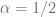
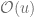
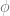
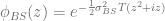
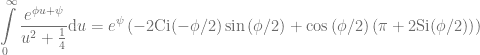
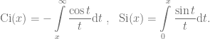
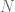
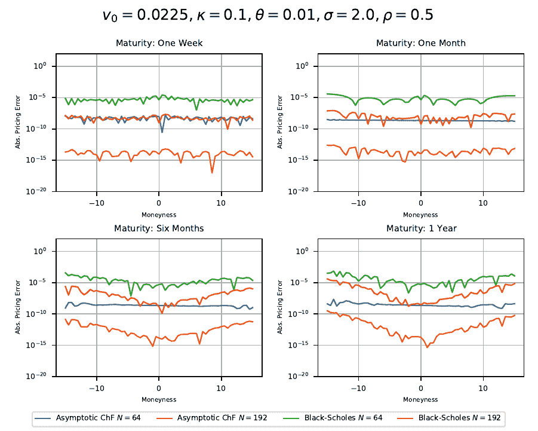
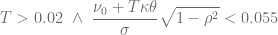

<!--yml

category: 未分类

date: 2024-05-13 00:10:32

-->

# 针对 Heston 模型的一种新的控制变量方法 - HPC-QuantLib

> 来源：[`hpcquantlib.wordpress.com/2020/08/30/a-novel-control-variate-for-the-heston-model/#0001-01-01`](https://hpcquantlib.wordpress.com/2020/08/30/a-novel-control-variate-for-the-heston-model/#0001-01-01)

针对 Heston 模型的半解析估值方法在极高的波动率情景下通常表现不佳。当观察卡尔-马登公式中期权价格的渐近行为时，可以更清晰地看到这些困难所在，其中（模型定义和更多参考资料请参见[这里](https://hpcquantlib.wordpress.com/2020/05/17/optimized-heston-model-integration-exponentially-fitted-gauss-laguerre-quadrature-rule/)）：

![\begin{array}{rcl} C(S_0, K, T) &=& Fe^{-rT} - \frac{\sqrt{Se^{(r-q)t}K}e^{-rt}}{\pi}\displaystyle\int\limits_{0}^{\infty}{\Re\left( e^{i u \left(\ln\frac{S}{K}+(r-q)T\right) } \frac{\phi_T\left(u-\frac{i}{2}\right)}{u²+\frac{1}{4}} \right)  \mathrm{d}u}\nonumber \\ \phi_T(z) &=& \exp\left\{\frac{v_0}{\sigma²}\frac{1-e^{-DT}}{1-Ge^{-DT}}\left(\kappa-i\rho\sigma z-D\right) + \frac{\kappa\theta}{\sigma²}\left(\left(\kappa-i\rho\sigma z-D\right)T-2\ln\frac{1-Ge^{-DT}}{1-G}\right) \right\} \nonumber \\  D&=&\sqrt{\left(\kappa - i\rho\sigma z\right)²+\left(z²+iz\right)\sigma²} \nonumber \\ G&=&\displaystyle\frac{\kappa -i\rho\sigma z-D}{\kappa -i\rho\sigma z + D}\end{array}](img/f8616e3316626a39e6ad151945aaa1cd.png).

将渐近展开式计算到的漫长计算得到

![\phi_T\left(u-\frac{i}{2}\right)\xrightarrow[]{u\rightarrow \infty} e^{\phi u + \psi}](img/852d3577f4418910d88bbd3351f1521e.png)

with

![\displaystyle \begin{array}{rcl} \phi &=& -\frac{1}{\sigma}\left(v_0 + \kappa\theta T \right)(\sqrt{1-\rho²} + i\rho)\nonumber \\ \psi &=& \frac{1}{\sigma²}\left[(\kappa - \rho\sigma/2)(v_0+\kappa\theta T) + \kappa\theta\log\left(4-4\rho²\right) - i\left(\rho²\sigma/2- \kappa\rho\right)\frac{v_0+\kappa\theta T}{1-\rho²} + 2i\kappa\theta\arctan{\frac{\rho}{\sqrt{1-\rho²}}} \right]\end{array}](img/37cb65f79173146f6ac3061ef01acce1.png)

高波动率导致减小，并进而导致积分被缓慢衰减，这使得任何类型的 Black-Scholes 控制变量都变得无效。

无效。另一方面，渐近展开式的积分具有易于评估的半解析解

与特殊函数，又称三角积分

此函数可以作为高效的控制变量，用于这些否则难以处理的高波动性参数集。使用不同阶数的 Gauss-Laguerre 积分进行与 Black-Scholes 控制变量的比较如下图所示。

作为经验法则，基于特征函数渐近展开的控制变量胜过标准的 Black-Scholes 控制变量，如果

.

该算法的 QuantLib 实现是[PR#898](https://github.com/lballabio/QuantLib/pull/898)的一部分。
