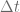

<!--yml

category: 未分类

日期：2024-05-17 23:41:59

-->

# 利用预处理器在 GPU 上加速 VPP 定价 – HPC-QuantLib

> 来源：[`hpcquantlib.wordpress.com/2012/01/22/accelerate-vpp-pricing-on-the-gpu-using-preconditioner/#0001-01-01`](https://hpcquantlib.wordpress.com/2012/01/22/accelerate-vpp-pricing-on-the-gpu-using-preconditioner/#0001-01-01)

如 Solving Sparse Linear Systems using CUSP and CUDA 中所述，可以使用基于隐式欧拉方案的有限差分方法在 GPU 上解决 VPP 定价问题。矩阵求逆是使用数值库 cusp 的 BiCGStab 求解器在 GPU 上执行的[1]。VPP 的最佳执行问题可以使用 GPU 上的动态规划来解决每个时间片（见[2]）。

隐式欧拉方案在的收敛次序较低并不是一个缺点，因为每小时的优化步骤无论如何都会强制。这个步长对于隐式欧拉方案来说足够小，以获得很高的准确性。显式欧拉方案在时甚至也是数值不稳定的。仅在大的和时收敛。

显然，矩阵求逆主导着定价程序的总运行时间。预处理是改善所涉及的 BiCGStab 算法性能的标准技术。cusp 库支持一组适合该问题的预处理器。

+   对角线：预处理非常便宜，但通常效果有限。

+   近似逆：具有不同丢弃策略的非对称布里德森。

+   平滑聚合：基于平滑聚合的代数多重网格预处理器。

在 CPU 上，[QuantLib](http://www.quantlib.org)支持基于[Thomas 算法](http://en.wikipedia.org/wiki/Tridiagonal_matrix_algorithm)的预处理。该算法使用次操作解决了一个三对角矩阵。相应的预处理器可以看作是对对角线预处理器的自然扩展。在 CPU 上的实验表明，三对角预处理器对我们的 VPP 定价问题会导致显著加速。即将发布的[CUDA 4.1](http://developer.nvidia.com/cuda-toolkit-41)版本的 CUSPARSE 库包含了 GPU 的三对角求解器。通过一个小的接口类，CUDA 三对角求解器可以被用作 cusp 预处理器。源代码在[这里](http://www.hpc-quantlib.de/src/gpupred.zip)可用。该代码依赖于最新的[QuantLib](http://quantlib.org/)版本，来自[SVN trunk](http://quantlib.svn.sourceforge.net/viewvc/quantlib/)。

测试床是一个具有和 4 周成熟度（对应个练习步骤）的 VPP 合同。因此，除了随机模型的三个维度之外，该问题还有一个大小为的第四维度，用于通过动态规划解决优化问题。

下图显示了在 GPU 和 CPU 上算法的不同运行时间。

在 GPU 上最快的算法（使用 BiCGStab 和三对角预处理器的隐式 Euler 方案）的性能比最佳 CPU 实现（基于 Douglas 方案的操作分裂）大约快十倍。非对称的 Bridson 预处理器与 Lin＆More 的 GPU 上的放弃策略是第二好的算法，但在更大的网格上会耗尽内存。对角线预处理器会降低 GPU 上的总体性能，而具有平滑聚合预处理器的 BiCGStab 算法没有收敛。

[1] cusp，[稀疏矩阵和图计算的通用并行算法](http://code.google.com/p/cusp-library/)

[2] 在 GPU 上定价虚拟电厂
