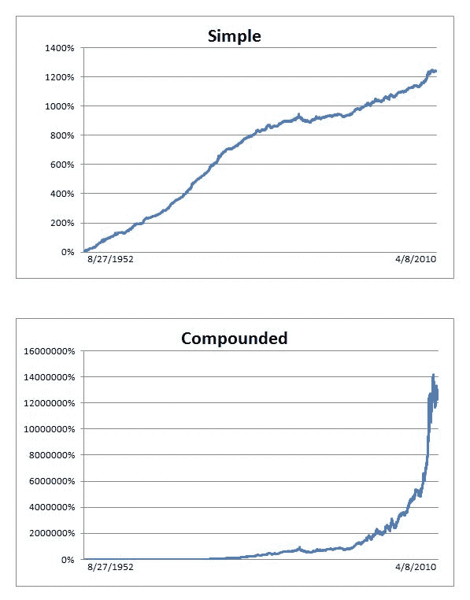

<!--yml

类别: 未分类

日期: 2024-05-12 18:31:28

-->

# S&P500 指数 1952 年至今的自适应 RSI | CSSA

> 来源：[`cssanalytics.wordpress.com/2010/04/10/adaptive-rsi-on-sp500-index-1952-present/#0001-01-01`](https://cssanalytics.wordpress.com/2010/04/10/adaptive-rsi-on-sp500-index-1952-present/#0001-01-01)

****自 1952 年 8 月 27 日至 2010 年 4 月 8 日交易^GSPC****

月度报告
