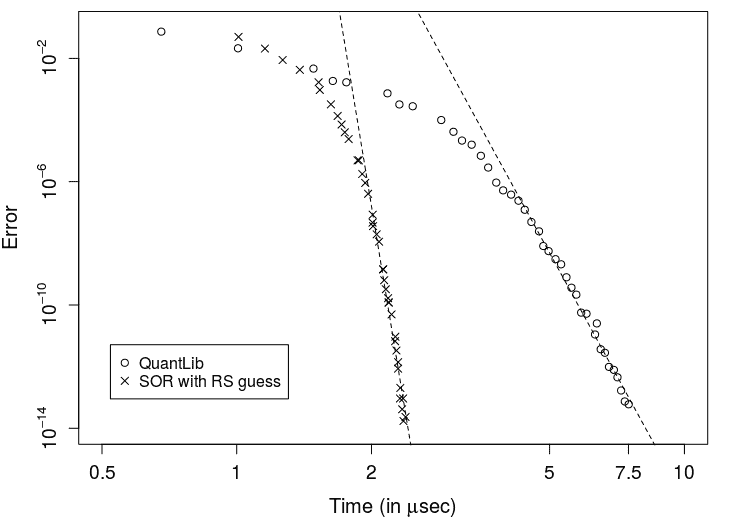

<!--yml

category: 未分类

date: 2024-05-13 00:18:23

-->

# 自适应 SOR 方法用于隐含波动率计算 – HPC-QuantLib

> 来源：[`hpcquantlib.wordpress.com/2017/08/06/adaptive-sor-method-for-implied-volatility-calculation/#0001-01-01`](https://hpcquantlib.wordpress.com/2017/08/06/adaptive-sor-method-for-implied-volatility-calculation/#0001-01-01)

最近 Fabien Le Floc’h [1] 在一篇博客文章中建议将自适应逐次超松弛法 [2] 与改进的显式近似隐含波动率公式 [3] 结合起来计算初始猜测值。这两种算法的实现都很简单。

一大批 OTM 和 ITM 期权以及不同的位移因子已被确定为基准组合，以便与原始 QuantLib 实现进行性能比较。从下图中可以看出，新方法的速度是当前 QuantLib 实现的两到三倍，具体取决于准确度。

这里提供了实现方法 [here](https://github.com/lballabio/QuantLib/pull/286/files)，上图源自类 BlackFormulaTest 中的 testImpliedVolAdaptiveSuccessiveOverRelaxation 测试用例。

[1] Le Floc_h, F (2017) [从 Black-Scholes 价格计算隐含波动率](http://chasethedevil.github.io/post/implied-volatility-from-black-scholes-price/)

[2] Li, M. (2008) [用于计算 Black-Scholes 隐含波动率的自适应逐次超松弛法](http://mpra.ub.uni-muenchen.de/6867/)

[3] J. Gatheral, I. Matic, R. Radoicic, D. Stefanica (2017), [更紧密的隐含波动率上限](https://papers.ssrn.com/sol3/papers.cfm?abstract_id=2922742)
