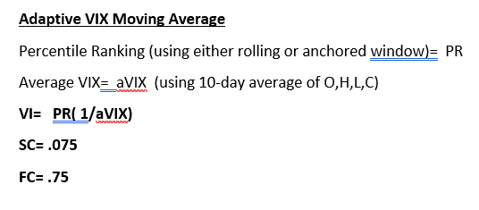

<!--yml

类别：未分类

日期：2024-05-12 17:39:32

-->

# 自适应 VIX 移动平均线 | CSSA

> 来源：[`cssanalytics.wordpress.com/2019/11/26/adaptive-vix-moving-average/#0001-01-01`](https://cssanalytics.wordpress.com/2019/11/26/adaptive-vix-moving-average/#0001-01-01)

技术或定量分析面临的挑战之一是确定能够适应不同市场环境的策略。最明显的是根据 VIX 代理的预测或隐含波动率的变化。在更具波动性的时期，我们预期会有更多的信号噪音，而在波动较小的时期，我们预期会有较少的信号噪音。但是我们如何在策略中捕捉到这一点呢？一种方法是使用 VIX 来标准化收益率，如本博客中所介绍的 [“VIX 调整动量”](https://cssanalytics.wordpress.com/2014/07/29/vix-adjusted-momentum/)。最近，[Justin Czyszczewski 进行了一项优秀的后续分析](https://justinczyszczewski.com/vix-and-trend-following/)，表明 VIX 调整的趋势跟踪最近在这些快速变动的市场中取得了很大成功（提示：使用 VIX 的 O、H、L、C 的中位数或平均值与收盘数据相比将使原始策略的优势在历史上更加一致）。我将很快在后续的帖子中展示一个新的变体，使用这个框架。

解决这个问题的另一种方法是根据 VIX 的变化调整回溯长度。那么我们应该如何做呢？进入[基本自适应移动平均框架](https://www.tradingtechnologies.com/xtrader-help/x-study/technical-indicator-definitions/adaptive-moving-average-ama/)，它试图根据一些波动性或趋势强度函数的函数变化移动平均线的速度或回溯。

我们可以轻松地通过观察波动性相对于过去历史的标准化度量来替换“VI”中的 VIX。如果它更高，我们想要更多平滑或更长的回溯期，如果它更低，我们想要更短的回溯期。可以通过以下方式实现：

基本上，我们正在使用到目前为止的所有历史记录的百分位排名，除以过去 10 天的平均 VIX 来可视化这个移动平均线的工作。我们可以在下面的图表中看到它应用于标普 500（SPY）的情况：

注意，在牛市期间，移动平均线非常接近价格，然后通过在纠正期间变得更加平滑来滤除噪音。这正是我们想要看到的！现在让我们比较一个使用当前价格的标准 200 日简单移动平均线策略和使用自适应 VIX 移动平均线滤波器的策略。

结果是总体性能（不包括交易成本）的显着提高，同时交易数量大大减少（48 比 164），这将进一步提高净性能。结果如下表所示：

这个概念可以通过在 AMA 线上使用简单移动平均来延伸多种方式，从而创建更快速的交叉策略，更能响应市场情况。最终，这是一种非常简单直观的方式，可以根据不断变化的波动率模式来调整标准的趋势跟踪。
