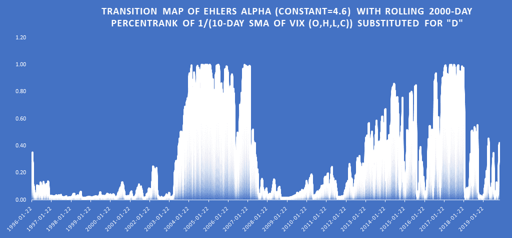
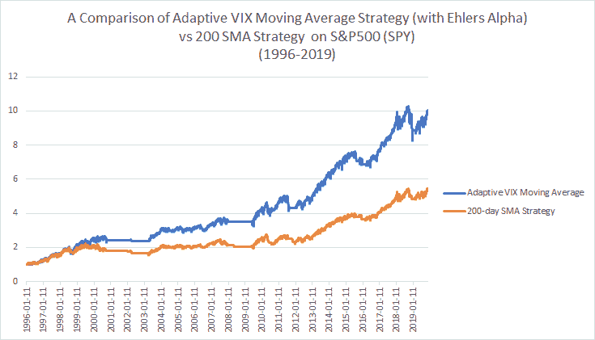
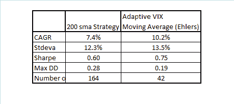

<!--yml

分类: 未分类

日期：2024-05-12 17:39:16

-->

# 具有 Ehlers Alpha 公式的自适应 VIX 移动平均线 | CSSA

> 来源：[`cssanalytics.wordpress.com/2019/12/04/adaptive-vix-moving-average-with-ehlers-alpha-formula/#0001-01-01`](https://cssanalytics.wordpress.com/2019/12/04/adaptive-vix-moving-average-with-ehlers-alpha-formula/#0001-01-01)

在[上一篇文章](https://cssanalytics.wordpress.com/2019/11/26/adaptive-vix-moving-average/)中，我描述了一种相对简单的方法，将 VIX 纳入著名的 AMA 或自适应移动平均框架中。Alpha 公式需要两个单独的参数-短期和长期常数，这需要用户更大的规范。理想情况下，您需要指定的参数越少越好（尽管重要的是要注意，逻辑上的最大滞后和最小响应性的要求通常倾向于决定界限）。

Ehlers 在他关于[“分形自适应移动平均”](http://www.stockspotter.com/Files/frama.pdf)的论文中建议使用以下公式来[计算指数平均值中的 Alpha](https://www.investopedia.com/ask/answers/122314/what-exponential-moving-average-ema-formula-and-how-ema-calculated.asp):

**alpha= exp(- 4.6*(D -1))**

其中 D 类似于前一篇文章中的“VI”或趋势因子。请注意，这个公式是以不同的方式调整的，用于创建自适应波动率度量，[在这篇文章中](https://cssanalytics.wordpress.com/2017/11/15/adaptive-volatility/)。我发现它非常有用和直观，所以它代表了上一篇文章中 AMA 框架的一个可行替代方案。

根据读者反馈，我将简化百分位数函数为 2000 天的滚动回溯，以便更容易避免在复制中的混淆（之前使用的是锚定回溯或“扩展时间窗口”）。我们可以用 VIX 的 10 天 SMA 的 1/(百分位数)替换公式中的“D”，并使用 Alpha 输出计算 SPY 的 EMA/指数移动平均值。以下是自适应 Alpha 应该看起来像回溯到 1996 年：

请注意，较高的 Alpha 意味着更快的移动平均（更少的平滑和滞后），而较低的 Alpha 意味着更慢的移动平均（更多的平滑和滞后）。我们可以看到在上图中，大多数时候 Alpha 在牛市中较高，在熊市中较低（90 年代是一个例外）。毫无疑问，VIX 和均值回归之间存在关系，在 Alpha 测量较低的时期，这种关系在 SPY 上的效果很好。事实上，我的研究显示，在这个 Alpha 测量较低的情况下，在下跌日购买的盈利能力是高的。这意味着在价格嘈杂或均值回归时进行更多的平滑处理，而在价格是明天价格的良好估计时进行较少的平滑处理。显然，这正是我们在创建自适应过滤器时寻找的东西。

现在让我们看看这种新的过渡计算在自适应移动平均框架中的表现。再次比较当 SPY 的收盘价 > 200sma 时的买入策略与 AMA> 200sma 的策略。

与之前的帖子一致，AMA 策略优于基本的 200sma 策略，交易次数更少。在这种情况下，Ehlers alpha 方法导致的结果与使用经典的 AMA 框架计算 alpha 非常相似，但交易次数更少。请注意，“D”为 4 对比 4.6 产生了与经典 AMA 框架相近的表现和交易次数。无论哪种情况，我希望这表明使用 VIX（或您可以使用历史波动率或 GARCH）作为自适应移动平均的替代品，而不是使用价格，具有较高的鲁棒性。在我看来，使用自适应方法来平滑而不是使用静态平滑方法，更糟糕的是在趋势跟踪策略中使用实际价格，这是合乎逻辑的。
