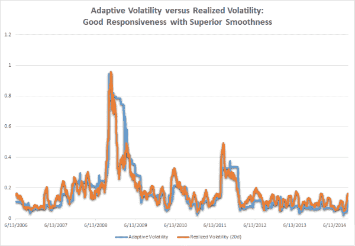
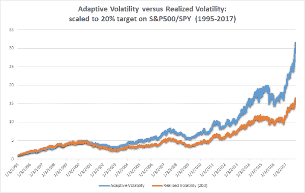
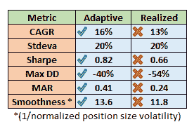

<!--yml

分类：未分类

日期：2024-05-12 17:44:39

-->

# 自适应波动性 | CSSA

> 来源：[`cssanalytics.wordpress.com/2017/11/15/adaptive-volatility/#0001-01-01`](https://cssanalytics.wordpress.com/2017/11/15/adaptive-volatility/#0001-01-01)

设计策略中的固有挑战之一是需要指定某些参数。波动性参数通常不受回看的影响，但是使用短期波动性与使用长期波动性存在固有的权衡。前者对当前市场条件更具响应性，而后者更加稳定。一种方法是使用一系列回看来减少估计量或策略的方差，即你减少了错误的风险。但另一方面，你并没有提高准确性或减少偏差。最终，你不希望低估相关特征，就像你不希望在数据中过度拟合随机噪音一样。预测波动性有助于实现解决方案，但更加复杂，因为要实施并交换回看参数以获得一组新的参数。使用市场为基础的衡量方法，例如期权市场具有最少的参数和固有的假设，理论上可以提高准确性，但数据不容易获得，并且更适用于个别股票而不是宏观市场。

另一种方法是创建一种“自适应”波动性测量，其根据市场情况变化其回看。使用指数移动平均框架，我们可以应用过渡函数，该函数使用某个变量来帮助我们决定什么情况应该需要更短或更长的回看。更具体地说，我们使用所选预测变量的数学变换来改变指数移动平均的平滑常数或 alpha。这种方法的好处在于，它可以通过将短期或长期波动性视为市场条件的函数来潜在地改善结果，并且可以优于选择单个参数或多个参数的篮子。此外，它可以在响应性和平滑度之间取得更好的平衡，这可以在交易成本成为问题时产生更好的结果。

我们如何选择这个预测变量？关于波动性有两点观察可以帮助我们确定使用什么：

1.  波动性在特定市场体制内可能会回归均值-这有利于长期回看波动性，以避免在仓位大小上进行低效和反生产力的变化

1.  波动性在过渡到新的市场体制时可能会上升或下降-这有利于更短期的回看波动性，以通过增加或减少仓位大小迅速做出响应。

我们不能确切地预测我们处于哪种情况，所以解决这些问题的最简单方法是查看市场是处于趋势还是均值回归。最简单的方法是使用所选市场的基础价格相对于时间的 R 平方。高的 R 平方表示强线性拟合，或趋势程度高，而相反则表示区间或横向市场。如果市场处于趋势状态（R 平方较高），那么我们希望缩短我们的回溯期，以确保我们可以捕捉到任何突然或突然的波动变化。如果市场没有趋势或均值回归（R 平方较低），那么我们希望延长我们的回溯期，因为我们也期望波动性应该回归到其历史长期均值。

**过渡函数：**

为了将 R 平方值转换为平滑常数（SC）或指数移动平均值的 alpha，我们需要进行数学转换。由于市场呈对数正态分布，指数函数是最合理的选择。

**SC=  EXP（-10 x（1- R-squared（price/time，length））**

**MIN（SC，0.5）**

为了获得更稳定的 R 平方度量，我们使用 20 天的回溯期，但 15 到 60 天的值都是合理的（较短的会更嘈杂，较长的会有更大的滞后）。通过选择上述公式中的-10，这将默认为几乎固定或始终回溯的历史波动性回溯期，我们期望这将在波动性均值回归时作为“公平价值”的指示。（严格来说，如果 R 平方为零，则将（2-SC）/SC 代入给出 44052 的有效回溯期。）通过选择 MAX SC 为 0.5，我们将平滑期限制为最低回溯期为实际上的 3 天（2/（n+1）=SC）。因此，自适应波动率度量可以将其有效的回溯窗口在 3 天和全部历史之间变化。

这个公式被应用于获取平方回报的指数移动平均值。将其转化为年化波动率，你需要取最终值的平方根，并乘以 252 个交易日的平方根。我们可以将其与通常使用的标普 500（SPY）的 20 天实现波动性进行比较以可视化差异：

考虑到自适应波动率使用的平均回溯期比 20 天长得多，我们可以看到在趋势波动性期间，它具有相当的响应性，并且在均值回归波动性期间具有平稳或不变的波动性。这导致了更高准确度和更低周转率的理想组合。即使不考虑交易成本，结果也令人印象深刻（请注意，下面的示例中的杠杆比例没有受到限制，以便孤立出纯粹的差异）：

结果显示，自适应波动性优于实现波动性，尽管没有显示出来，但这在所有实现回看窗口中都是正确的。相对于 20 天的实现波动性，自适应波动性在年度表现上优于 3%，而标准偏差相同。考虑交易成本后，这种收益差距会显著增加。风险调整后的收益更高，但更令人印象深刻的是，即使在相同的波动率水平下，这也伴随着更低的回撤。这是由于响应性和平滑性的更好组合。无论哪种情况，我相信自适应波动性是值得考虑的一个替代工具。人们可以提出各种不同的预测因子和转换公式进行研究，这可能更优越——使用 R 平方的目的是它恰好是简单直观的，加上指数转换函数。
