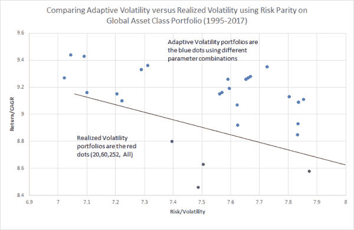
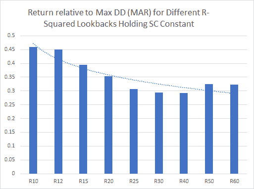

<!--yml

category: 未分类

date: 2024-05-12 17:44:18

-->

# 自适应波动性：使用全球风险平价进行稳健性测试 | CSSA

> 来源：[`cssanalytics.wordpress.com/2017/11/29/adaptive-volatility-a-robustness-test-using-global-risk-parity/#0001-01-01`](https://cssanalytics.wordpress.com/2017/11/29/adaptive-volatility-a-robustness-test-using-global-risk-parity/#0001-01-01)

在上一篇文章中，我们介绍了使用自适应波动性的概念，以便根据市场情况具有灵活的回看。我们使用价格的 R 平方作为基础市场趋势的强度的代理，以便在指数移动平均框架中变化半衰期。过渡函数使用指数公式转换为平滑常数。这种方法可能受欢迎的原因有很多，从制度或状态相关波动性框架，到通过更加响应市场反馈循环来改善尾部风险缓解，如 Alpha Architect 的[这篇文章](https://alphaarchitect.com/2017/11/14/can-asset-bubbles-mathematically-quantified-burst/)中所述。在后一种情况下，通过在市场似乎形成任何方向的泡沫时缩短波动性回看（如由趋势指标，如赫斯特指数或 R 平方测量），我们可以更快地调整波动性以适应市场条件的变化。

为了测试自适应波动率测量的稳健性，我们决定采用形成风险平价投资组合的方法，受到[这篇文章](https://blog.thinknewfound.com/2017/11/risk-parity-much-data-use-estimating-volatilities-correlations/)的启发，该文章由新发现研究提供。 我们简单的全球风险平价投资组合使用五大主要资产类别：国内股票（VTI）、商品（DBC）、国际股票（EFA）、债券（IEF）和房地产（ICF）。 选择 VTI 是有意的，因为我们已经使用 SPY 进行了第一次测试。 VTI 包含全方位的国内股票，包括大型、中型和小型市值，而 SPY 仅限大型市值。 我们创建了简单的风险平价投资组合（仓位大小等于 1/波动率，按资产间逆波动率之和缩放） ，每周重新平衡，并在执行上延迟 1 天。 对于已实现波动率投资组合，我们单独运行每个投资组合，使用包括 20 天、60 天、252 天和所有历史记录在内的各种参数。 为了测试自适应波动率，我们运行了 27 个不同的投资组合，这些投资组合变化了最大平滑常数和 R 平方回看。 平滑常数在.1、.5 和.9 之间变化，R 平方回看使用 10、12、15、20、25、30、40、50 和 60 天变化。 我们选择保持乘数（原始帖子中的-10）不变，因为它是设计上最长回溯（所有历史记录）的代理。 测试期间从 1995 年至今，必要时我们使用 ETF 的指数进行扩展以回溯时间。 在下图中，我们为每个投资组合绘制了回报与风险的图表。

我们使用一条线来分隔已实现波动率投资组合的表现，以更好地说明自适应波动率投资组合的表现优势。 所有参数组合在回报方面表现都优于已实现波动率投资组合。 就风险调整后的回报或夏普比率而言，已实现波动率投资组合在所有投资组合分布的 0％、3.3％、13.3％和 33％百分位数上排名--换句话说，几乎所有自适应投资组合在风险调整后的基础上也表现优异。 使用某些参数对自适应波动率投资组合有系统性优势吗？ 事实证明，最大平滑常数的选择不如 R 平方的选择重要。 我们在先前的帖子中指出，平均而言，较短的 R 平方参数比长参数更可取，只要它们不要太短以至于捕捉到噪声。 较短的回看期应该使自适应波动率更快地适应当前市场情况，从而减少回撤并改善回报。 当我们对平滑常数值求平均（保持它们恒定）并查看作为 R 平方回看函数的最大回撤（MAR）的回报时，就会验证这种模式。

显然，短期 R 平方值相对于最大回撤改善了收益。虽然未显示，但回撤要低得多，驱动了这种效果，而收益表现出了较为适度的改善。较短的回看期的缺点是增加了换手率，可以通过较长的再平衡窗口或通过改进的平滑措施或规则来减轻资产配置变化的影响而进行缓解。另一种选择是对所有可能的 R 平方和平滑常数组合进行平均，倾向于较短的 R 平方参数，以在灵敏度和平滑度之间取得良好的平衡，同时减轻参数选择不当的风险。

总之，这个简单的稳健性测试似乎表明自适应波动性相对稳健，并且可能具有实际价值，可以作为实现波动率的替代品或补充。我们将进行一些单一股票测试，以进一步研究这种效应，并可能与传统的预测方法（如 GARCH）进行比较。对这个概念的额外探索可以通过改变过渡公式或趋势指标的选择来进行。最后，将这些方法测试在一个更正式的波动率预测模型中可能是有价值的，而不仅仅是使用回测，并根据哪些参数在每一天最有效来校准参数。

本网站上的信息由 David Varadi, CFA 提供，保留所有权利，仅供信息目的而编制，并不构成购买或出售任何证券、产品或其他金融工具的要约。所有投资和策略都存在风险，包括本金损失，并且不能仅凭图表或图表来做投资决策。任何博客或文章的作者主要负责其准备工作，并表达他们自己的观点和见解，这些观点和见解可能随时改变，并可能与我们公司或其关联公司的其他人士的观点或意见不同。提出的任何结论或前瞻性陈述都是推测性的，并不打算预测任何特定投资策略的未来或绩效。任何转载的材料都是经过拥有者的许可而进行的。
