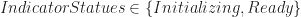
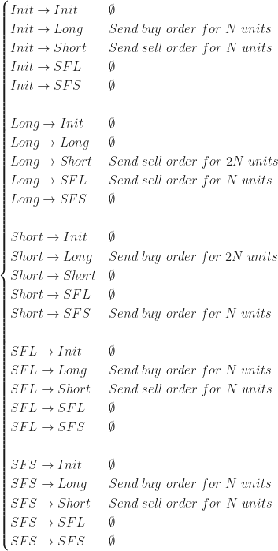

<!--yml

category: 未分类

date: 2024-05-18 13:59:50

-->

# Algorithm design and correctness – Quantum Financier

> 来源：[`quantumfinancier.wordpress.com/2018/02/24/algorithm-design-and-correctness/#0001-01-01`](https://quantumfinancier.wordpress.com/2018/02/24/algorithm-design-and-correctness/#0001-01-01)

让你编写的软件可以访问你或你公司的现金账户是一件可怕的事情。当手动执行交易时出错已经够糟糕了（如果你还没有经历过，你可以相信我的话），但当一段软件在一个紧密循环中进行意外交易时，这可能是一场灭绝事件。换句话说，没有比让不正确的软件与市场互动更快的自我焚化方法了。显然，正确性是算法设计的关键部分。那么人们该如何确保^(1)它呢？

抽象地说，一个交易算法只是一组根据事物状态采取的具体行动。这种状态可以是算法本身的内部状态（如持仓、工作订单等），也可以是与外部世界相关联的（当前/历史市场状态、现金余额、风险参数等）。因此，我自然会将它们视为有限状态机（FSM）。这有一些直接的优势。有限状态机在计算机科学领域是一个非常成熟的抽象，因此无需重复发明轮子，因为最佳实践已经得到广泛接受。由于它们经常被使用，你几乎可以确定能够找到针对你所选择的语言实现的有限状态机的示例。例如，在 Python Package Index 上搜索“有限状态机”会返回超过 100 种不同的框架。我相信对于几乎任何现代语言，结果都会类似。话虽如此，在我们深入研究一些模式应用之前，让我们先回顾一下。

根据维基百科的说法，有限状态机是一种抽象机器，它在任何给定时间都可以处于有限数量的状态之一。有限状态机可以根据一些外部输入从一个状态转换到另一个状态；从一个状态转换到另一个状态称为一个转换。有限状态机由其状态列表、其初始状态和每个转换的条件定义。我们将使用海龟交易系统 2 的规则作为示例。规则如下概括：

**进场：当价格突破前 55 天的最高价（低于前 55 天的最低价）时，做多（做空）。**

**当价格跌破前 20 天的最低价（高于前 20 天的最高价）时，退出：做空（做多）。**

正如我们之前所学的，要完全定义一个有限状态机（FSM），我们需要列出其状态、初始状态以及每个转换的条件。然后我们必须将这些交易规则转换为适当的有限状态机定义。

根据上述规则，我会定义以下交易状态：  除了交易状态外，以下状态也将被定义，因为它们与策略相关：  最后 。也就是说，我们的算法的状态空间由以下三元组定义： 

如果您能原谅我对符号的滥用，以下概述了状态转换及其相应的条件：

![\begin{cases} Init\rightarrow Init & IndicatorStatus=Initializing \\Init\rightarrow Long & IndicatorStatus=Ready\land Prc_{t}>High50_{t} \\Init\rightarrow Short & IndicatorStatus=Ready\land Prc_{t}<Low50_{t} \\Init\rightarrow SFL & \emptyset \\Init\rightarrow SFS & \emptyset \\ \\Long\rightarrow Init & \emptyset \\Long\rightarrow Long & Prc_{t}\ge Low20_{t} \\Long\rightarrow Short & Prc_{t}<Low50_{t} \\Long\rightarrow SFL & Low50_{t}\le Prc_{t}<Low20_{t} \\Long\rightarrow SFS & \emptyset \\ \\Short\rightarrow Init & \emptyset \\Short\rightarrow Long & Prc_{t}>High50_{t} \\Short\rightarrow Short & Prc_{t}\le High20_{t} \\Short\rightarrow SFL & \emptyset \\Short\rightarrow SFS & High20_{t}<Prc_{t}\le High50_{t} \\ \\SFL\rightarrow Init & \emptyset \\SFL\rightarrow Long & Prc_{t}>High50_{t} \\SFL\rightarrow Short & Prc_{t}<Low50_{t} \\SFL\rightarrow SFL & Low50_{t}\le Prc_{t}\le High50_{t} \\SFL\rightarrow SFS & \emptyset \\ \\SFS\rightarrow Init & \emptyset \\SFS\rightarrow Long & Prc_{t}>High50_{t} \\SFS\rightarrow Short & Prc_{t}<Low50_{t} \\SFS\rightarrow SFL & \emptyset \\SFS\rightarrow SFS & Low50_{t}\le Prc_{t}\le High50_{t} \end{cases}](img/1b7d638274224e67954875e3498a0b13.png)

知道可能的状态转换后，我们可以确定每个实例中需要采取的交易行动：

这显然是一个用来阐明我的观点的简单示例，但让我们考虑一下设计。首先，很明显每个状态是相互排斥的，这是有效有限状态机的先决条件。简单地说，这意味着在任何时间点上我都可以评估状态并清楚地了解算法试图做什么，因为在那个特定的时间点上只能有一种可能的转换。如果我决定定义以下转换，情况就不会是这样：

在这种情况下，两个条件都可能评估为真，因此可能存在多个可能的状态转换。看日志时，你怎么知道这个算法试图做什么？在这种情况下，情况再次显而易见，但在更复杂的有限状态机中，我总是觉得值得花时间仔细考虑整个状态空间，并以类似上述的方式清晰地定义算法行为。这可能看起来很啰嗦，但在我写下一行生产代码之前，我都会在纸上虔诚地做这件事。

同样的模式也可以用在交易堆栈的其他部分。例如，您的订单管理系统可以将订单定义为具有以下状态的有限状态机（FSM）：。在这种情况下，转换将与接收交换订单事件有关，例如确认、拒绝消息等。如果你停下来想一想，你几乎可以用几乎没有别的东西而只是 FSMs 来设计整个交易堆栈。通过使用 FSMs，您可以设计以确保算法的正确性，并消除可能潜入的一整类潜在设计缺陷。

这种模式在面向对象设计中非常合适，其中状态和相关行为可以被组织成良好解耦的类。尽管如此，一些函数式语言提供了一种类型系统，当正确使用时可以为您提供额外的保证，并且可以帮助您构建一些非常强大的抽象。我们将在随后的文章中详细讨论一个例子。与此同时，我一如既往地很感兴趣，听听你在工作中发现了哪些模式有用。

* * *

^(1\. 或者尽可能接近确定性！↩)
