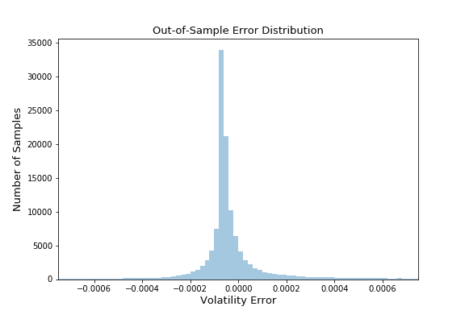

<!--yml

category: 未分类

日期：2024-05-13 00:14:10

-->

# 几乎完全精确的 SABR 插值使用神经网络和梯度提升树 - HPC-QuantLib

> 来源：[`hpcquantlib.wordpress.com/2019/10/12/almost-exact-sabr-interpolation-using-neural-networks-and-gradient-boosted-trees/#0001-01-01`](https://hpcquantlib.wordpress.com/2019/10/12/almost-exact-sabr-interpolation-using-neural-networks-and-gradient-boosted-trees/#0001-01-01)

**更新 03-11-2019**：基于神经网络添加了无套利的 SABR 校准。

SABR 模型有非常高效的近似方法


就像原始的 Hagan 等人的公式[1]或其变体[2]一样，但这些解析公式通常不是无套利的。求解相应的偏微分方程导致无套利解决方案


但是计算量很大。这里的基本思想是使用神经网络或梯度提升树来插值（预测）解析近似值与大量模型参数的精确结果之间的差异。

第一步是通过利用 SABR 模型的缩放对称性来减少参数空间的维数 [3]


所以我们可以将重点放在的情况上，而不失一般性

.

这反过来也限制了的“自然”参数空间，将被设置为

.

接下来要做的是建立一个高效的 PDE 求解器以准备训练数据。QuantLib 求解器已经支持两种标准的误差减少技术，即围绕重要点的自适应网格细化和围绕收益特殊点的单元平均。后者确保空间方向上平稳的二阶收敛 [4]。Hundsdorfer-Viewer ADI 方案在时间方向上也是二阶的，并且在开始时额外的 Rannacher 平滑步骤也将确保时间方向上的平稳收敛 [5]。因此，Richardson 外推可用于提高整体算法的收敛阶数。如下所示的例子定价为


如下图所示，对比展示了 Richardson 外推的效率。缩放因子为 1.0 的原始网格大小为。


训练数据是通过五维拟随机蒙特卡洛 Sobol 序列生成的，适用于参数范围

![\displaystyle \alpha \in [0, 1], \ \beta \in [0, 1], \ \rho \in [-1, 1], \ \nu \in [0, 1], T\in [\frac{1}{12}, 1]](img/2dd7bbbc34c6adf7d3784b69fbcd24d6.png)。

风险中性密度分布的和分位上的罢工均等地分布在 SABR 模型的 ATM 波动率上。PDE 求解器不仅会计算的公平价值，还将计算周围一系列现货价值的价格。利用 SABR 模型的缩放对称性，可以利用计算新的和值下的更多价格。

培训集包括 617K 个样本值。网络经过训练以适应偏微分方程解的正确 SABR 波动率和 Floc’h-Kennedy 近似值之间的差异。它不需要一个大型的神经网络来插值参数空间，例如以下 Tensorflow/Keras 模型定义用于下面的示例中，共有 46K 个参数。

```
model = Sequential()
model.add(Dense(20, activation='linear', input_shape=(7, )))
model.add(Dense(100, activation='linear'))
model.add(Dense(400, activation='sigmoid'))
model.add(Dense(10, activation='tanh'))
model.add(Dense(1, activation='sigmoid'))
model.compile(loss='mae', optimizer='adam')

```

对于神经网络的预测能力，始终重要的是对输入数据进行归一化处理，例如使用 sklearn.preprocessing.MinMaxScaler。神经网络的样本外平均绝对误差约为年化波动率的 0.00025，远优于 Kennedy-Floc’h 或 Hagan 等近似值。。

下图显示了使用来自先前[文章](https://hpcquantlib.wordpress.com/2019/01/11/finite-difference-solver-for-the-sabr-model/)的参数示例的正确波动率与不同近似之间的差异。 还可以使用梯度树提升算法，如 XGBoost 或 LightGBM。例如，模型

```
xgb_model = xgb.XGBRegressor(nthread=-1,
                             max_depth=50,
                             n_estimators=100,
                             eval_metric ="mae")

gbm_model = lgb.train({'objective': 'mae',
                       'num_leaves': 500 }
                      lgb.Dataset(train_X, train_Y),
                      num_boost_round=2000,
                      valid_sets=lgb_eval,
                      early_stopping_rounds=20)

```

导致 XGBoost 的样本外平均绝对误差为 0.00030，LightGBM 为 0.00035。乍一看，插值看起来很平滑，如下图所示，使用相同的 SABR 模型参数，但放大后会暴露出不可微分的点，这破坏了稳定的希腊字母。

不同近似的平均运行时间如下表所示。


通过这种高效的定价程序，可以在几分之一秒内完成完整 SABR 模型的校准。为了测试这种方法，已经使用了几个 Heston 参数配置来计算单个到期日的 15 个基准期权的隐含波动率。使用标准的 Levenberg-Marquardt 优化器通过 PDE 定价器或神经网络定价器校准了完整的 SABR 模型。如预期的那样，神经网络校准程序只花费了 0.2 秒，但 PDE 校准则平均花费了半小时以上。

[1] P. Hagan，D. Kumar，A. Lesnieski，D. Woodward：[管理微笑风险。](http://web.math.ku.dk/~rolf/SABR.pdf)

[2] F. Le Floc'h，G. Kennedy：[通过简单扩展明确 SABR 校准。](https://papers.ssrn.com/sol3/papers.cfm?abstract_id=2467231)

[3] H. Park：[SABR 模型的高效定价方法。](https://arxiv.org/pdf/1308.0665.pdf)

[4] K. in't Hout：[金融中的数值偏微分方程解释。](https://www.palgrave.com/de/book/9781137435682)。

[5] K. in't Hout，M. Wyns：Hundsdorfer–Verwer 方案在具有混合导数项的二维对流扩散方程中的收敛性。
