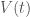
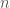

<!--yml

类别：未分类

日期：2024-05-18 08:08:42

-->

# 分析性信用敞口，C++中的示例代码 | 量化角

> 来源：[`quantcorner.wordpress.com/2013/02/27/analytical-credit-exposure-in-c/#0001-01-01`](https://quantcorner.wordpress.com/2013/02/27/analytical-credit-exposure-in-c/#0001-01-01)

在这篇文章中，我们快速回顾了一些与**交易对手风险**相关的概念，并提供了一些计算**信用敞口**的**C++**代码。

如果您阅读了**乔恩·格雷戈里**的书**《交易对手信用风险和信用价值调整：全球金融市场的持续挑战》**，您应该会认识到我们实际上将**乔恩·格雷戈里**的电子表格**电子表格 2.2** 和**电子表格 2.2b**从工作簿**chapter2.xls**中的工作簿“CVA 中心”[CVACentral](http://www.cvacentral.com "CVA 中心")移植到了**C++**中。

首先，让我们考虑一个单一资产（*例如*，场外期权），并让：

– **** 为时间处的资产价值，

– **** 为概率密度函数（pdf） 的函数，以及

– **** 为到期时间。

# 标记为**MARK-TO-MARKET（MtM）**

**MtM** 表示如果交易对手违约可能会潜在损失的价值。

# **替换成本**

替换成本可能与**MtM**（*例如* 在不流动的市场上）不同。尽管如此，通常的做法是基于给定交易的当前**MtM**价值来计算**信用敞口**。

# **敞口** 和 **正敞口**

在**MtM**方面存在潜在损失的不对称性。如果他们的**MtM**为正，机构会损失。但是，如果**MtM**为负，则不会获利。因此，只有*正*的敞口才关乎**信用风险**。


**潜在未来敞口（PFE）**

**PFE** 的目标是在未来某个时间点刻画**MtM**。它是在给定*时间范围*和给定*置信水平*下的可能敞口。**PFE** 在很多方面与[**风险价值**](https://quantcorner.wordpress.com/2012/09/12/var-with-normally-distributed-returns-using-boos/ "使用 Boost 计算正态分布回报的风险价值")的概念相似。


在实践中，**信用敞口** 是通过在离散模拟时间段（）内取资产的所有正值或替换成本的总和来计算的。


# **预期敞口**

**当前暴露**是指今天曝光的替换成本。在时间的**预期暴露**是在时间的**平均暴露**，即


我们现在转向**C++**代码，其中包括类定义文件、类实现文件和测试文件：

```
// Analytical_Credit_Exposure.hpp

// Édouard Tallent @ TaGoMa.Tech
// February 2013
// QuantCorner: https://quantcorner.wordpress.com

#ifndef ANALYTICAL_CREDIT_EXPOSURE
#define ANALYTICAL_CREDIT_EXPOSURE

class AnalyticalCE
{
public:
    double EE() const;
    double PFE() const;
    double EEThreshold() const;
    double PFEThreshold() const;

public:
    double mu;      // expected MtM
    double sig;     // s.d of the MtM
    double alpha;   // confidence level
    double t;       // threshold variable

public:
    AnalyticalCE(); // Default constructor
    AnalyticalCE(const AnalyticalCE& ace);  // Copy constructor
    virtual ~AnalyticalCE();    // Virtual destructor
    AnalyticalCE& operator = (const AnalyticalCE& cred);    // Assignment operator 

};
#endif
```

```
// Analytical_Credit_Exposure.cpp

// Édouard Tallent @ TaGoMa.Tech
// February 2013
// QuantCorner: https://quantcorner.wordpress.com

#include <cmath>
#include <boost\math\distributions\normal.hpp>
#include "Analytical_Credit_Exposure.hpp"

double AnalyticalCE::EE() const
{
    return mu * boost::math::cdf(boost::math::normal(), mu/sig) +
        sig * boost::math::pdf(boost::math::normal(), mu/sig);
}

double AnalyticalCE::PFE() const
{
    return mu + boost::math::quantile(boost::math::normal(), alpha) * sig;
}

double AnalyticalCE::EEThreshold() const
{
    return mu * (boost::math::cdf(boost::math::normal(), mu/sig) -
        boost::math::cdf(boost::math::normal(), (mu - t)/sig)) +
        sig * (boost::math::pdf(boost::math::normal(), mu/sig) -
        boost::math::pdf(boost::math::normal(), (mu - t)/sig)) +
        t * boost::math::cdf(boost::math::normal(), (mu - t)/sig);
}

double AnalyticalCE::PFEThreshold() const
{
    return std::min(t , mu + boost::math::quantile(boost::math::normal(), alpha) * sig);
}

AnalyticalCE::AnalyticalCE() : mu(0.0), sig(20.0), alpha(0.95), t(0.10)
{
    // Constructor initializer
}

AnalyticalCE::AnalyticalCE(const AnalyticalCE& ace) : mu(ace.mu),
    sig(ace.sig), alpha(ace.alpha), t(ace.t)
{
    // Copy constructor
}

AnalyticalCE::~AnalyticalCE()
{
    // Destructor
}

AnalyticalCE& AnalyticalCE::operator = (const AnalyticalCE& cred)
{
    if (this == &cred)
        return *this;
}
```

```
// Analytical_Credit_Exposure_test.cpp

// Édouard Tallent @ TaGoMa.Tech
// February 2013
// QuantCorner: https://quantcorner.wordpress.com

#include "Analytical_Credit_Exposure.hpp"
#include <iostream>

int main()
{
    try
    {
        // Creation of an AnalyticalCE object
        AnalyticalCE risk;
        risk.mu = 0.00;
        risk.sig = 0.20;
        risk.alpha = 0.90;
        risk.t = 0.10;

        // Print out to the console
        std::cout << "Expected exposure:\t\t\t\t" << risk.EE() << std::endl;
        std::cout << "Potential future exposure:\t\t\t" << risk.PFE() << std::endl;
        std::cout << "Expected exposure for a given threshold:\t" << risk.EEThreshold() << std::endl;
        std::cout << "Potential future exposure for a given threshold:" << risk.PFEThreshold() << std::endl;
    }
    catch(std::exception& e)
    {
        std::cout << "Error Message:\t" << e.what() << std::endl;
    }

    return 0;
}
```

最终，控制台输出：


**感谢 Jon Gregoy 抽出时间通过电子邮件回答我的问题。*
