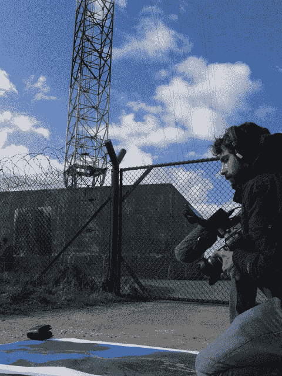

<!--yml

分类：未分类

日期：2024 年 05 月 18 日 14:15:31

-->

# 美国证监会说“不” - 马瓦狙击手和朋友们

> 来源：[`sniperinmahwah.wordpress.com/2015/03/27/and-the-sec-said-nope/#0001-01-01`](https://sniperinmahwah.wordpress.com/2015/03/27/and-the-sec-said-nope/#0001-01-01)

我不怎么看电视（我不是电视的粉丝），但大约两三周前，我偶然看到了 Canal+ 的 *Le Grand Journal* 脱口秀节目 - 我们可以说 *Le Grand Journal* 或多或少是法国版的（已故）*Colbert Report* 或者 *大卫·莱特曼秀*，但是，嗯，没有斯蒂芬·科尔伯特的才华。这种节目不是我的菜，但有三个人（一个记者和两个科学家，我想）被邀请来谈论人工智能 - “人工智能将如何改变我们的世界”等等。这是真的：人工智能引发了很多关于我们未来以及人类将如何与机器互动的迷人而又伦理的问题，但当被问及人工智能潜在的致命后果时，记者回答说：我们已经有了一场由人工智能引起的灾难，那就是 2010 年 5 月 6 日的“闪电崩盘”。哇！ Nanex 和 Waddell and Reed 都会喜欢这个。美国证监会也是。

去年，我真的很惊讶，因为这位记者邀请我谈论我的书（顺便说一句，我将写一篇简短的文章介绍我的书，因为我经常被问到是否有英文译本；答案是否定的……至少还没有）。他是[La Tête au Carré](http://www.franceinter.fr/emission-la-tete-au-carre)的主持人，这是法国国家频道 France Inter 播出的关于科学的最佳节目之一。我非常清楚地记得这个[节目](http://www.franceinter.fr/emission-la-tete-au-carre-trading-haute-frequence-la-finance-a-toute-vitesse)，因为我当时有[Frédéric Abergel](https://www.linkedin.com/in/abergel)陪同，他在巴黎中央理工学院应用系统数学实验室工作（该实验室的一些前学生现在是芝加哥高频交易公司的员工），之前曾在 Natixis 和巴克莱资本工作过。（Frédéric 也是巴黎会议[Market Microstructure: Confronting Many Viewpoints](http://market-microstructure.institutlouisbachelier.org/search.aspx?q=&mode=bio&rezp=1000&lng=FR#.VRVngVqBBbl)组织委员会的成员，去年十二月我受邀在那里演讲。）这是我与量化分析师进行的第一次联合采访，我记得我们都强调了算法交易的“人性化”——认为在速度之外，算法是由人类编写和管理的，等等。这就是为什么听到记者谈论人工智能和闪崩让我非常惊讶，因为那不完全是我和 Frédéric 试图在节目中解释的——尽管最近我们得知对冲基金“[Bridgewater 据说开始组建人工智能团队](http://www.bloomberg.com/news/articles/2015-02-27/bridgewater-is-said-to-start-artificial-intelligence-team)”但那并不是关于高频交易（HFT）的。

正如这个轶事所说明的一个重要问题：在法国（如果不是其他地方），大部分关于市场结构和高频交易的新闻报道都很糟糕（不冒犯，但这是事实）。我理解一些与高频交易相关的问题很复杂（我也不敢说自己完全搞懂了所有这些问题），但很多记者甚至都不试图真正理解他们在谈论什么。一个例子是 2012 年 6 月在法国国家电视台 France 2 播出的《现金调查》节目。该节目标题为“疯狂金融 - 机器人交易员的攻击”，这 90 分钟的报道是一场灾难（点击此处查看 AmsterdamTrader 的一篇公正评论）。不仅是“报道”（这里需要大括号），而且记者们试图陷害一些被采访者的方式真的很恶心。资本基金管理公司的首席执行官让-菲利普·布沙尔将长期记得 - 记者们试图强迫他承认 CFM 是一家高频交易公司，因为该公司发布了与高频交易相关的工作机会；事实是：即使 CFM 位于一个或两个交易所，这些愚蠢的记者也没有意识到，一个以持有多头仓位而闻名的对冲基金需要了解订单在新的高频世界中是如何执行的。这很简单，不是吗？

在法国，这个伪电视报道给金融行业的许多人造成了创伤（自 2012 年以来，我遇到的 99%的人都问我：“你看过关于高频交易的这部可怕电影吗？”）。这个媒体灾难的后果是：现在没有人从事该行业的人愿意再和记者谈论高频交易（这是可以理解的）。但一部新（更严肃）的法国关于市场结构和高频交易的纪录片正在制作中。由 Canal+（法国知名的提供最好纪录片的有线电视频道）制作，它将涵盖与高频交易相关的历史和最近的事件。我一年前就被这个团队联系过了，我必须承认他们真的试图理解他们将要谈论的内容，所以我同意参与这个项目 - 这意味着：接受采访和拍摄。我对此并不是很舒服，因为我不喜欢电视，但我像写书一样做了，即：只有一个目标：试图解释事物的具体现实。

我从记者那里了解到了一些有趣的事实：事实上，在法国，大多数人因为之前的报道而不愿再谈论这个话题，因为那使他们受到了创伤；一些来自高频交易/市场行业的人只接受了采访，因为他们知道我也参与其中——我认为他们被我告知纪录片不会针对高频交易和/或市场的阴谋而感到放心，因为我告诉记者要对情况有一个平衡的看法；我还了解到，大多数高频交易公司拒绝出镜/接受采访，他们说：“不，抱歉，迈克尔·刘易斯的书《[闪 Boys](https://book.douban.com/subject/25939800/)》引起了很多噪音，所以我们不发表评论”（高频交易公司是懦夫，还是怎么了？）；甚至美国证监会也出于同样的原因拒绝了。而一个大型的荷兰市场制造商也拒绝了。因此，在法国，我们有了这个可怕的电视报道，而在美国，他们有了《[闪 Boys](https://book.douban.com/subject/25939800/)》——两种不同的产品，但造成的后果却是一样的。

据我所知，这部 90 分钟的纪录片预计将于 4 月播出，会出现一些具有挑战性的人物。有些人以前曾在其他电影中出现过（海姆·博德克、戴夫·劳尔、埃里克·亨萨德和雷姆科·伦特曼——我敢打赌最后两个不会说同样的话）；而像 IEX 的布拉德·勝山这样的人将首次出现在法国电视上；除了我之外，其他法国人也会出现，比如数学家马修·罗森鲍姆和麦凯兄弟公司的联合首席执行官斯蒂凡·泰克——你会在电影中看到我在“[我家后院的高频交易](https://sniperinmahwah.wordpress.com/2014/09/22/hft-in-my-backyard-part-i/)”系列中谈到的麦凯的一个菜肴。至于我，采访持续了 6 小时——真的非常累——第二天我们搬到了豪特姆，在那里我被拍摄在跳跃交易塔附近，谈论我对高频交易微波网络的调查。我尽力而为，但这一点都不容易。我希望所有参与这部纪录片的人不会后悔。

