<!--yml

类别：未分类

日期：2024 年 5 月 13 日 00:17:14

-->

# 安德烈森-休格波动率插值 – HPC-QuantLib

> 来源：[`hpcquantlib.wordpress.com/2018/01/05/andreasen-huge-volatility-interpolation/#0001-01-01`](https://hpcquantlib.wordpress.com/2018/01/05/andreasen-huge-volatility-interpolation/#0001-01-01)

几年前，安德烈森和休格提出了一种高效且无套利的波动率插值方法[1]，基于一步有限差分隐式欧拉方案应用于局部波动率参数化。可能最引人注目的用例是从一组期权报价生成局部波动率曲面。

起点是杜皮雷（Dupire）关于欧式看涨期权价格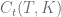在时刻的前向方程，其中行权价为，到期时间为，给出如下：

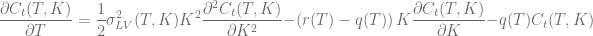

用折现因子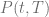、前向价格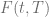和金钱性质来定义规范化看涨期权价格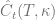，如下所示：

。

规范化价格的杜皮雷前向方程如下：

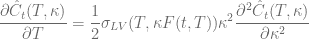。

重写这个方程，用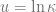和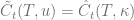表示如下：

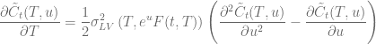

标准化的看跌期权价格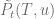满足同样的方程，可以通过将看涨期权价格-看跌期权价格套利插入上述方程中轻松证明

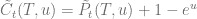.

原算法[1]的数值稳定性可以通过立即校准看涨期权和看跌期权来增强，同时插值方案对稳定性有显著影响。这个话题已在[2][3]中讨论。对于有限差分方案，沿着当前现货水平集中网格有利于算法的稳定性和准确性。

为了稳定计算局部波动率函数

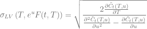

应当评估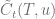相对于时间的一阶导数，利用矩阵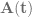的逆的导数可以得到

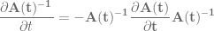

作为例子，下图展示了将 Andreasen-Huge 波动率插值不同标准的 SABR 波动率偏斜校准到离散行权价集合上

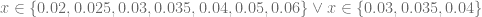

对于 SABR 参数

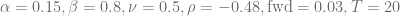

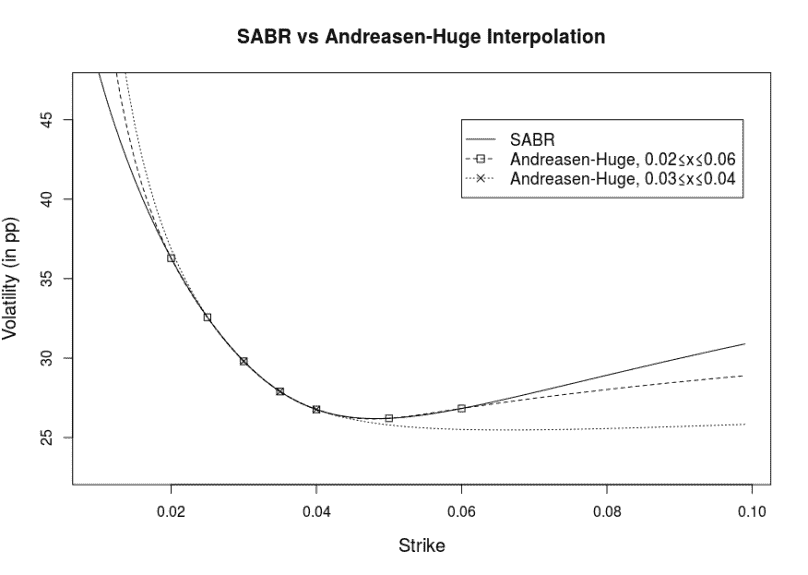

QuantLib 实现是[1.12 版本](http://quantlib.org/download.shtml)的一部分。

[1] J. Andreasen, B. Huge, [波动率插值](https://papers.ssrn.com/sol3/papers.cfm?abstract_id=1694972)

[2] F. Le Floc’h, [Andreasen-Huge 插值 – 不要保持平坦](http://chasethedevil.github.io/post/dont-stay-flat-with-andreasen-huge-interpolation/)

[3] J. Healy, [使用 Andreasen-Huge 一步法进行样条插值填补空缺](https://quantsrus.github.io/post/andreasen_huge_spline/)
