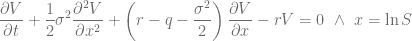
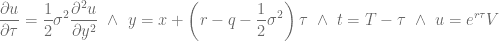
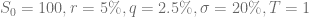
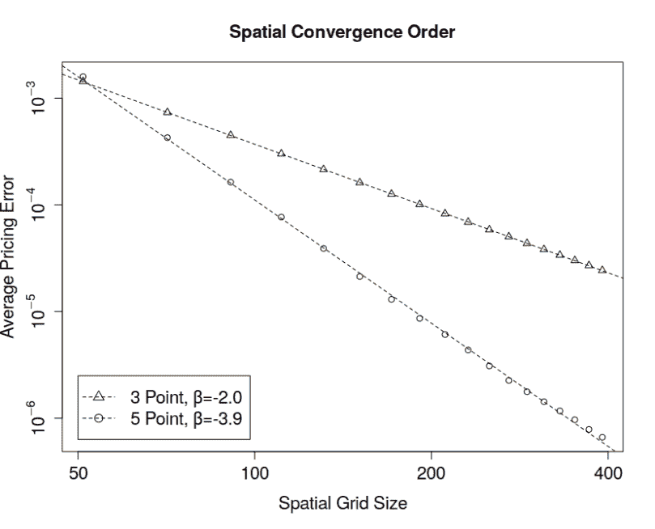
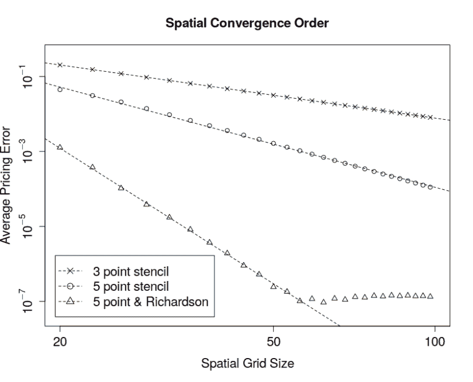

<!--yml

分类：未分类

日期：2024 年 05 月 13 日 00:16:38

-->

# 任意数量的模板点 - HPC-QuantLib

> 来源：[`hpcquantlib.wordpress.com/2018/06/05/arbitrary-number-of-stencil-points/#0001-01-01`](https://hpcquantlib.wordpress.com/2018/06/05/arbitrary-number-of-stencil-points/#0001-01-01)

基于偏微分方程的标准有限差分衍生品定价算法的空间收敛阶为二。原因是这些实现使用了三点中心式模板进行一阶和二阶导数计算。三点模板导致一个三对角矩阵。这样的线性系统可以通过托马斯算法高效地求解。

更高的空间准确度依赖于具有更多点的模板。相应的线性系统不再可以通过托马斯算法解决，而是可以通过 BiCGStab 迭代求解器以传统的三点模板作为非常有效的预处理器来解决。在任意网格上计算更大模板的系数的计算算法在[1]中概述。

在使用更高阶模板之前，应首先确保两种标准误差缩减技术已经到位，即围绕重要点进行自适应网格细化[2]，并围绕到期收益的特殊点进行单元平均化，或者（同样适用于普通期权）将行权价放在两个网格点之间的中间位置。让我们专注于 Black-Scholes-Merton PDE

在[将其转换为热传导方程](https://quant.stackexchange.com/questions/84/transformation-from-the-black-scholes-differential-equation-to-the-diffusion-equ)之后

为了展示收敛改进。空间定价误差定义为一组基准期权的均方根误差（RMSE）。在这个例子中，基准投资组合由行权价为

.

该示例中的其他参数为

.

使用“足够多”的时间步长来积分 PDE，以使空间误差保持不变。

如上图所示，从标准的三点 stencil 到五点 stencil 时，收敛空间阶数从二阶增加到四阶。另一方面，现在解决得到的线性系统需要更长的时间。总的来说，只有当目标 RMSE 低于  时，五点 stencil 才会比标准的三点离散化更快。

下图显示了五点 stencil 和 Richardson 外推的有效组合。

 图表基于测试用例 `testHigerOrderBSOptionPricing` 和

在 PR [#483](https://github.com/lballabio/QuantLib/pull/483/files) 中的 `testHigerOrderAndRichardsonExtrapolationg`。

[1] B. Fornberg, [1988], 在任意间隔的网格上生成有限差分公式。

[2] Tavella, D. and C.Randall [2000], 金融工具定价 有限差分方法, Wiley 金融工程系列, 约翰威利 & 儿子, 纽约
