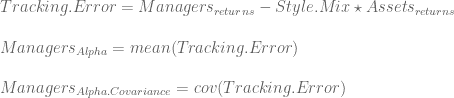
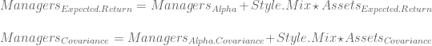

<!--yml

类别：未分类

日期：2024 年 5 月 18 日 14:45:43

-->

# 资产配置流程摘要 | 系统投资者

> 来源：[`systematicinvestor.wordpress.com/2011/11/22/asset-allocation-process-summary/#0001-01-01`](https://systematicinvestor.wordpress.com/2011/11/22/asset-allocation-process-summary/#0001-01-01)

我想回顾我写过的一系列关于资产配置和投资组合构建的帖子，并展示它们如何符合投资组合管理框架。

**资产配置流程的第一步**是创建输入假设：预期收益，风险和协方差。这更多地是一门艺术而不是科学，因为我们试图预测所有资产类别的未来联合实现。有许多方法可以创建输入假设，例如：

通常首选鲁棒的协方差矩阵估计。例如，协方差缩减估计器在[《Honey, I Shrunk the Sample Covariance matrix》（2003）](http://www.ledoit.net/honey.pdf)中由 Olivier Ledoit 和 Michael Wolf 很好地解释。

当使用历史输入假设时，引入具有简短历史信息的新资产类别会存在问题。例如，美国财政部于 1997 年推出了通货膨胀保护证券（TIPS）。这是一个有吸引力的资产类别，有助于抵御通货膨胀。要纳入 TIPS，我建议遵循[《分析具有不同历史长度的投资》（1997）](http://www.cib.espol.edu.ec/Digipath/D_Papers/38608.pdf)中概述的方法。

**资产配置流程的下一步**是创建有效边界并选择目标投资组合。我建议除了传统的投资组合收益标准差外，还要考虑不同的风险度量。例如，[最大损失，平均绝对偏差](https://systematicinvestor.wordpress.com/2011/10/14/maximum-loss-and-mean-absolute-deviation-risk-measures/)，以及[预期损失（CVaR）和条件最大回撤（CDaR）](https://systematicinvestor.wordpress.com/2011/10/25/expected-shortfall-cvar-and-conditional-drawdown-at-risk-cdar-risk-measures/)风险度量。要选择目标投资组合，请查看有效边界上的投资组合，并选择符合您的定量和定性要求的投资组合。例如，定量要求可以是低历史回撤，定性要求可以是合理的权重。例如，如果模型建议将固定收益分配 13.2343％，则将其舍入为 13％。

我还建议参考[几何有效前沿](https://systematicinvestor.wordpress.com/2011/11/09/geometric-efficient-frontier/)来审视目标投资组合，以确保您对目标投资组合的风险得到适当的补偿。如果您对可能的未来经济或市场情景有看法，请对目标投资组合进行压力测试，以了解在这些情景下它的行为如何。例如，请阅读[资产配置的情景方法](http://www.mlc.com.au/resources/MLC/Marketing/Static%20Files/pdf/A_scenario_approach_to_asset_allocation.pdf)文章。

有时，我们想将短期战术模型与长期战略目标投资组合结合起来。我认为将战术信息引入战略资产组合的最佳方法是使用 Black-Litterman 模型。请阅读我的文章[Black-Litterman 模型](https://systematicinvestor.wordpress.com/2011/11/16/black-litterman-model/)以了解一个数值例子。

**资产配置过程的下一步** 是实施目标投资组合。如果您采用基金投资组合方法，并使用外部经理实现目标资产组合，请执行[风格分析](https://systematicinvestor.wordpress.com/2011/11/18/style-analysis/)来确定每位经理的风格混合，并视觉上研究经理的风格是否随时间保持一致。我们希望投资于遵循其投资要求的经理，以便我们可以将其正确映射到我们的目标资产组合中。

我们可以利用风格分析的信息来创建经理的输入假设。让我们将风格分析中的 Alpha 和追踪误差的协方差与资产输入假设相结合，以确定经理的输入假设。

经理的输入假设：

注意，我们简单地将均值和协方差相加，因为经理追踪误差和资产回报在构建时是独立的。

接下来，我们可以创建经理的有效前沿，以便在该前沿上的所有投资组合都具有目标资产配置，如从每个经理的风格分析中隐含的那样。

**资产配置过程的最后一步**是决定何时以及如何重新平衡：更新投资组合以达到目标混合。你可能每天都要重新平衡，但这样会非常昂贵。一个好的替代方法是根据时间段重新平衡，比如每个季度、每年，或者设定边界，即如果资产类别的权重与目标相差超过 3%，则重新平衡。

总之，**资产配置过程**包括四个决策步骤：

+   制定输入假设

+   制定有效边界

+   实施目标投资组合

+   制定重新平衡计划

所有这些步骤都包括一些定量和定性的迭代。我强烈建议在将您辛苦赚来的储蓄投入到资产配置投资组合之前尽可能多地进行实验。
