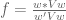

<!--yml

类别: 未分类

日期: 2024-05-18 14:41:53

-->

# 回测资产配置投资组合 | 系统投资者

> 来源：[`systematicinvestor.wordpress.com/2012/03/19/backtesting-asset-allocation-portfolios/#0001-01-01`](https://systematicinvestor.wordpress.com/2012/03/19/backtesting-asset-allocation-portfolios/#0001-01-01)

在上一篇文章[投资组合优化：用 GNU MathProg 语言指定约束条件](https://systematicinvestor.wordpress.com/2012/03/14/portfolio-optimization-specify-constraints-with-gnu-mathprog-language/)中，Paolo 和 MC 提出了一个问题：“你怎样构建一个等风险贡献投资组合？”不幸的是，这个问题无法表达为[线性](http://en.wikipedia.org/wiki/Linear_programming)或[二次规划](http://en.wikipedia.org/wiki/Quadratic_programming)问题。

本文大纲：

+   我将展示如何使用非线性求解器制定并解决等风险贡献投资组合。

+   我将对基于我在[资产配置](https://systematicinvestor.wordpress.com/?s=asset+allocation)系列文章中描述的各种风险度量的等风险贡献投资组合和其他资产配置投资组合进行回测。

Pat Burns 写了一篇优秀的文章：[解释风险贡献-将投资组合的方差分割为归因于每个资产的部分](http://www.portfolioprobe.com/2011/04/13/unproxying-weight-constraints/)。等风险贡献投资组合是一种将总投资组合风险平均分配给其资产的投资组合。（这个概念类似于 1/N 投资组合 - 一种将总投资组合权重均匀分配给其资产的投资组合。）

风险贡献（风险分数）可以用投资组合权重  和协方差矩阵 (V) 表示：



我们的目标是找到投资组合权重 ，使得所有资产的风险贡献相等。这个目标函数可以在 R 中轻松编码：

```

	risk.contribution = w * (cov %*% w)
	sum( abs(risk.contribution - mean(risk.contribution)) )

```

我推荐以下参考文献以详细讨论风险贡献：

我将使用一个非线性规划求解器，[Rdonlp2](http://arumat.net/Rdonlp2/tutorial.html)，它是基于由[Peter Spellucci 博士](http://www.mathematik.tu-darmstadt.de/fbereiche/numerik/staff/spellucci/spellucci.html)开发并拥有版权的 donlp2 程序来解决等风险贡献投资组合的。[请注意，以下代码可能在您的计算机上无法正确执行，因为需要 Rdonlp2 包，但在 CRAN 上不可用]

```

#--------------------------------------------------------------------------
# Equal Risk Contribution portfolio
#--------------------------------------------------------------------------
ia = aa.test.create.ia()
n = ia$n		

# 0 <= x.i <= 1
constraints = new.constraints(n, lb = 0, ub = 1)

# SUM x.i = 1
constraints = add.constraints(rep(1, n), 1, type = '=', constraints)		

# find Equal Risk Contribution portfolio 
w = find.erc.portfolio(ia, constraints)	

# compute Risk Contributions 	
risk.contributions = portfolio.risk.contribution(w, ia)

```

接下来，我想在 [Backtesting Minimum Variance portfolios](https://systematicinvestor.wordpress.com/2011/12/13/backtesting-minimum-variance-portfolios/) 文章中扩展，包括等风险贡献投资组合和其他基于我在 [Asset Allocation](https://systematicinvestor.wordpress.com/?s=asset+allocation) 系列文章中描述的各种风险度量的资产配置投资组合。

```

###############################################################################
# Load Systematic Investor Toolbox (SIT)
# https://systematicinvestor.wordpress.com/systematic-investor-toolbox/
###############################################################################
con = gzcon(url('http://www.systematicportfolio.com/sit.gz', 'rb'))
    source(con)
close(con)

	#*****************************************************************
	# Load historical data
	#****************************************************************** 
	load.packages('quantmod,quadprog,corpcor,lpSolve')
	tickers = spl('SPY,QQQ,EEM,IWM,EFA,TLT,IYR,GLD')

	data <- new.env()
	getSymbols(tickers, src = 'yahoo', from = '1980-01-01', env = data, auto.assign = T)
		for(i in ls(data)) data[[i]] = adjustOHLC(data[[i]], use.Adjusted=T)							
	bt.prep(data, align='remove.na', dates='1990::2011')

	#*****************************************************************
	# Code Strategies
	#****************************************************************** 
	prices = data$prices   
	n = ncol(prices)

	# find week ends
	period.ends = endpoints(prices, 'weeks')
		period.ends = period.ends[period.ends > 0]

	#*****************************************************************
	# Create Constraints
	#*****************************************************************
	constraints = new.constraints(n, lb = 0, ub = 1)

	# SUM x.i = 1
	constraints = add.constraints(rep(1, n), 1, type = '=', constraints)		

	#*****************************************************************
	# Create Portfolios
	#*****************************************************************			
	ret = prices / mlag(prices) - 1
	start.i = which(period.ends >= (63 + 1))[1]

	weight = NA * prices[period.ends,]
	weights = list()
		# Equal Weight 1/N Benchmark
		weights$equal.weight = weight
			weights$equal.weight[] = ntop(prices[period.ends,], n)	
			weights$equal.weight[1:start.i,] = NA

		weights$min.var = weight
		weights$min.maxloss = weight
		weights$min.mad = weight
		weights$min.cvar = weight
		weights$min.cdar = weight
		weights$min.cor.insteadof.cov = weight
		weights$min.mad.downside = weight
		weights$min.risk.downside = weight

		# following optimizations use a non-linear solver
		weights$erc = weight		
		weights$min.avgcor = weight		

	risk.contributions = list()	
		risk.contributions$erc = weight		

	# construct portfolios
	for( j in start.i:len(period.ends) ) {
		i = period.ends[j]

		# one quarter = 63 days
		hist = ret[ (i- 63 +1):i, ]

		# create historical input assumptions
		ia = create.historical.ia(hist, 252)
			s0 = apply(coredata(hist),2,sd)		
			ia$correlation = cor(coredata(hist), use='complete.obs',method='pearson')
			ia$cov = ia$correlation * (s0 %*% t(s0))

		# construct portfolios based on various risk measures
		weights$min.var[j,] = min.risk.portfolio(ia, constraints)
		weights$min.maxloss[j,] = min.maxloss.portfolio(ia, constraints)
		weights$min.mad[j,] = min.mad.portfolio(ia, constraints)
		weights$min.cvar[j,] = min.cvar.portfolio(ia, constraints)
		weights$min.cdar[j,] = min.cdar.portfolio(ia, constraints)
		weights$min.cor.insteadof.cov[j,] = min.cor.insteadof.cov.portfolio(ia, constraints)
		weights$min.mad.downside[j,] = min.mad.downside.portfolio(ia, constraints)
		weights$min.risk.downside[j,] = min.risk.downside.portfolio(ia, constraints)

		# following optimizations use a non-linear solver		
		constraints$x0 = weights$erc[(j-1),]
		weights$erc[j,] = find.erc.portfolio(ia, constraints)		

		constraints$x0 = weights$min.avgcor[(j-1),]
		weights$min.avgcor[j,] = min.avgcor.portfolio(ia, constraints)						

		risk.contributions$erc[j,] = portfolio.risk.contribution(weights$erc[j,], ia)
	}

```

接下来，让我们回测这些投资组合并创建摘要统计数据：

```

	#*****************************************************************
	# Create strategies
	#****************************************************************** 		
	models = list()
	for(i in names(weights)) {
		data$weight[] = NA
			data$weight[period.ends,] = weights[[i]]	
		models[[i]] = bt.run.share(data, clean.signal = F)
	}

	#*****************************************************************
	# Create Report
	#****************************************************************** 
	models = rev(models)

	# Plot perfromance
	plotbt(models, plotX = T, log = 'y', LeftMargin = 3)	    	
		mtext('Cumulative Performance', side = 2, line = 1)

	# Plot Strategy Statistics  Side by Side
	plotbt.strategy.sidebyside(models)

	# Plot transition maps
	layout(1:len(models))
	for(m in names(models)) {
		plotbt.transition.map(models[[m]]$weight, name=m)
			legend('topright', legend = m, bty = 'n')
	}

	# Plot risk contributions
	layout(1:len(risk.contributions))
	for(m in names(risk.contributions)) {
		plotbt.transition.map(risk.contributions[[m]], name=paste('Risk Contributions',m))
			legend('topright', legend = m, bty = 'n')
	}

	# Compute portfolio concentration and turnover stats based on the
	# On the property of equally-weighted risk contributions portfolios by S. Maillard, 
	# T. Roncalli and J. Teiletche (2008), page 22
	# http://www.thierry-roncalli.com/download/erc.pdf
	out = compute.stats( rev(weights),
		list(Gini=function(w) mean(portfolio.concentration.gini.coefficient(w), na.rm=T),
			Herfindahl=function(w) mean(portfolio.concentration.herfindahl.index(w), na.rm=T),
			Turnover=function(w) 52 * mean(portfolio.turnover(w), na.rm=T)
			)
		)

	out[] = plota.format(100 * out, 1, '', '%')
	plot.table(t(out))

```


在那段时间内，最小方差（min.risk）投资组合表现非常好，年复合增长率为 10.5%，最大回撤为 14%。等风险贡献（find.erc）投资组合也表现不错，年复合增长率为 10.5%，最大回撤为 19%。1/N 投资组合（equal.weight）是最差的策略，年复合增长率为 7.8%，最大回撤为 45%。

一个有趣的修改策略的方法是考虑用于构建协方差矩阵的不同波动率度量。例如，[TTR package](http://cran.r-project.org/web/packages/TTR/index.html) 提供了 Garman Klass – Yang Zhang 和 Yang Zhang 波动率估计方法的函数。更多详情，请参阅 [Different Volatility Measures Effect on Daily MR by Quantum Financier](http://quantumfinancier.wordpress.com/2010/05/05/different-volatility-measures-effects-on-daily-mr/) 文章。

受到 [I Dream of Gini by David Varadi](http://cssanalytics.wordpress.com/2012/02/24/i-dream-of-gini/) 的启发，我将在下一篇文章中展示如何创建基尼效率前沿。

若要查看此示例的完整源代码，请参阅 [bt.aa.test() function in bt.test.r at github](https://github.com/systematicinvestor/SIT/blob/master/R/bt.test.r)。
