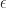
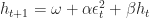
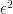
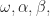

<!--yml

类别：未分类

日期：2024 年 05 月 18 日 14:02:46

-->

# GARCH 和 EGARCH 的基本介绍（第一部分）- 量化金融家

> 来源：[`quantumfinancier.wordpress.com/2010/09/12/381/#0001-01-01`](https://quantumfinancier.wordpress.com/2010/09/12/381/#0001-01-01)

鉴于之前一系列关于使用 GARCH(1,1) 预测波动性的帖子，几位读者要求提供一个在金融领域广泛使用的两个模型的非常基本介绍：GARCH 和 EGARCH。

统计学中在金融领域使用的一项重要工具是最小二乘模型（不仅限于线性最小二乘）。对于初学者来说，最小二乘模型用于确定因变量随着另一个变量（称为自变量或预测变量）的变化而变化的程度。当我们拟合模型时，预测值与实际值之间的差异被称为误差项或残差，用希腊字母ε表示（）。正如我最喜欢的博客文章之一中所提到的：[残差的奇迹](http://quantivity.wordpress.com/2009/08/02/wonder-of-residuals) by [Quantivity](http://quantivity.wordpress.com/)，这个概念有着丰富的信息和用途。

当我们拟合模型时，我们，或者至少我是，对分析误差的大小感兴趣。最小二乘模型的一个基本假设是，误差的平方（为了消除负数的影响而进行平方）在模型中的每个数据点上保持恒定。用于这种等方差假设的术语是同方差性。然而，对于金融时间序列方差（读作波动性或风险），并不能总是假定为常数，浏览金融数据，我们可以看到一些时期比其他时期更加波动。牢记这一点，当拟合模型时，这意味着残差的幅度较大。此外，方差的这些波动不是随机分布在时间上的；存在自相关效应。简单来说，我们称之为波动率聚集，意思是高方差时期倾向于聚集在一起；想象一下 VIX 的暴涨。非恒定方差被称为异方差性。这就是 GARCH 模型的用武之地，并帮助我们找到一个可以用来预测模型中残差的波动率测度，从而放宽通常有缺陷的等残差假设。

在讨论 GARCH 模型之前，我必须快速介绍它的近亲，即 ARCH（自回归条件异方差性）模型。考虑一下预测波动性的最简单方法；滚动 x 天标准差。假设我们按年（252 天）为周期进行观察。借助这个历史标准差的值，我们想要预测下一天的值。中心趋势统计告诉我们均值是最佳猜测。我已经听到一些人对这个想法感到不满。

使用均值时，每 252 个观察都是等权重的。然而，让更近期的观察加权更有意义吗？也许我们可以使用指数加权平均来解决这个问题，但仍然不是最佳解决方案。关于这种方法还可以做另一个观察；它忘记了任何超过 252 天的数据点（它们的权重为 0）。这种加权方案对于定量取向的投资者来说并不是最理想的，因为它们相当任意。这就是 ARCH 模型出现的地方，其中对残差应用的权重会自动估计为最佳参数（[David Varadi](http://cssanalytics.wordpress.com) 将其称为 [level 1 adaptation](http://cssanalytics.wordpress.com/2010/04/09/level-2-adaptation-the-adaptive-rsi/)）。广义 ARCH 模型（GARCH）基于相同的原理，但随着时间的推移，权重逐渐变小，永远不会达到 0。

在上一篇系列帖子中，我使用了阶数为 (1,1) 的 GARCH 模型。这样定义，模型通过查看长期历史方差的加权平均、期间预测的方差（第二个 1，也称为 GARCH 项的数量）和前一天的平方残差（第一个 1，也称为 ARCH 项的数量）来预测该期间的方差。或者更正式地说：

其中 *h* 表示方差， 表示平方残差，*t* 表示期间。常数  必须由模型每个期间使用最大似然法估计和更新。（对此的解释超出了本博客的范围，我建议使用像 R 这样的统计软件进行实现。）另外，可以改变阶数以改变模型中包含的 ARCH 和 GARCH 项的数量。有时需要更多的滞后项来准确预测波动率。

用户需要谨慎行事；这不是一个一劳永逸的方法，结果预测可能完全不同于真实方差。始终检查你的工作，并执行诸如 Ljung 箱检验之类的诊断测试，以确认平方残差中没有自相关。

很少，这是一个长篇，我希望帖子的第一部分能让 GARCH 模型更易于理解，并且这个介绍是有用的。我鼓励你评论，如果帖子的某些方面可以更清晰地表达的话。最后，请关注第二部分，在那里我将给出另一个 GARCH(1,1) 的示例，用于价值风险估计（这是学术文献中相当流行的应用），以及关于 EGARCH 的第三部分！

QF
