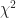
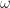
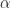
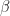

<!--yml

category: 未分类

date: 2024-05-18 14:02:33

-->

# GARCH 和 EGARCH 的基本介绍（第二部分） - 量子金融家

> 来源：[`quantumfinancier.wordpress.com/2010/09/14/basic-introduction-to-garch-and-egarch-part-2/#0001-01-01`](https://quantumfinancier.wordpress.com/2010/09/14/basic-introduction-to-garch-and-egarch-part-2/#0001-01-01)

正如上一篇文章所承诺的，我们将看一下 GARCH(1,1) 模型的一个流行实现：风险价值。我选择了这个实现，因为它在学术文献中经常被使用，且具有教育目的。风险价值，也简称 VaR，是一个投资组合风险的度量。简而言之，1% 的风险价值被定义为统计上有 99% 的把握超过明天任何损失的美元数，或者是投资组合中 1% 的时间内遭受的损失。需要快速提醒的是；这仅仅是在您做出投资决策时需要考虑的另一个风险度量。

对于这个例子，让我们回忆一下（不那么美好的）最近的危机时期，并逐步使用 GARCH 和 VaR 测试该概念。我们将查看一份由 70% 股票（SPY）和 30% 债券（AGG）组成的 1,000,000 美元投资组合的 VaR，样本期限为从 AGG 成立的 2003-09-27 到黑色星期之前的一天 2008-10-05。这个日期是由我亲自选择的，因为我知道这是市场上极度恐慌的波动期。然后，我们将查看在危机期间使用构建的 GARCH 模型的 VaR 性能，样本外期限为从 2008-10-06 到 2009 年底。

首先，我们构建投资组合，下面是每个单独组成部分的数字以及最后一列中的投资组合。

从表中的标准偏差可以看出，SPY 比 AGG 更加波动。还请注意 SPY 的尾部非常厚（正常值为 3）。最后，负偏度表明左尾（负回报）更长，这意味着更极端的损失。

接下来，我们寻找 ARCH 效应的存在。我们对投资组合回报样本拟合了一个阶数为 1 的 ARCH 模型，然后计算了残差的平方。从 15 个滞后自相关值中，我们看到我们的残差的自相关似乎存在显著的自相关效应（除了第一个值为正且相当高之外）。但是，作为纪律严明的投资者，我们并不总是相信我们得到的第一个数字。因此，我们将使用 Ljung Box 检验测试 ARCH 效应的显著性，其结果是  统计量为 179.4636，在 0.05 的置信水平下显著。我们现在在我们的数据中统计上确信 ARCH 效应的存在。

现在，我们准备拟合我们的 GARCH(1,1)模型，一旦完成，我们得到以下系数  = 4.604e-06,  = 3.090e-01，最后  = 6.485e-01。现在我们有了模型，我们可以预测我们的标准差（波动率）。完成此步骤后，我们想要找到我们的 VaR 的 1%分位数。我们得到了 0.003995719，现在要找到我们的 VaR，我们可以选择分布假设。我们可以假设它是正态分布，并将其乘以 2.327，因为正态随机变量的 1%位于均值以下 2.327 个标准偏差。现在我不喜欢这个，因为当处理金融数据时，我通常更喜欢避开正态性假设。我宁愿使用模型中观察到的误差的经验分布。只需将模型残差标准化并观察其经验分布以找到 1%分位数；我们得到了 2.619797 的结果。

使用这些数据，我们现在可以估计我们的 VaR。我们简单地将我们的预测的 1%分位数（0.003995719）与我们的标准化残差（2.619797）以及投资组合资本相乘。我们得到了 10,467.97 美元的 VaR，将其与假设正态分布时的 9,298.04 美元进行比较。现在，我们可以每天重复这个过程，为明天进行预测。为了完成分析，看一下下面的图表，其中显示了每日损失与每日 VaR 的情况。请注意，轴已经反转（正数表示损失，负数表示盈利）。

现在，按照同样的方法，我们在我们的样本外数据上使用模型（不重新计算，只更新新数据），从 10 月 6 日的黑色星期开始，直到 2009 年底。轴的原理相同。

注意观察到，在该期间，投资组合的风险价值（Value-at-Risk）几乎对所有数据点的损失都高于遭受的损失（约为 97%）。看起来，该期间的风险价值（VaR）测量大多保守。就是这样；希望这篇逐步应用的文章对你有所帮助并且清晰易懂，对于有时晦涩的主题有所启发。敬请期待本系列的最后一篇关于 EGARCH 的文章。

QF
