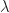
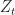

<!--yml

category: 未分类

日期：2024 年 05 月 18 日 14:02:21

-->

# GARCH 和 EGARCH 的基本介绍（第三部分）- 量子金融家

> 来源：[`quantumfinancier.wordpress.com/2010/09/23/basic-introduction-to-garch-and-egarch-part-3/#0001-01-01`](https://quantumfinancier.wordpress.com/2010/09/23/basic-introduction-to-garch-and-egarch-part-3/#0001-01-01)

这是关于波动率建模系列文章的最后一部分，在这里我将简要介绍 GARCH 模型的许多变种之一：指数 GARCH（简称 EGARCH）。我选择了这个变种，因为它改进了 GARCH 模型，并更好地模拟了一些市场机制。

在 GARCH 文章中，我没有提及模型的任何局限性，因为我把它们留到了今天的文章中。首先，GARCH 模型假设只有未预期的超额回报的幅度确定了。直观地说，我们可以质疑这个假设；我会争辩说，不仅回报的幅度，而且回报的方向也会影响波动性。简单地说：负冲击（事件/新闻等）对波动性的影响比正冲击更大。想想 VIX 的不对称性质（请参阅[比尔·卢比的 Vix and More](http://vixandmore.blogspot.com/)）。

另一个可能会让量化精明的投资者担心的局限性是波动性冲击的持续性。冲击估计的波动性会持续多长时间？一些可能持续有限的时间，而其他可能持续*永远*；从根本上改变市场波动性结构。在 GARCH（1,1）模型中，冲击可能持续也可能不持续，这取决于具体情况，这可能是不可取的。

这两个局限性是 EGARCH 模型背后的主要驱动因素，它满足了这些异议。废话不多说，这是 EGARCH 的构建：

和

其中和是系数，而来自广义误差分布。

使用这个模型，我们可以预期更好地估计资产回报的波动性，因为 EGARCH 如何抵消经典 GARCH 模型的局限性。在实施方面，一如既往，我建议使用统计软件进行分析。

顺便提一下，我必须引用此系列文章的来源，因为我大部分时间都在参考其他学术论文，并提取了部分文字，尽量只关注我认为对介绍重要的内容。如果您想了解更多信息，请参考它们。

Nelson, D.B.（1991 年）。资产回报中的条件异方差性：一种新方法。Econometrica，59（2），347-370。

Engel, R. (2001). Garch 101: 应用计量经济学中的 arch/garch 模型使用。《经济展望杂志》，15(4)，157-168。

QF
