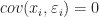
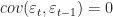

<!--yml

category: 未分类

date: 2024-05-18 14:01:48

-->

# 慎选所愿—量化金融家

> 来源：[`quantumfinancier.wordpress.com/2010/10/28/be-careful-what-you-wish-for/#0001-01-01`](https://quantumfinancier.wordpress.com/2010/10/28/be-careful-what-you-wish-for/#0001-01-01)

追求最小阻力路径是人性所趋。虽然在某些情况下这可能是好事，但当涉及到我的资本时，我通常尝试保持简单，但我总是尽量远离知识上的懒惰。

许多顶尖博主都提到了处理市场数据时的假设陷阱和参数统计的局限性。在使用特定方法或模型之前，最好先对基本假设进行一些研究。如果它们不适合我们的数据，那么我们就知道我们必须更加小心，但是它们仍然可能非常有用，当你的假设不符合时，不要自动忽略一种方法或模型。

例如，考虑计量经济学的伟大工作马：最小二乘模型。它在学术界被广泛使用。实际上很难找到一篇金融论文没有以某种方式或形式提到回归的。那就是我们做的事情，我们喜欢以简单而优雅的方式尝试建模现象。它通常以最简单的形式使用；您可能知道的最小二乘模型，即线性回归。我相信本博客的大多数读者以某种方式使用过它。我还认为一些人可能在不太注意其一些假设的情况下使用过它。

1\. 总体回归函数在参数上是线性的

2\. 自变量和误差独立：

3\. 误差同方差性（即恒定方差）

4\. 无自相关：

5\. 回归模型正确指定，所有相关变量均已包含

6\. 误差服从正态分布

现在有了这个想法，我们看到 ols 在我们盲目应用之前需要解决一些假设问题。对于金融时间序列来说，最重要的两个是第 3 和第 4\. 在此处查看有关此事的更具体讨论的[系列帖子](https://quantumfinancier.wordpress.com/2010/09/12/381/)。

这里的重点并不是要完全否定最小二乘法；我经常使用它。重点在于表明有时假设可能会非常限制性，需要考虑，无论你想使用什么方法或模型，也要记住，有时，交易中最简单的路径并不总是最好的。当你遇到一个新的有希望的工具时，为你的交易工具箱是个好习惯，要深入挖掘并理解背后的过程和你每次使用它时所做的假设。这也是对非参数和非线性统计方法的一个很好的宣传，它们通常倾向于有更宽松的基础假设。

QF
