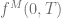

<!--yml

分类：未分类

日期：2024 年 05 月 17 日 23:38:50

-->

# 基于有限差分法的百慕大式互换定价 - HPC-QuantLib

> 来源：[`hpcquantlib.wordpress.com/2011/12/19/bermudan-swaption-pricing-based-on-finite-difference-methods/#0001-01-01`](https://hpcquantlib.wordpress.com/2011/12/19/bermudan-swaption-pricing-based-on-finite-difference-methods/#0001-01-01)

尽管 Hull-White 模型或 G2++模型等短期利率模型有些老态龙钟，但这些模型仍然被用于风险管理或作为基准模型。自早期以来，QuantLib 就支持基于三项式树定价百慕大式互换。现在是时候比较三项式树定价算法与有限差分法的性能和准确度了。

G2++模型由以下随机微分方程定义

其中  表示时间 0 到到期 T 的市场瞬时远期利率（见，例如，[1]）。Hull-White 模型可以看作是 G2++模型的一维简化。相应的偏微分方程（PDE）可以使用[Feynman-Kac](http://en.wikipedia.org/wiki/Feynman%E2%80%93Kac_formula)定理导出。

QuantLib 支持多种算子分裂方案来解决多维 PDE 的问题。 [SVN trunk](http://sourceforge.net/p/quantlib/code/HEAD/tree/) 包含了基于 Hull-White 和 G2++模型定价百慕大式互换的 FDM 引擎。其他短期利率模型，如 CIR++或 Black-Karasinski 模型，可以以相同的方式实现。

从下面的图表可以看出，基于有限差分法的定价引擎优于三项式树定价引擎。

[1] D. Brigo, F. Mercurio, [利率模型-理论与实践](http://www.fabiomercurio.it/contents2nd.html)
