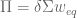
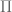
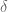
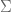
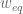
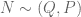

<!--yml

类别：未分类

日期：2024 年 05 月 18 日 14:43:55

-->

# Black-Litterman 模型 | 系统性投资者

> 来源：[`systematicinvestor.wordpress.com/2011/11/16/black-litterman-model/#0001-01-01`](https://systematicinvestor.wordpress.com/2011/11/16/black-litterman-model/#0001-01-01)

[Black-Litterman 模型](http://en.wikipedia.org/wiki/Black%E2%80%93Litterman_model) 是由 Fischer Black 和 Robert Litterman 于 1992 年创建的，旨在解决传统 Markowitz 均值-方差资产配置模型的缺点。它解决了以下两个问题：

+   在均值-方差有效边界上的投资组合缺乏多样性。

+   在均值-方差有效边界上的投资组合的不稳定性：输入假设的微小变化经常导致非常不同的有效投资组合。

我建议阅读一本非常好的非技术性介绍：[《黑-利特曼模型，从业者的介绍》T. Becker (2009)](http://www.styleadvisor.com/sites/default/files/IWM09JanFeb_BlackLittermanModel.pdf)。

我将采用 [The Intuition Behind Black-Litterman Model Portfolios by G. He, R. Litterman (1999)](http://www.cis.upenn.edu/~mkearns/finread/intuition.pdf) 论文中提出的国家配置示例，并使用当前市场数据进行更新。

首先，我需要每个国家的市值数据来计算均衡投资组合。我找到了以下两个资本化数据来源：

我将使用世界数据银行的市值数据。

```

# load Systematic Investor Toolbox
setInternet2(TRUE)
source(gzcon(url('https://github.com/systematicinvestor/SIT/raw/master/sit.gz', 'rb')))

	#--------------------------------------------------------------------------
	# Visualize Market Capitalization History
	#--------------------------------------------------------------------------

	hist.caps = aa.test.hist.capitalization()	
	hist.caps.weight = hist.caps/rowSums(hist.caps)

	# Plot Transition of Market Cap Weights in time
	plot.transition.map(hist.caps.weight, index(hist.caps.weight), xlab='', name='Market Capitalization Weight History')

	# Plot History for each Country's Market Cap
	layout( matrix(1:9, nrow = 3, byrow=T) )
	col = plota.colors(ncol(hist.caps))
	for(i in 1:ncol(hist.caps)) {
		plota(hist.caps[,i], type='l', lwd=5, col=col[i], main=colnames(hist.caps)[i])
	}

```


从 1988 年到 2010 年，日本和美国之间的权重发生了重大变化。在 1988 年，日本占 47%，美国占 33%。到 2010 年，日本占 13%，美国占 55%。这一变化是由于资金流入美国，而日本的资本化在时间上相当稳定，可以从每个国家的时间序列图中观察到。

其次，我需要每个国家的历史价格系列来计算协方差矩阵。我将使用来自[Yahoo Finance](http://finance.yahoo.com)的历史数据：

Black-Litterman 模型的第一步是使用反向优化找到隐含的均衡收益。



其中  是均衡收益，  是风险厌恶系数，  是协方差矩阵，而  是市值权重。风险厌恶参数可以通过将超额市场投资组合回报除以其方差来从历史数据中估计。

```

# Use reverse optimization to compute the vector of equilibrium returns
bl.compute.eqret <- function
(
	risk.aversion, 	# Risk Aversion
	cov, 		# Covariance matrix
	cap.weight, 	# Market Capitalization Weights
	risk.free = 0	# Rsik Free Interest Rate
)
{
	return( risk.aversion * cov %*% cap.weight +  risk.free)	
}

	#--------------------------------------------------------------------------
	# Compute Risk Aversion, prepare Black-Litterman input assumptions
	#--------------------------------------------------------------------------
	ia = aa.test.create.ia.country()

	# compute Risk Aversion
	risk.aversion = bl.compute.risk.aversion( ia$hist.returns$USA )

	# the latest market capitalization weights
	cap.weight = last(hist.caps.weight)	

	# create Black-Litterman input assumptions	
	ia.bl = ia
	ia.bl$expected.return = bl.compute.eqret( risk.aversion, ia$cov, cap.weight )

	# Plot market capitalization weights and implied equilibrium returns
	layout( matrix(c(1,1,2,3), nrow=2, byrow=T) )
	pie(coredata(cap.weight), paste(colnames(cap.weight), round(100*cap.weight), '%'), 
		main = paste('Country Market Capitalization Weights for', format(index(cap.weight),'%b %Y'))
		, col=plota.colors(ia$n))

	plot.ia(ia.bl, T)

```


接下来，让我们比较使用历史输入假设和 Black-Litterman 输入假设创建的有效边界。

```

	#--------------------------------------------------------------------------
	# Create Efficient Frontier(s)
	#--------------------------------------------------------------------------
	n = ia$n

	# -1 <= x.i <= 1
	constraints = new.constraints(n, lb = 0, ub = 1)

	# SUM x.i = 1
	constraints = add.constraints(rep(1, n), 1, type = '=', constraints)		

	# create efficient frontier(s)
	ef.risk = portopt(ia, constraints, 50, 'Historical', equally.spaced.risk = T)		
	ef.risk.bl = portopt(ia.bl, constraints, 50, 'Black-Litterman', equally.spaced.risk = T)	

	# Plot multiple Efficient Frontiers and Transition Maps
	layout( matrix(1:4, nrow = 2) )
	plot.ef(ia, list(ef.risk), portfolio.risk, T, T)			
	plot.ef(ia.bl, list(ef.risk.bl), portfolio.risk, T, T)			

```


比较转换图，Black-Litterman 有效投资组合多样化。有效投资组合在各种风险水平下分配到各种资产类别。通过其构造，Black-Litterman 模型非常适合解决多样化问题。

Black-Litterman 模型还引入了一种机制，以使投资者的观点合并到输入假设中，使得输入假设的微小变化不会导致非常不同的有效投资组合。Black-Litterman 模型调整了预期收益和协方差：

![\bar{\mu} = \left [ (\tau \Sigma)^{-1}+P'\Omega^{-1}P \right ]^{-1}  \left [ (\tau \Sigma)^{-1}\Pi + P'\Omega^{-1}Q  \right ]  \newline\newline  \bar{\Sigma}=\Sigma+\left [ (\tau \Sigma)^{-1}+P'\Omega^{-1}P \right ]^{-1}   ](img/e960f9efabadbe868d19331626495be2.png)

其中，P 是观点选择矩阵，而 Q 是观点均值向量。Black-Litterman 模型假设观点符合 。

```

bl.compute.posterior <- function
(
	mu, 		# Equilibrium returns
	cov, 		# Covariance matrix
	pmat=NULL, 	# Views pick matrix
	qmat=NULL, 	# Views mean vector
	tau=0.025 	# Measure of uncertainty of the prior estimate of the mean returns
)
{
	out = list()	
	omega = diag(c(1,diag(tau * pmat %*% cov %*% t(pmat))))[-1,-1]

	temp = solve(solve(tau * cov) + t(pmat) %*% solve(omega) %*% pmat)	
	out$cov = cov + temp

	out$expected.return = temp %*% (solve(tau * cov) %*% mu + t(pmat) %*% solve(omega) %*% qmat)
	return(out)
}

	#--------------------------------------------------------------------------
	# Create Views
	#--------------------------------------------------------------------------
	temp = matrix(rep(0, n), nrow = 1)
		colnames(temp) = ia$symbols

	# Relative View
	# Japan will outperform UK by 2%
	temp[,'Japan'] = 1
	temp[,'UK'] = -1

	pmat = temp
	qmat = c(0.02)

	# Absolute View
	# Australia's expected return is 12%
	temp[] = 0
	temp[,'Australia'] = 1

	pmat = rbind(pmat, temp)	
	qmat = c(qmat, 0.12)

	# compute posterior distribution parameters
	post = bl.compute.posterior(ia.bl$expected.return, ia$cov, pmat, qmat, tau = 0.025 )

	# create Black-Litterman input assumptions with Views	
	ia.bl.view = ia.bl
		ia.bl.view$expected.return = post$expected.return
		ia.bl.view$cov = post$cov
		ia.bl.view$risk = sqrt(diag(ia.bl.view$cov))

	# create efficient frontier(s)
	ef.risk.bl.view = portopt(ia.bl.view, constraints, 50, 'Black-Litterman + View(s)', equally.spaced.risk = T)	

	# Plot multiple Efficient Frontiers and Transition Maps
	layout( matrix(1:4, nrow = 2) )
	plot.ef(ia.bl, list(ef.risk.bl), portfolio.risk, T, T)			
	plot.ef(ia.bl.view, list(ef.risk.bl.view), portfolio.risk, T, T)			

```


比较转换图，Black-Litterman + 观点有效投资组合更多地分配给日本和澳大利亚，符合预期。投资组合多样化，并且与 Black-Litterman 有效投资组合相比并没有发生 drastical 的变化。

Black-Litterman 模型提供了一种优雅的方式来解决基于历史输入假设的传统 Markovitz 均值-方差资产配置模型的缺点。它解决了以下两个问题：

+   在均值-方差有效边界上的投资组合缺乏多样化。Black-Litterman 模型使用从当前市值加权的均衡收益来构建多样化的投资组合。

+   在均值-方差有效边界上投资组合的不稳定性。Black-Litterman 模型引入了一种机制，将投资者的观点合并到输入假设中，以使输入假设的微小变化不会导致非常不同的有效投资组合。

我强烈建议探索并阅读以下文章和网站，以更好地理解 Black-Litterman 模型：

要查看此示例的完整源代码，请查看[github 上的 aa.test.r 中的 aa.black.litterman.test() 函数](https://github.com/systematicinvestor/SIT/blob/master/R/aa.test.r)。
