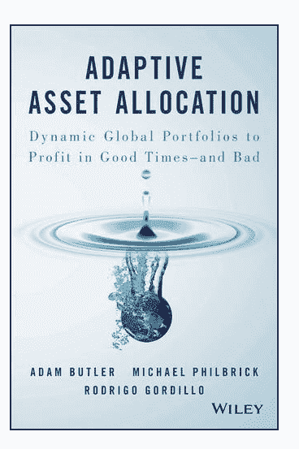

<!--yml

category: 未分类

date: 2024-05-12 17:45:24

-->

# Book Review: Adaptive Asset Allocation | CSSA

> 来源：[`cssanalytics.wordpress.com/2016/02/29/book-review-adaptive-asset-allocation/#0001-01-01`](https://cssanalytics.wordpress.com/2016/02/29/book-review-adaptive-asset-allocation/#0001-01-01)

我最近读了《**自适应资产配置**》（[书籍链接](http://www.amazon.com/gp/product/1119220351/ref=as_li_tl?ie=UTF8&camp=1789&creative=390957&creativeASIN=1119220351&linkCode=as2&tag=cssa01-20&linkId=JCEGQ45I326MHECE)），作者是**ReSolve Asset Management**的 Butler、Philbrick 和 Gordillo。这本书是 ReSolve 团队多年研究的结晶，是下一代动态资产配置方法的核心原理。这种方法的核心原理是在追求更高风险调整回报率的过程中，具有“随心所欲”的能力，并能够适应经济环境的变化。 （CSSA 的读者们可能还记得我们之前发表的一篇关于[自适应资产配置](https://cssanalytics.wordpress.com/2012/07/17/adaptive-asset-allocation-combining-momentum-with-minimum-variance/)的文章，如果不记得的话，可以回顾一下，还有关于 AAA 的[原始白皮书之一](http://papers.ssrn.com/sol3/papers.cfm?abstract_id=2328254)）这本书写得非常好，章节易于阅读，从头到尾有说服力地发展故事情节。

这本书并不是一本密集的量化巨著，而是一份关于一致且严谨发展的投资理念的总结，该理念是围绕学术研究和概念精心构建的。在这个意义上，适应性资产配置是一部真正的“杰作”，对资产配置理论领域的重要贡献。没有这个背景，就无法在任何交易系统或战术资产配置模型中正确地构建思想。在投资组合管理的广泛可能方法中很容易感到困惑：你应该使用动量吗？你应该寻求最小化风险吗？你应该使用长期还是短期估计？你应该包含还是排除某些资产类别？你应该在什么时间范围内交易？最终，这些问题的答案取决于是否有一个框架，该框架清晰地融合了你对输入假设的信心和你对其一无所知的假设。这本书确实有助于解决这些交易模型/系统开发中的关键问题。适应性资产配置还巧妙地将主动资产配置方法与财务规划之间的自然联系紧密联系起来。其中很多内容既是理论的，也是基于他们作为财务顾问与富裕客户合作的经验。作者们表明，用一种专门设计来管理波动性本身的投资组合管理方法对于退休投资者至关重要。适应性资产配置不仅是一种投资理念或量化方法，而且这本书证明它是财富管理的一种一致且全面的解决方案。

**谁应该阅读这本书？：** 如果你是一名寻找交易系统思路的短期交易者，这本书可能不适合你。但如果你是一位投资者、投资组合经理或对长周期模型感兴趣的交易者，这是一本必读的书，将有助于发展和凝结你的资产配置思维。
