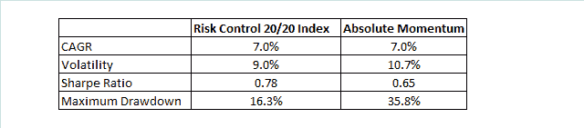
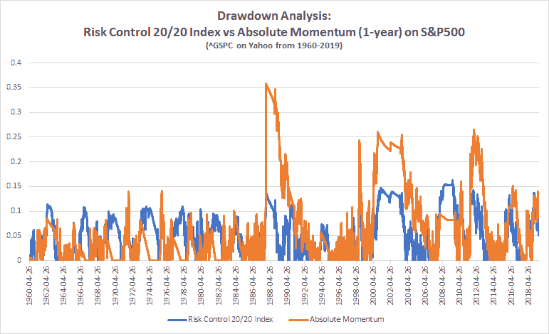

<!--yml

category: 未分类

日期: 2024 年 05 月 12 日 17:41:26

-->

# 使用回撤保护构建风险控制指数（第一部分） | 中国证券学会

> 来源：[`cssanalytics.wordpress.com/2019/07/09/building-a-risk-control-index-with-drawdown-protection-part-1/#0001-01-01`](https://cssanalytics.wordpress.com/2019/07/09/building-a-risk-control-index-with-drawdown-protection-part-1/#0001-01-01)

**Introduction**

追随趋势和绝对动量方法是管理风险的两种成熟方法。另一种管理风险的方法是使用波动率目标。前者优于在熊市中减少大幅回撤，而后者倾向于通过归一化每日投注规模来减少峰度。两者的结合往往会增加夏普比率，同时一般都会减少峰度和偏度。如果你想深入了解这方面内容，可以查看[Rob Carver 的这篇文章](https://qoppac.blogspot.com/2018/07/vol-targeting-and-trend-following.html)。Rob 提出的一个概念是，追随趋势和绝对动量的一个挑战是它们本质上是二元的——你要么“全入”，要么“全出”，这是次优的。

在金融领域没有神奇的数字——如果股市的 1 年超额收益率为 1%，这是否意味着你应该像它上涨 10%或更多一样坚定？显然，斜率与未来风险之间存在一定的关系。-1%的超额收益是否真的比 1%的超额收益更糟糕？这些水平比你想象的更加任意。在一定范围内，退出或减仓都是有利可图的。

从方差或幸运的角度来看，二元趋势/动量系统的另一个缺点是，通过全入或全出，你可以更多地受到任何一次交易的任意执行时机的伤害。（减少这个问题的一种方法是使用多个回溯，详细内容请参阅[Newfound Research 的这篇文章](https://blog.thinknewfound.com/2019/01/tightening-the-uncertain-payout-of-trend-following/)。这也是我们在[“投资者智慧”中使用的“趋势强度”指标](https://cssanalytics.wordpress.com/investor-iq-etf-digest/)）相比之下，采用持续持仓规模的策略有一个好处，它可以根据信念来调整曝光，并且不太容易受到时机风险的影响。

最后，追踪/动量系统面临的最大挑战是 **它们并没有直接与任何财务或基于风险的目标挂钩**。在任何给定的时间框架内，由于重复的惩罚或在你的信号触发之前发生的大幅短期修正，你能损失多少都没有限制。在高动量市场或 1987 年这样的情况下，这种额外的尾部风险可能是相当大的，因为二元趋势/动量信号往往仍然是 100%投资。

**Risk Control**

风险控制的概念在年金市场或由保险公司运行的各种计划中更频繁地使用，用于管理股权风险。通常这些方法与使用波动率定位完全相同([见此处的示例](http://www.annuityadvisors.com/forms/great-american/S&P-500-Risk-Control-Index.pdf))。然而，还有更多的奇特策略，这些策略添加了一种动态覆盖类型，以进一步减少风险。无论使用的确切方法如何，这第二层都旨在成为一种回撤保护形式。在传统的风险控制/波动率定位具有适度风险配置的情况下，这个特性非常重要，因为它在熊市中仍然有大量股权暴露。

为了构建一个具有回撤保护的风险控制指数，我建议投资者使用具有一定时间框架的回撤目标或“底线”。例如，许多投资者对其投资组合在一年内不要亏损超过-20%有风险偏好（此底线和回望期的选择是可选的）。您可以通过根据投资组合权益曲线的当前回撤程度来缩放头寸大小，从而直接控制此风险。这种方法大致模拟了设计用于保险 20%以下亏损的合成看涨期权。以下是构建具有回撤保护的风险控制指数的步骤。以本例中我们可以称之为“**风险控制 20/20 指数**”（20%风险目标，20%回撤目标）：

**步骤 1：** **风险曝光 (RE):** 开发一个以选定的波动率预测或实现波动率预测窗口为特色的波动率定位方法（在本例中，我选择了 20 天的实现历史波动率）。按目标波动率（本例中为 20%）除以当前波动率来缩放头寸，从而允许某些最大杠杆（在本例中不使用杠杆）。跟踪此策略的权益曲线，用于步骤＃2

**步骤 2：** **回撤曝光 (DE):** 选择一些目标回撤（在本例中我选择了 20%），权益“底线”（F）等于 1 减去目标回撤。当前权益水平（CE）等于昨日风险控制/波动率目标权益曲线的价值，除以过去 n 天的最高价格（在本例中选择了 1 年）。回撤曝光 (DE)的公式为：**MAX((1/(1-F)) x (CE-F)),0)**

**步骤 3: 总风险曝光 (TE):** 在次日应用的最终组合曝光计算如下：**TE= RE x DE**

这种方法的优势在于，您可以连续地对市场回撤做出响应，同时按波动率进行缩放，以提高风险调整后的回报。请记住，20%的风险目标和 20%的下限是相当慷慨的，因此我们可以轻松将此风险控制 20/20 指数与标准绝对动量（1 年回报减去国债）进行比较。将此比较结果应用于标准普尔 500 指数，可以在下面的表格中看到使用日执行以避免偏见（选择指数价格数据可观察到跨不同市场制度的行动）：

两种方法的表现几乎相等，但风险控制 20/20 指数在风险统计方面更佳，波动性更低，夏普比率更高，最大回撤要低得多。很难看出两个权益曲线之间的差异，但滚动回撤分析更加具有启发性：

在这张图表中，你可以清楚地看到风险控制 20/20 指数在控制大幅下跌方面做得更好。事实上，在绝对动量发生最大下跌的情况是在 1987 年，当动量很高时，信号未能及时改变以适应崩盘。相比之下，风险控制指数逐渐转向更低的权益暴露水平。在过去三十年中还有几次大的回撤，风险控制指数通过持续调整头寸大小而表现优异，得益于其能够不断缩减头寸。*当然，没有什么能够防范跳空风险或大幅度的单日下跌*，但在理论上，带有回撤保护的风险控制指数应该为投资者提供更明确的保护。在下一篇文章中，我们将探讨改进这一原始方法的各种方法，以及一些启发式方法，使其对实际交易更加实用。
