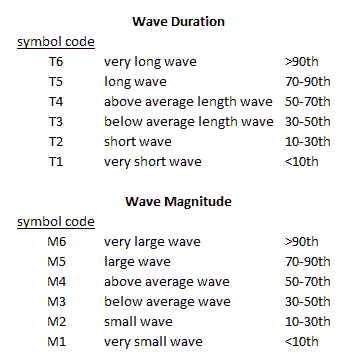

<!--yml

分类：未分类

日期：2024-05-12 18:11:08

-->

# CSS 波动理论构建基础 第二部分 | CSSA

> 来源：[`cssanalytics.wordpress.com/2011/04/12/css-wave-theory-building-blocks-part-2/#0001-01-01`](https://cssanalytics.wordpress.com/2011/04/12/css-wave-theory-building-blocks-part-2/#0001-01-01)

在第一部分，我们讨论了一些用于波动理论（如艾略特波动）的可测试框架所需的元素。在本文中，我们将讨论一个非常简单的用于测试和研究的框架。一个好的分类系统的一个最重要的方面是能够将其分类为广泛的一般原则，并将信息压缩为可管理的块。这种信息压缩是允许人类在某些机器无法做到的任务上取得成功的因素之一——即涉及到不完全信息的博弈论应用，以及在随机噪声存在的情况下进行抽象模式识别。

时间序列数据中描述运动的两个主要组成部分是：1）价格和 2）时间。其他元素将在第三部分讨论。然而，在大多数情况下，市场从起点开始的移动可以通过其**持续时间**（自移动开始以来的时间长度）和**幅度**（自移动开始以来波动单位的累积收益/损失）来描述。正如第一部分讨论的那样，我们重要的是要采用归一化，以增加在样本外泛化的能力。归一化使我们能够将事物整齐地分类到均匀分布的类别中，这些类别可以包含一系列示例，而不是必须寻找可能已经发生或可能尚未发生的非常具体的示例。我建议回顾至少 7-15 年的波动分析，以创建用于分类的分布。因此，波可以根据下图编码为具有两位描述符的方式：（*价格代码，时间代码*）。一旦我们能够将波整齐地分类，我们现在就可以使用经典的数据挖掘技术来找到相关模式。例如，市场的移动可以描述为：T6，M6-，表示一个非常大的移动，持续了很长时间。这个主题还有更多细微之处，我将在第三部分讨论。

