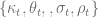
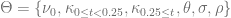
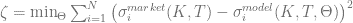
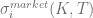
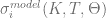
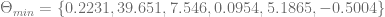
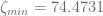
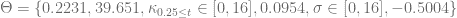

<!--yml

类别：未分类

日期：2024-05-17 23:43:23

-->

# 校准：确定性优化器的比较 – HPC-QuantLib

> 来源：[`hpcquantlib.wordpress.com/2011/05/17/calibration-comparison-of-deterministic-optimizers/#0001-01-01`](https://hpcquantlib.wordpress.com/2011/05/17/calibration-comparison-of-deterministic-optimizers/#0001-01-01)

目标是校准一个时间相关的 Heston 模型，该模型由以下 SDE 定义

参数集  应该在时间上分段常数。该模型基于特征函数方法有一种半封闭解来定价普通欧式看涨/看跌期权 [1]。

基于 2002 年 7 月 5 日的数据，DAX 隐含波动率曲面定义了“基准”校准问题。

.

非线性最小二乘优化问题由拟合度度量定义

其中  是罢工价 K 和到期 T 的市场隐含波动率， 是相应的从模型价格推导出的 Black-Scholes 波动率隐含值。此问题的最优解是

导致拟合度度量为  （请记住，这个结果是一个简单的校准过程的结果。由于大  和  值，我不会使用这些参数来定价衍生产品。）。

  上图显示了参数集的“拟合度”曲面

：**θ = { 0.2231, 39.651, $κ_{0.25 ≤ t} \in [0, 16]$, 0.0954, $σ \in [0, 16]$, -0.5004 }**

为了能够比较更多的确定性优化器，模型校准将使用[R](http://www.r-project.org/)进行，并借助额外的包[minpack.lm](http://cran.r-project.org/web/packages/minpack.lm/index.html)和[minqa](http://cran.r-project.org/web/packages/minqa/index.html)进行。

**非线性最小二乘优化**：

1.  **nls.lm**：Levenberg-Marquardt 算法（基于[MINPACK](http://www.netlib.org/minpack)，也可在[QuantLib](http://quantlib.org/)中找到）

1.  **nls**：高斯牛顿算法

1.  **nl2sol**：基于 PORT 库。

**非线性（信任区域）最小化**：

1.  **nlm**：牛顿样式最小化器

1.  **bfgs**：由 Broyden、Fletcher、Goldfarb 和 Shanno 发表的拟牛顿方法

1.  **l-bfgs-b**：包含箱式约束的有限内存 BFGS 算法

1.  **cg**：共轭梯度算法

1.  **nm**：Nelder-Mead 方法

1.  **bobyqa**：通过插值形成二次模型的信任区域方法。

1.  **newuoa**：通过插值形成二次模型的信任区域方法。

1.  **uobyqa**：通过插值形成二次模型的信任区域方法。

具体结果取决于起始向量，但下图显示了一种常见结果。

  最佳方法是非线性最小二乘算法 nls.lm 和 nls，其次是 nl2sol。未包含在图中的算法甚至比此问题的“nm”表现更差。

拟合优度量是基于[QuantLib](http://quantlib.org)中的 C++ 计算，并使用[RCPP](http://cran.r-project.org/web/packages/Rcpp/index.html)暴露给[R](http://www.r-project.org/)。可以在[这里](http://hpc-quantlib.de/src/optimproblem.zip)找到执行优化和创建图表的 C++ 代码和 R 脚本。

1] A. Elices，[使用变换方法处理具有时间相关参数的模型：Heston 模型的应用](http://arxiv.org/pdf/0708.2020)

[2]  A. Sepp，[使用傅立叶变换处理跳跃扩散过程的随机波动性下的欧式期权定价：应用](http://math.ut.ee/%7Espartak/papers/stochjumpvols.pdf)
