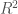

<!--yml

类别：未分类

日期：2024-05-18 06:42:37

-->

# 我们能否知道谁在哪个暗池中交易？ | 机械市场

> 来源：[`mechanicalmarkets.wordpress.com/2015/11/15/who-trades-on-which-dark-pools/#0001-01-01`](https://mechanicalmarkets.wordpress.com/2015/11/15/who-trades-on-which-dark-pools/#0001-01-01)

市场透明度确保投资者获得公平价格，并获得准确数据进行研究。但是，透明度也会使交易者更难将其意图隐藏起来，以免让竞争对手和交易对手得知。交易所和监管机构的任务是平衡市场客户的透明度需求。暗池以最少的允许透明度运作，旨在帮助机构隐藏其订单流量。他们大致通过以下两种方式实现这一点：

1.  缺乏交易前透明度。在交易执行之前，暗池中的订单是不可见的。

1.  交易后透明度降低。暗池要求快速向综合交易报告交易，但此过程并非即时进行。公共交易数据订阅者也不知道哪个暗池（或批发商/ELP）报告了给定的交易。

市场结构一直在变化，第 2 个方面有一个新的变化。FINRA [Rule 4552](https://www.finra.org/industry/rule-filings/sr-finra-2013-042) 规定每周暗池交易量必须[发布](https://ats.finra.org/) 每个证券。* 这些数据是以 2 周的延迟基础上公开的，但正如我们将看到的，它可能仍然具有一些信息价值。

# 13F 持仓数据

监管也要求大型资产管理公司在 45 天内报告他们的季度末长期持仓。[1] 许多对冲基金等待到最后一刻才提交他们的 13F，这表明他们认为披露的信息具有价值。

一些对冲基金，如 Greenlight Capital，公开[推广](http://www.cnbc.com/2014/04/22/david-einhorn-takes-stake-in-hft-nemesis-iex.html) 暗池 IEX。Greenlight 还拥有 IEX 的股份，因此它更倾向于在那里进行交易是有道理的。我们可以将 Greenlight 的季度性长头寸变化与 FINRA 4552 数据相结合，以了解它是否在 IEX 上交易了不成比例的交易量。这是 Greenlight 季度交易活动与 IEX 的密度图：

确实看起来有些事情发生了。上述是 NMS Tier 1 股票的整个宇宙。如果我们将其限制在我们怀疑 Greenlight 更可能交易的股票上会怎么样？这是一个类似的图，限制在 Greenlight 在前一季度 13F 中报告了长期持仓的股票上：

与上文类似。包括带有阴影的 95%置信区间的线性回归。

显然，相关性与因果关系不同，但这种关系表明 Greenlight 可能会向 IEX 导入大量交易量。IEX 还在其[网站](http://iextrading.com/tops/)上报告了接近实时的交易量，因此可能可以发现 Greenlight 当前是否在交易某只股票。另一个支持 IEX 的机构 Pershing Square 交易次数太少，无法进行类似的分析，但当 Pershing Square 最近[购买](http://www.businessinsider.com/bill-ackman-buys-more-valeant-2015-10)了 200 万股时，IEX 的 VRX 交易量异常高，这可能不仅仅是巧合。[2]

提到由于 Greenlight 或 Pershing Square 支持 IEX 而泄漏了有价值的信息几乎太容易了。Ackman 关于前置交易的偏执在《Flash Boys》中占据了重要地位。[3] 而 Greenlight 有时候[感觉到](http://www.bloombergview.com/articles/2014-02-14/david-einhorn-will-say-what-stocks-he-owns-when-he-s-good-and-ready)即使 13F 披露也会损害其业务。[4]

# 更广泛的分析

检查其他对易于检测的暗池偏好的对冲基金似乎很有趣。我选择了[Octafinance](http://www.octafinance.com/hedge-funds/top-hedge-funds/)上列出的前 100 家基金，并尝试查询[Jive Data](https://api.jivedata.com/documentation/)在截至 2015 年 6 月 30 日的前 5 个季度内的 13F 数据。然后，我对每个对冲基金的相对交易量和所有暗池的相对交易量（这些交易量度量在第一个图的说明中定义）进行了[套索回归](http://statweb.stanford.edu/~tibs/lasso.html)，使用了前 4 个季度的数据。第 5 个季度作为测试数据。回归仅包括给定基金在该季度内活跃于某只股票的数据点。[5] 这并不是什么花哨的东西，但这个过程希望能捕捉到一些表面上的关系，比如 Greenlight 与 IEX 的关系。这是使用的[R 脚本](https://mechanicalmarkets.wordpress.com/wp-content/uploads/2015/11/ats-13f-rscript.zip)，以及其输出的[图表和表格](https://mechanicalmarkets.wordpress.com/wp-content/uploads/2015/11/ats-13f-output.zip)。

见第二个压缩文件中的“lassoResultsWhenFundTraded_LogHFAnomVol_on_LogAtsAnomVol.csv”以获取套索结果的摘要表格。[6] 在对如此大量的回归分析进行统计显著性评估时需要谨慎，但很多事情都很明显。Mariner Investment Group 看起来是较容易被发现的基金之一[7]，测试集的几乎没有低于 0.5。

Mariner Investment Group 的测试数据的预测和实际成交量测量。

看起来 Mariner 喜欢在 Level ATS 上交易，并且倾向于避免 Sigma-X 和 UBS 的暗池。我们无法将基金的路由决策与其他原因分开 —— 例如，如果高零售参与者扭曲了某只股票的价格，使得该基金的活动与 Interactive Brokers' ATS (IATS)的活动相关联，那么该基金可能更有可能交易该股票，即使该基金不在那里交易。[8] 但是，似乎存在一个趋势，即对冲基金更倾向于远离 UBS 的 ATS； Tortoise Capital Advisors 是唯一一个对 UBS 有正系数的基金，而许多基金的系数都是负数。我不知道这样做的原因，可能是对冲基金对执行质量不满意，或者只是他们不是 UBS 的客户。如果是前者，这种分析就给那些希望隐藏意图的交易者提出了一个棘手的困境：如果你不喜欢某个场所，那么你的信息泄露可能会增加，即使你避免了它。如果情况确实如此，即使你认为他们在搞[不正当的事情](http://www.bloomberg.com/news/articles/2015-08-12/itg-pays-record-dark-pool-fine-for-running-secret-trading-desk)，你可能也想路由到那里。有时，修复市场结构需要集体行动，我们需要监管机构代表我们采取行动。

一些活跃度很高的基金具有令人惊讶的大测试。可能每当你能对一个基金的成交量做出自信的预测时，该基金的交易方向可能特别难以预测。我想知道 Citadel Advisors 是否也是如此（他们的预测的接近 0.1），因为我真的期望 Citadel 足够复杂，能够隐藏他们的交易。一些表现出更容易检测到流量的高活跃度基金包括：Bridgewater (约为 0.07)，Millenium (约为 0.05)，Royce (约为 0.1，显然喜欢摩根士丹利的 ATS，并且避免 JP 摩根的)，BlueMountain (约为 0.07，可能喜欢摩根士丹利，并且避免瑞银)，Tudor (约为 0.1，可能避免瑞银)，Carlson (约为 0.13，可能更偏好 ITG[9]，并在 Fidelity 和 Interactive Brokers 的 ATS 上交易更多的股票)，以及 Ellington (约为 0.2)。Highbridge、Adage、D.E. Shaw，以及两家 Two Sigma 实体的可检测性非常弱 (约为 0.03)。AQR、Renaissance 和 Visium 可能通过这种方式泄露很少或没有成交量信息。

许多不太活跃的基金也有相当大的 ，但我发现讨论预测最失败的例子是有趣的。Magellan Asset Management 的预测在测试季度表现不佳：

Magellan Asset Management 测试数据的预测和实际成交量测量。

其回归中最大的组成部分是一种明显的在 IEX 进行交易的倾向。这种关系在最后一个季度突然发生了逆转：

Magellan 在给定季度交易的股票相对成交量与异常的 IEX 成交量。线性回归显示了每个季度关系的 95% 置信带。

Magellan 曾经是 IEX 的大量用户吗？但在 Q2 开始就开始避免使用了吗？我们不能确定，因为这种趋势是通过数据窥探发现的，但它是有启示性的。如果是这样，Magellan 可能已经采取了最简单的对策，改变他们的行为。

# 不可预测的交易

避免这种泄漏的关键是进行不可预测的交易，或者至少按照人口规范进行交易。在我看来，这意味着 Einhorn 在《闪 Boys》中描述的推理几乎完全是错的：

> 听完 Brad 的陈述后，Einhorn 问了他一个简单的问题：**为什么我们不都选择同一个交易所呢？** 为什么投资者不组织起来资助一个单一的股票交易所，委托它保护他们的利益，并保护他们免受华尔街的掠食者？

区块交易可以是一项有价值的服务，但其效用是有限的。要看到原因，假设 100 名高阿尔法投资者同意专门在一个交易场所进行交易，并且公开文件显示其中只有一位拥有微米股票。突然，那个交易场所报告了不寻常的微米交易量。通过一些辅助数据（也许是新闻文章或观察到的价格影响），其他交易者可能会确定该投资者是在减少还是增加他的持仓。

我想象这种信息泄漏也可能发生在明显的交易所上。主要交易所有更多的交易量来掩盖机构的执行。但是，如果一家对冲基金更倾向于在次要交易所交易（或者列入主要交易所的黑名单），他们的活动可能会留下痕迹。坚持使用相同的[执行算法](https://mechanicalmarkets.wordpress.com/2015/04/30/market-data-patterns-order-anticipation-and-an-example-trading-strategy/)（或者算法性的订单类型）的投资者甚至可能泄漏出他们交易的一面。[10]

Reg. NMS 的前提是交易所之间的竞争降低成本并防止[滥用](https://www.sec.gov/news/press/2005-53.htm)。如果一个新兴场所被广泛认为是优越的，它将迅速吸引市场份额。对主要交易所不满意的人们尚未就替代方案达成共识。这意味着，如果他们毫无保留地支持他们最喜欢的新兴场所，他们的执行质量可能会受到影响。这一定很令人沮丧。因此，如果新兴企业尝试强迫参与者使用他们的场所的方案，那是可以理解的。纽交所已经[建议](http://www.sec.gov/comments/10-222/10222-19.pdf)，IEX 的设计包括反竞争的路由实践和[挂单](https://mechanicalmarkets.wordpress.com/2015/10/05/iex-peg-orders-last-look-for-equity-markets/)处理。除非被市场碎片化所影响的交易者停止自己的碎片化，否则他们唯一的前进道路就是攻击 Reg. NMS 的基本原理。我不确定这是否是答案[11]，但如果市场批评家为他们在单一的、整体性的交易所上交易的日子感到留恋，那也不应该让人感到意外。

[1] 特别大的头寸必须[更快](http://www.sec.gov/answers/sched13.htm)报告。在美国，空头头寸不必报告，尽管有[运动](http://www.bloomberg.com/news/articles/2015-10-21/nyse-pleads-for-rules-to-make-hedge-funds-reveal-short-positions)试图改变这一点。欧洲股票的[大量空头头寸](https://www.esma.europa.eu/page/Short-selling)必须快速报告，我很想看到这篇帖子的分析能否用更高分辨率的欧洲数据重复。

[2] 这是 IEX 在 10 月 21 日收盘后不久最活跃的股票的[截图](https://mechanicalmarkets.wordpress.com/wp-content/uploads/2015/11/iex-tops-screenshot-4pm-oct21.png)。在 Pershing Square 宣布他们已经交易之前，这一大部分交易量出现了（尽管我没有截图）。这是我提醒你，这个博客上没有任何交易或投资建议的好机会。

[3] 来自“[闪电侠](http://www.nytimes.com/2014/04/06/magazine/flash-boys-michael-lewis.html)”（强调添加）：

> 比尔·阿克曼经营着一家著名的对冲基金，Pershing Square，经常大量购买公司的股份。在勘弥山出现在他的办公室解释发生的事情之前的两年里，阿克曼开始怀疑人们可能正在利用他交易的信息在他之前进行交易。阿克曼说：“每次我都觉得有泄漏。”“我以为可能是首席经纪人。”“这不是我想到的那种泄漏。”

它从来没有，对吧？

[4] Greenlight 还[说过](http://www.cnbc.com/2014/04/22/david-einhorn-takes-stake-in-hft-nemesis-iex.html)：

> 我们认为，对于任何担心快速计算机利用他们的投资者来说，最佳的应对方法是要求将他们的订单发送到 IEX。

但是对于担心慢速交易者“利用”他们的投资者呢？在这种情况下，也许他们在把所有交易量发送到 IEX 之前应该三思？

[5] 这意味着为了使用这种特定方法来预测基金在特定股票中的活动量，您需要知道他们是否可能进行交易。也许有时候这是可能的。但是，无论如何，这不是我在这里尝试做的事情。这篇文章只是为了看看基金是否有任何可检测的偏好，而不是确定这些偏好是否会产生交易机会。

[6] 其中包含由 Lasso 回归给出的每个对冲基金相对交易量与 ATS 异常交易量的系数。每个（季度，股票）对是一个数据点。均方误差分别给出了训练集（Total_MSE_Train）和测试集（Total_MSE_test）。训练集（R-Squared_MSE_Test）和测试集（R-Squared_MSE_Test）分别给出了的度量，注意测试集的略有不同，因为它使用训练集的平均值作为其“零预测”。每组的样本大小由 n_Train 和 n_Test 给出。

[7] 他们的股票[组合](http://www.nasdaq.com/quotes/institutional-portfolio/mariner-investment-group-llc-69114)主要由 ETF 和生物科技组成，所以这可能是一个人为因素。

[8] 在这种情况下，IATS 的交易活动仍然可能是对对冲基金交易量的有用预测因素。

[9] ITG 的交易量在被罚款后已经[崩溃](http://meanderful.blogspot.com/2015/09/ubs-and-iex-gain-itg-lose-finra-ats.html)，因为它在自己的暗池中进行专营交易。我想象他们自上一季度末（6 月 30 日）结束以来，可能已经失去了许多客户，因此对于后续季度的预测准确性可能较低。

[10] 如果有需求的话，也许我可以调查一下市场数据模式是否与机构资金流动相关。

[11] 首先，目前还不清楚为什么使交易基础设施更类似于公共事业的运动会在交易所止步。那么经纪人、执行算法和中间商呢？我认为类似的博弈论困境也可能适用于这些群体。将竞争激烈的行业重组为国家监督的垄断部分地是承认没有进一步增值创新的前景。正如 Cliff Asness 所[说](http://www.bloombergview.com/articles/2014-06-20/why-i-love-high-speed-trading)：

> [我]它是垄断者经常提出的论点 —— 他们实际上只是在为客户创造效率，消除浪费。

* ATS 数据通过[`www.FINRA.org/ATS`](http://www.FINRA.org/ATS)提供，由 FINRA 2015 版权所有。
