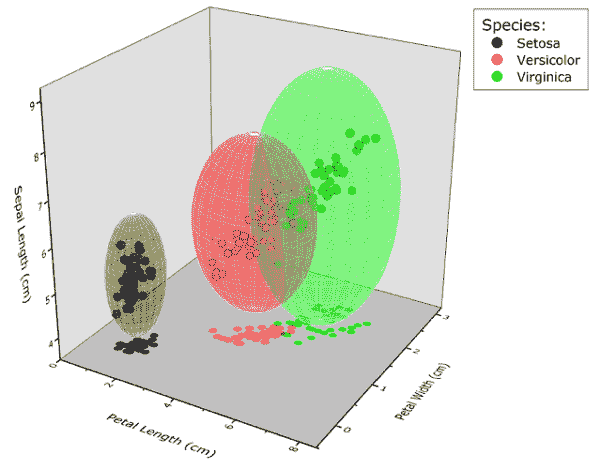

<!--yml

分类：未分类

日期：2024-05-12 17:51:56

-->

# 投资组合管理的聚类随机子空间方法 | CSSA

> 来源：[`cssanalytics.wordpress.com/2014/11/04/cluster-random-subspace-method-for-portfolio-management/#0001-01-01`](https://cssanalytics.wordpress.com/2014/11/04/cluster-random-subspace-method-for-portfolio-management/#0001-01-01)

href=”[`cssanalytics.files.wordpress.com/2014/11/cluster-image-3.png”&gt`](https://cssanalytics.files.wordpress.com/2014/11/cluster-image-3.png%E2%80%9D&gt);

我个人研究的众多领域之一是创造新方法，以改进[均值-方差优化](https://cssanalytics.wordpress.com/2013/10/03/mean-variance-optimization-and-statistical-theory/ "Mean-Variance Optimization and Statistical Theory")。不久前，我曾写过一个关于将[随机子空间方法](http://en.wikipedia.org/wiki/Random_subspace_method)（RSM）应用于改进标准投资组合优化的潜在替代方案的概念。我将 RSM 应用于优化称为[RSO](https://cssanalytics.wordpress.com/2013/10/06/random-subspace-optimization-rso/ "Random Subspace Optimization (RSO)")- 在同质化的宇宙中显示出了与传统均值-方差相比的潜力。随机子空间的原始概念起源于著名的贝尔实验室，旨在降低预测或分类的维度。RSM 最流行的应用是在机器学习中生成更健壮的“决策树”的“随机森林”。RSM 使用装袋（bagging）从预测因子中抽取样本，并将它们的估计组合在一起形成“集成”。其主要优势在于，由每组预测因子产生的噪声倾向于与其他随机选择的组不太相关。因此，噪声被“抵消”，剩下的是更稳定和准确的预测器集成。

虽然 RSM 框架在统计上是可靠的，但确实存在一些明显的弱点，需要更精细的方法。我与[Systematic Edge](http://systematicedge.wordpress.com/)的 Michael Guan 合作，担任他的计算机科学论文顾问，共同研究了一种更优越的方法，称为“Cluster Random Subspace Method”（CRSM）。Michael 是一个非常聪明的人，和他一起工作非常有趣。我们还收到了[GestaltU](http://gestaltu.com/)的 Adam Butler 的一些宝贵反馈。我们用来展示 CRSM 优势的应用是投资组合优化，但该概念也可以应用于预测和分类（包括随机森林）。论文可以在这里找到：[CRSO 论文](https://cssanalytics.files.wordpress.com/2014/11/crso-thesis1.pdf)<a . 我鼓励每个人都阅读这篇论文，但对于那些想要更简单概述的人，我将在下一篇帖子中提供摘要。
