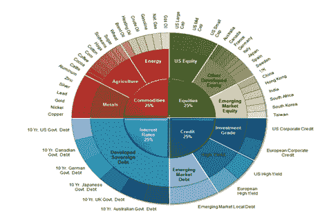

<!--yml

category: 未分类

date: 2024-05-12 18:03:22

-->

# Cluster Risk Parity– A Visual Representation | CSSA

> 来源：[`cssanalytics.wordpress.com/2013/01/04/cluster-risk-parity-a-visual-representation/#0001-01-01`](https://cssanalytics.wordpress.com/2013/01/04/cluster-risk-parity-a-visual-representation/#0001-01-01)

下图是通过 Salient Capital Advisors 的*静态风险平价*方法借鉴的：[`www.theriskparityindex.com/static/pdfs/Salient-Risk-Parity-Index-White-Paper.pdf`](http://www.theriskparityindex.com/static/pdfs/Salient-Risk-Parity-Index-White-Paper.pdf)。这个视觉对于读者理解[Cluster Risk Parity](https://cssanalytics.wordpress.com/2013/01/03/cluster-risk-parity/ "Cluster Risk Parity") (CRP)方法的细微差别和相对优点是有用的。在他们的方法中，***个别资产和集群是事先定义的***，因此没有使用***动态聚类方法***。然而，他们使用的概念是类似的：在资产“集群”内部和之间平衡风险贡献。在这种情况下，重要的是澄清，饼图的每个部分的大小/面积是风险贡献的函数，而不是百分比资本配置。

正如您从这张特定的图表中清楚地看到的那样，它在精神上与[“全天候”投资组合](https://cssanalytics.wordpress.com/2012/11/07/the-all-weather-portfolio-derivation/ "The “All-Weather” Portfolio Derivation")或者更简单的[永久投资组合](https://cssanalytics.wordpress.com/2012/11/01/permanent-portfolio-derivation-and-historical-performance/ "Permanent Portfolio Derivation and Historical Performance")非常相似。主要区别在于后者的投资组合方案代表了“战略资产配置”替代方案，而[Cluster Risk Parity](https://cssanalytics.wordpress.com/2013/01/03/cluster-risk-parity/ "Cluster Risk Parity")(以及 Salient 指数)是一种动态资产配置框架。GestaltU 在最近的一篇文章中很好地描述了为什么重视动态方法是重要的：[`gestaltu.blogspot.com/2013/01/the-full-montier-absolute-vs-relative.html`](http://gestaltu.blogspot.com/2013/01/the-full-montier-absolute-vs-relative.html)。关于 CRP，优势在于创造一个不需要事先在静态基础上预先指定资产和权重的框架。相反，它允许投资组合能够适应资产回报的方差/协方差矩阵的变化 —— 这在动态框架中被证明特别有用，以规范化风险暴露。这个框架是如此通用，以至于可以相对容易地适应任何类型的风险因子或制度框架。
