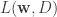
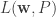

<!--yml

category: 未分类

date: 2024-05-18 13:53:12

-->

# 组合回归与排名 | Quantivity

> 来源：[`quantivity.wordpress.com/2010/09/06/combining-regression-and-ranking/#0001-01-01`](https://quantivity.wordpress.com/2010/09/06/combining-regression-and-ranking/#0001-01-01)

许多类型的交易分析问题归结为一种形式或另一种形式的[*回归*](http://en.wikipedia.org/wiki/Regression_analysis)和[*排名*](http://en.wikipedia.org/wiki/Ranking)的组合，（*例如*）经典或最小化自定义损失函数。然而，这两种技术之间的关系是微妙的，它们的相互依赖性受到了多种实际困难的影响。一个熟悉的例子是缺乏必要的性能等价性，意味着优秀的回归可能导致较差的排名，反之亦然。

[KDD-2010](http://www.sigkdd.org/kdd2010/)最近刊登了一篇论文，[组合排名和回归](http://www.eecs.tufts.edu/~dsculley/papers/combined-ranking-and-regression.pdf)由[Sculley](http://www.eecs.tufts.edu/~dsculley/)撰写，描述了一种同时优化双重目标函数的方法。具体来说，来自第一页：

> 在两个不同的指标族上表现良好的模型。第一组指标是基于回归的指标，如均方误差，它奖励模型为给定示例预测一个接近真实目标值 y 的数值 y′，并惩罚远离 y 的预测。第二组是基于排序的指标，如 ROC 曲线下面积（AUC），它奖励模型为产生具有与一对给定示例的真实值 y[1] > y[2] 相同的成对顺序 y′[1] > y′[2] 的预测值。

这种组合方法的声称优点在金融数据方面非常有趣：

+   *稳定性*：防止学习出现在一个指标集上表现良好但在另一个指标集上表现不佳的退化模型。

+   *非正态分布*：在罕见事件的情况下提高回归性能，包括长尾和极端少数类分布。

优化目标为，（见第 3 页）:

![\min_{{\bf w} \in \mathbb{R}^m} [ \alpha L({\bf w}, D) + (1 - \alpha) L({\bf w}, P) + \frac{\lambda}{2} ||{\bf w}||²_2 ] ](img/53095a8a1d902f2a26cdc8586f4a7fb9.png)

其中  是回归损失， 是排序损失，![\alpha \in [0, 1] ](img/53f0dd9b602ff1f4d81daf74b8444c4b.png) 是损失权重参数。算法使用[随机梯度下降](http://en.wikipedia.org/wiki/Stochastic_gradient_descent)。
