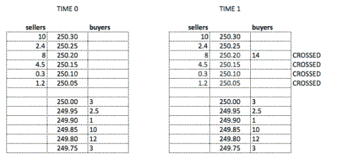

<!--yml

类别：未分类

日期：2024-05-18 15:28:38

-->

# 比特币的数据整合来源 | Tr8dr

> 来源：[`tr8dr.wordpress.com/2015/01/27/consolidated-source-of-data-for-bitcoin/#0001-01-01`](https://tr8dr.wordpress.com/2015/01/27/consolidated-source-of-data-for-bitcoin/#0001-01-01)

2015 年 1 月 27 日 · 下午 7:55

看起来每隔一个月就会出现一个新的比特币交易所。 对于交易研究和回测而言，跨越最流动交易所的历史数据至关重要。 我的最小清单是：

1.  BTC/USD

    1.  bitfinex (15%)

    1.  bitstamp（5%）

    1.  coinbase（新交易所，但可能会占据市场份额）

1.  BTC/CNY

    1.  okcoin (28%)

    1.  btcn (44%)

（百分比交易量来自 [`bitcoincharts.com/charts/volumepie/`](http://bitcoincharts.com/charts/volumepie/ "bitcoincharts")）。 这些交易所不仅具有独特的协议，还具有需要标准化的独特语义。

例如，bitstamp 为订单簿的部分横扫产生以下交易序列。 例如，在这里进行了部分横扫，放置了一个 BUY 14 @ 250.20 的订单，越过了订单簿卖方的 4 个订单：

在 Bitstamp 中，将看到以下交易：

1.  **NEW BUY 14 @ 250.20, id: 43**

1.  DEL  SELL 1.2 @ 250.05, id: 23

1.  **UPDATE BUY 12.8 @ 250.20: id, 43**  (更新被动订单的大小)

1.  TRADED 1.2 @ 250.05

1.  DEL SELL 0.3 @ 250.10, id: 24

1.  **UPDATE BUY 12.5 @ 250.20: id, 43**  (更新被动订单的大小)

1.  TRADED 0.3 @ 250.10

1.  …

1.  TRADED 8 @ 250.20

1.  DEL BUY 0 @ 250.20, id: 43

这里的奇怪之处在于，许多市场数据流和订单簿实现将仅在 1 次交叉中进行交易，因此通常只会看到：DEL、TRADE、DEL、TRADE、DEL TRADE（删除可能也不会在交易之间排序）。 在重播此数据时，典型的 OB 实现将立即扫描订单簿，而不会在交叉和删除之间出现中间 UPDATE 状态。 在这样的实现中，看到交叉后的非零大小更新并完全删除订单，可能会被视为错误或遗漏 NEW，因为订单不再记录在 OB 中。

还有一点是，Bitstamp 不指示交易的一方（即哪一方是主动方），尽管这在股票或外汇等市场中不常见，但比特币交易所提供了这一信息。 幸运的是，因为提供了初始交叉订单，可以使用二部图（在存在多个交叉订单的情况下）来确定最可能的主动方订单，从而确定交易方向。

**数据结算中心**

我想建立和/或参与以下事项：

1.  构建强大的标准化 L3 或 L2 -> L3（暗示）订单簿实时数据源

    1.  用于将数据收集到简单的二进制刻度数据库格式中

    1.  还可重用作实时交易的连接处理程序

1.  标准化交易流（例如上述示例中的问题）

1.  基于交易所特定的语义来识别交易中的买入/卖出标识。

1.  除了交易所特定的 Tick 流/数据库外，创建一个统一的订单簿流：

    1.  将市场状态同步到最接近的毫秒。

    1.  规范化订单 ID 空间，使订单 ID 不会冲突，并且可以识别订单来源。

1.  提供简单的方法来生成条形图或者从 L3 数据中筛选交易。

开发需要一定的时间，而在托管方面需要的资金相对较少。假设没有使用许可协议方面的问题，也许可以作为一种非盈利的安排提供数据。我们不打算围绕此建立营利性公司，而是希望建立一个可以回馈社区的集体，也许能够利用捐赠的资源和/或数据。
