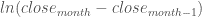

<!--yml

类别：未分类

日期：2024-05-18 08:08:13

-->

# 使用 R-ggplot2 创建热力图可视化收益率 | 量化角落

> 来源：[`quantcorner.wordpress.com/2013/11/02/creating-a-heatmap-to-visualize-returns-with-r-ggplot2/#0001-01-01`](https://quantcorner.wordpress.com/2013/11/02/creating-a-heatmap-to-visualize-returns-with-r-ggplot2/#0001-01-01)

我们希望可视化**伦敦 ICE 柴油期货合约**的月度收益率。为此，我们使用**R**和**ggplot2**库创建了一个热力图。

原始数据来自互联网。它们由 1981 年 4 月至 2013 年 10 月的第一个邻近伦敦 ICE 柴油期货合约的每日收盘价格组成。月度收益率计算如下：。

下面的**R**代码非常直观。它可以轻松修改以满足特定需求，并作为更高级图表的基础。我们还展示了结果。

```
###################################################
# Édouard Tallent @ TaGoMa.Tech, November 2013    #
# QuantCorner @ https://quantcorner.wordpress.com  #
###################################################

# Create a data object from the file object that actually is an object for the file containing the data
data <- read.table(file,sep=',',header=TRUE,na.strings="NA") # Create the data object from file

# Remove rows containing NAs
row.has.NA <- apply(data, 1, function(x){any(is.na(x))})
# sum(row.has.NA)
data <- data[!row.has.NA,]

# Create a xts object from the data object
require(xts)                                                            # Load xts
data <- as.xts(data[,2], order.by=as.Date(data[,1], format='%d/%m/%Y')) # Create the xts object

# Compute the monthly log return
require('quantmod')                                     # Load quantmod
ret <- monthlyReturn(data, type='log', leading=TRUE)    # Compute the monthly returns

# Create a matrix mat object from ret 
ret <- c(NA, NA, NA, ret, NA, NA)                               # The original time series nor starts on a Jan month nor ends on Dec 
mat <- matrix(ret*100, ncol=12, byrow=TRUE, dimnames=NULL)      # Create a R matrix
year <- seq(from=1981, to=2013, by=1)                           # Vector containing the years
month <- c('Jan','Feb','Mar', 'Apr','May','Jun','Jul','Aug','Sep','Oct','Nov','Dec')    # Vector containing the year months
colnames(mat) <- month  # Give columns names
rownames(mat) <- year   # Give rows names

# Transform the data in mat into a long series using the melt() function
require(reshape2)           # Load reshape2
molten <- melt(mat)         # Transform the series into a long series

# Define the color palette to be used in the hetmap
LtoM <-colorRampPalette(c('red', 'yellow' ))            # The spectrum of colors for the lowest returns
Mid <- "snow3"                                          # Snow3 is the color for the (approximatedly) median value
MtoH <-colorRampPalette(c('lightgreen', 'darkgreen'))   # The spectrum of colors for the highest values

# Plot the heatmap
require(ggplot2)                                                            # Load ggplot2 
hm <- ggplot(data=molten, aes(x=factor(Var2, levels=month.abb),
                y=Var1, fill=value)) + geom_raster()                        # Draw the heatmap using geom_raster()
hm <- hm + scale_fill_gradient2(low=LtoM(100), mid=Mid, high=MtoH(100))     # Colors, please!
hm <- hm + labs(fill='Return (%)')                                          # The legend
hm <- hm + geom_text(aes(label=paste(sprintf("%.1f %%", value))), size=4)   # Write the monthly returns in hte heatmap
hm <- hm + scale_y_continuous(breaks=1981:2013)                             # Deal with the y-axis
hm <- hm + xlab(label=NULL) +   ylab(label=NULL)                            # No axis names
hm <- hm + theme_bw()                                                       # No background grey grid
hm <- hm + theme(axis.text.x=element_text(size=10, hjust=0, vjust=0.4,
                angle=90))                                                  # Beautify the x-axis
hm <- hm + ggtitle(label='Monthly return - 1st nearby London ICE Gasoil futures contract')  # Add a title

print(hm)                                                                   # Print out the heatmap on the screen
```


