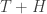
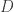

<!--yml

类别：未分类

日期：2024-05-18 13:52:45

-->

# 跨断面波动性 | Quantivity

> 来源：[`quantivity.wordpress.com/2011/03/02/cross-sectional-volatility/#0001-01-01`](https://quantivity.wordpress.com/2011/03/02/cross-sectional-volatility/#0001-01-01)

[滞后嵌入作为制度信号](https://quantivity.wordpress.com/2011/02/24/delay-embedding-as-regime-signal/)引发了足够多的问题，需要进一步评论*主成分空间*  和*跨断面波动性*  模型，从中导出制度信号 。理解这两者的价值有两个原因：

+   血统：这个模型在风险套利传统上是*风格上*代表性的，从[计算方法论建模统计套利动态](http://citeseerx.ist.psu.edu/viewdoc/summary?doi=10.1.1.99.6514)（Burgess, 1999）到[美国股票市场的统计套利](http://papers.ssrn.com/sol3/papers.cfm?abstract_id=1153505)（Avellaneda and Lee, 2008）；在实践方面，Burgess 和 Neil Yelsey（被 Infantino 和 Itzhaki 承认）都是声名显赫的套利交易台的负责人。

+   典型：这说明了如何构建*收益的转换*模型（通常通过[降维](http://en.wikipedia.org/wiki/Dimension_reduction)），而不是收益本身——正如 Paul Grimoldi 所评论的；这也回答了 Jeff 去年关于经典技术分析与定量方法之间对比的问题：对收益的视觉模式分析与对转换后收益的统计分析/机器学习之间的对比。

此模型的直觉很有说服力，尽管其粗略的数学表达方式相当难以理解：*通过股票投资组合收益的降维（主成分）[空间](http://en.wikipedia.org/wiki/Vector_space)可以预测均值回归收敛*。以下试图解释这种直觉，包括对比第 2.4 节和第 3.1 节中更标准的数学语言的使用。

第一步是选择一种降维方法来*去噪收益*，为预测收益提供一个转换的基础。这样做是有道理的，因为“主要风险因素应该以系统方式驱动股票的收益，并且残差作为噪音被清除”（第 30 页），因此与[CAPM](http://en.wikipedia.org/wiki/CAPM)相呼应，即回报由风险所证明（又一个[残差的奇迹](https://quantivity.wordpress.com/2009/08/02/wonder-of-residuals/)）。

识别匿名股权*风险因素*的诀窍是使用它们来指导去噪和[特征提取](http://en.wikipedia.org/wiki/Feature_extraction)。[主成分分析](http://en.wikipedia.org/wiki/Principal_component_analysis)（PCA）是一个自然的选择，因为主成分被选择为最大化方差，因此自然地捕捉了实现意义上的“风险”。PCA 进一步引人注目，因为相应的特征空间定义了一个*主成分空间*，它自然地作为统计/ML 分析的[特征向量](http://en.wikipedia.org/wiki/Feature_vector)。

通过选择主导 PCA 特征向量的少量个数并将它们组合成矩阵来进行去噪。被省略的特征向量，即仅解释了一小部分方差的向量，因此被视为“噪音”。据推测，假定的理由再次基于 CAPM：任何不能解释系统方差（*即*风险）的特征向量不能解释系统回报。的数量被备注为 4-5，总共解释了超过 80%的方差（脚注 19）。

第二步是通过维度缩减的主成分空间来定义*通过预测*：

其中是来自长期回归的估计值，是收益均值。回忆一下，PCA 假设*去均值*收益（见[Karhunen–Loève](http://en.wikipedia.org/wiki/Karhunen%E2%80%93Lo%C3%A8ve_theorem)来解释原因），因此必须添加平均值以生成预测。

使用*长期回归*生成尤其有趣，因为缺乏明确的理由（以及作者的拼写错误）导致人们只能进行推测。历史上，长期回归被用于评估收益的*可预测性*和*分量分解*（*如* 平稳性、漂移和随机漫步）。早期文献包括[Forward Exchange Rates as Optimal Predictors of Future Spot Rates](http://www.jstor.org/pss/1833137)（汉森和霍德里克，1980 年）和[Permanent and Temporary Components of Stock Prices](http://ideas.repec.org/a/ucp/jpolec/v96y1988i2p246-73.html)（法玛和法国，1988 年）。然而，显然使用于预测的意图与这一先例不同。

相反，将周期的*未来*累积对数收益率对主成分空间的*滞后*周期特征向量进行回归：

换句话说，根据过去来预测未来回报。然而，过去由主成分加上一个噪声项来定义。更好地理解这一点的一种方法是考虑当时：

因此，一步的前瞻回报等于前一步的缩放的*特征投资组合*加上噪声。延伸这种逻辑，长期可以解释为特征投资组合的纵向延伸，其中权重是恒定的缩放。

在这种解释中，沿着特征投资组合的纵向延伸引入了一个优势，即能够观察到期间的噪声并计算在这些期间同时最小化平方残差和的超平面。这一观点打开了线性机器学习的大门：不是试图估计单个点（这相当困难），而是可以估计一个超平面。请注意，这种解释突出了一个警告：使用这个模型预测未来累积回报*假设噪声在期间是稳定的*（如果，否则，期间是）。否则，回归假设就被违反了。因此，的持续时间必须足够短，以使这个假设成立。

交易信号是通过*假设残差之间的均值回归收敛*来生成，该残差是预测的最后期累积对数回报与实际累积回报之间的：

![\eta  = [ r_{t+1} + \cdots + r_{t + H} ] - [ \beta_1 \sum\limits_{i = 0}^{H-1} D_{t - i, 1} + \cdots + \beta_k \sum\limits_{i = 0}^{H-1} D_{t - i, k} ] ](img/add048b58ffda2905404fafd927ab1a9.png)

这种收敛*是通过*最小二乘回归估计超平面来实现的：残差在零附近是稳定的。因此，与零的偏离将在附近的某一点收敛回零。

或者，用交易术语说：如果实际回报大于预期回报，则假设相应的股票被高估，并卖出；否则，买入。

+   **横截面波动性**

最后，可以在主成分空间 内定义一个*交叉截面波动率*指标 。该指标是一个*实现*波动率估计量，即主成分的[样本标准差](http://en.wikipedia.org/wiki/Standard_deviation)，（是 中的第 i 行第 j 列元素）:

交叉截面均值以标准方式定义：

因此，回到原点：定义了延迟嵌入以测量波动率- regime 相关性，如[延迟嵌入作为制度信号](https://quantivity.wordpress.com/2011/02/24/delay-embedding-as-regime-signal/)中所述。
