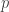
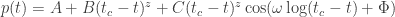
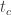
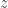
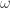
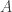
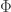
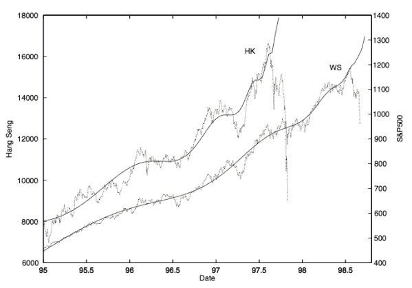

<!--yml

category: 未分类

日期：2024-05-18 13:43:29

-->

# LPPL 的好奇 | Quantivity

> 来源：[`quantivity.wordpress.com/2011/02/08/curiosity-of-lppl/#0001-01-01`](https://quantivity.wordpress.com/2011/02/08/curiosity-of-lppl/#0001-01-01)

最近构建非线性制度模型的工作使 Quantivity 重新回到 [econophysics](http://en.wikipedia.org/wiki/Econophysics)。在这样做的过程中，巧合地碰到了提出的对数周期幂律（LPPL）模型，它是描述投机泡沫的特征行为并预测其后续崩溃的对数周期振荡模型。换句话说：一个*宏观[制度发现](https://quantivity.wordpress.com/2010/02/15/regime-discovery/)模型*。

此模型由 Sornette、Johansen 和 Bouchaud（1996 年法国物理杂志 6 页 167-175）以及 Feigenbaum 和 Freund（国际现代物理 B 10: 3737, 1996 和 Modern Physics Letters B 12, 1998）独立提出。经济物理学爱好者会从 [Bouchaud](http://en.wikipedia.org/wiki/Jean-Philippe_Bouchaud) 和 [Theory of Financial Risk and Derivative Pricing: From Statistical Physics to Risk Management](http://books.google.com/books?id=4IBjPwAACAAJ) 以及 [Capital Fund Management](http://www.cfm.fr) 中记得他。

在数学上，LPPL 提出了一个工具的价格  随时间  的演变模型为：

其中  是最可能的崩溃时间， 是指数增长， 是振荡幅度，其余变量没有结构解释（、、 和 ）。换句话说：这是一个关于价格演变的振荡指数模型。崩溃预测的直觉实质上是对*指数价格增长无法持续，随着振荡增加趋向失败，表明投资者情绪波动*的一种诉求。

一如既往，通过实际案例进行模型直观解释是一种有效的方法：LPPL 拟合于 1997/1998 年的恒生和标普 500 的崩盘（摘自 [Critical Market Crashes](http://arxiv.org/abs/condmat/0301543) 作者 [Sornette](http://www.er.ethz.ch/people/sornette) 第 67 页）。

恒生指数 (Hang Seng) 和 标普 500 (S&P 500) 分别是每个指数最适合的 LPPL，直到各自的崩盘。

尽管 Quantivity 承认她不认为这个模型具有吸引力（尽管基于[行为金融学](http://en.wikipedia.org/wiki/Behavioral_economics)中起源于兽群行为和模仿效应的定性分析，激发了该模型，这是相当有趣的），但对 LPPL 的简要研究值得付出努力，因为它既是 *数学* 上的，也是 *社会学* 上的好奇。

从数学角度来看，LPPL 非常有趣，因为它建立在[幂律](http://en.wikipedia.org/wiki/Power_law)之上——幂律是经济物理学的喜爱，因为它们起源于[统计力学](http://en.wikipedia.org/wiki/Statistical_mechanics)。幂律占据主导地位的原因很有趣，由[Shalizi](http://cscs.umich.edu/~crshalizi/notabene/power-laws.html)（巧合的是，注意到对 Sornette 的引用）很好地总结了：

+   复杂性中的秩序：“幂律相关性很有趣，因为它们是发生了有趣和复杂事件的迹象”

+   乘法增长：“幂律事实上是由乘法增长过程的一种中心极限定理得出的”（另见 1/*f*、长记忆和分数布朗运动）

从社会学的角度来看，与标准的量化金融相比，LPPL 有几个有趣之处：

+   文献：过去 15 年的活跃研究文献，包括辩论和反驳

+   部分披露：LPPL 的主要支持者未公开披露其估计方法

+   密封预测：在[“金融泡沫实验”](http://www.ethlife.ethz.ch/archive_articles/100503_prognosenexperiment_nsn/index_EN)中使用密封预测

所有三者的组合在该领域中非常罕见，因此其本身就具有引人入胜的特点。对于那些有兴趣跟踪 LPPL 发展的人来说，以下是代表性文献：

+   [利用离散尺度不变性预测金融崩盘](http://arxiv.org/abs/cond-mat/9903321)，Johansen *et al.*（1999 年）

+   [金融市场中大价格变动的特征](http://arxiv.org/abs/cond-mat/0210574)，Johansen（2002 年）

+   [关键市场崩盘](http://arxiv.org/abs/condmat/0301543)，Sornette（2003 年）

+   [主要金融指数未来大幅变化的可预测性](http://arxiv.org/abs/condmat/0304601)，Sornette 和 Zhou（2003 年）

+   [标题：南非股票市场 2003-2006 年间投机性金融泡沫的案例研究](http://arxiv.org/abs/physics/0701171)，Zhou 和 Sornette（2007 年）

+   [支撑对数周期定律拟合金融崩盘机制的研究](http://www.unifr.ch/econophysics/symposium/talks07/FR07%20-%20David%20Bree.pdf)，Brée（2007 年）

+   [金融崩盘前的对数周期定律的意义](http://arxiv.org/abs/cond-mat/0106520)，Sornette 和 Johansen（2008 年）

+   [金融泡沫实验：泡沫终结的先进诊断和预测第一卷](http://arxiv.org/abs/0911.0454)，Sornette *et al.*（2009 年）

+   [2005-2007 年和 2008-2009 年中国股市泡沫的诊断与预测](http://arxiv.org/abs/0909.1007)，Jiang *等* (2009)

+   [金融泡沫、房地产泡沫、衍生品泡沫以及金融和经济危机](http://arxiv.org/abs/0905.0220)，Sornette *等* (2009)

+   如何用对数周期幂律预测金融市场崩溃，Jacobsson (2009)

+   [金融泡沫实验：高级诊断和泡沫终止的预测，第二卷-主文档](http://arxiv.org/abs/1005.5675)，Sornette *等* (2010)

+   [将对数周期幂律拟合到金融崩溃中：一种批判性分析](http://arxiv.org/abs/1002.1010)，Brée 和 Joseph (2010)

+   [金融泡沫的计算 LPPL 拟合](http://arxiv.org/abs/1003.2920)，Liberatore (2010)

+   [金融泡沫实验：高级诊断和泡沫终止的预测，第三卷](http://arxiv.org/abs/1011.2882)，Woodard (2010)

+   [频域中带有均值回归噪声的金融 LPPL 泡沫](http://arxiv.org/abs/1009.4835)，Liberatore (2010)

+   [对数周期函数的预测精度和不精确性](http://www.unifr.ch/econophysics/paper/download/id/1006.2010/format/pdf)，Brée *等* (2010)

+   [对数周期振荡分析及 2011 年 4 月至 6 月“黄金泡沫”的可能爆发](http://www.unifr.ch/econophysics/paper/download/id/1012.4118/format/pdf)，Tsirel *等*

查看[Sornette arXiv 个人资料](http://arxiv.org/find/q-fin/1/au:+Sornette_D/0/1/0/all/0/1)以获取更多文章。
