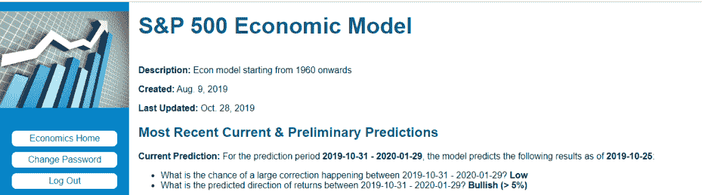

<!--yml

类别：未分类

日期：2024 年 05 月 12 日 17:39:46

-->

# 当前经济模型预测 | CSSA

> 来源：[`cssanalytics.wordpress.com/2019/10/29/current-economic-model-prediction/#0001-01-01`](https://cssanalytics.wordpress.com/2019/10/29/current-economic-model-prediction/#0001-01-01)

截至 10 月 25 日，经济模型的信号从横盘转变为看涨。自从创建以来，该模型的样本外预测在这些棘手的市场中一直非常有用。尽管明天是联邦储备委员会的日子，可能会改变市场情绪，但经济数据继续显示我们并未接近衰退区域。这一预测与过去两个月发表的许多悲观新闻文章形成鲜明对比。最终，新闻文章关注的是非常新近的数据，往往孤立地选择了一些可能不再具有很强预测价值的特定指标（或者是依赖于上下文）。这就是开发出一个集成模型的原因，该模型使用了 50 个不同的指标以及决策树框架内相同时间序列的数十个衍生指标。这个模型将在我们即将推出的网站上实时展示。

