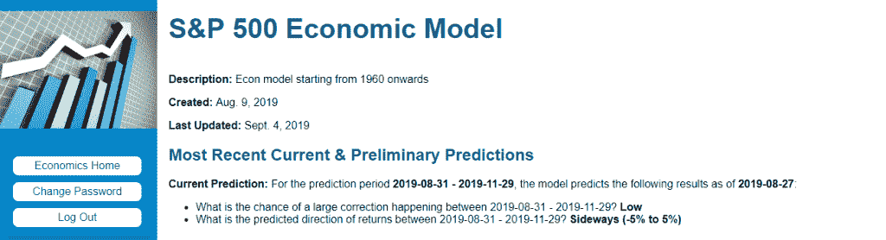

<!--yml

category: 未分类

date: 2024-05-12 17:41:10

-->

# 当前 S&P 500 经济模型预测 | CSSA

> 来源：[`cssanalytics.wordpress.com/2019/09/05/current-sp-500-economic-model-prediction/#0001-01-01`](https://cssanalytics.wordpress.com/2019/09/05/current-sp-500-economic-model-prediction/#0001-01-01)

在回应反馈时，[经济模型](https://cssanalytics.wordpress.com/2019/05/14/shiny-new-toys/)已经修订，以提供更简单易用的仪表盘。 输出是大幅度修正的几率，分为三个类别（低，回调> 10％，回调> 15％），以及未来 90 天标普 500 指数的预测方向（看涨：> 5％预期收益，横盘：> -5％ <5％预期收益，看跌：<-5％预期收益）。 以下是当前的更新。 我们将很快提供一些回测，初步结果相当有希望。 [投资者智商](https://cssanalytics.wordpress.com/investor-iq-2/)计划很快推出一个网站，以实时提供访问该模型以及当前 ETF 和股票分析。

