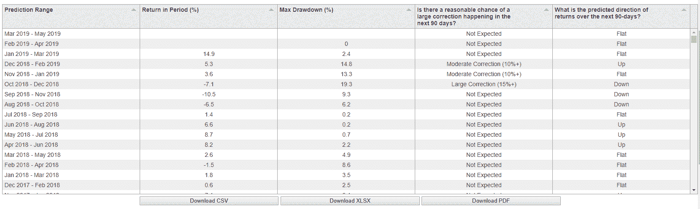

<!--yml

category: 未分类

date: 2024-05-12 17:42:30

-->

# 当前和历史 S&P500 经济预测模型预测 | CSSA

> 来源：[`cssanalytics.wordpress.com/2019/05/15/current-sp500-economic-forecasting-model-introduction/#0001-01-01`](https://cssanalytics.wordpress.com/2019/05/15/current-sp500-economic-forecasting-model-introduction/#0001-01-01)

在[上一篇帖子](https://cssanalytics.wordpress.com/2019/05/14/shiny-new-toys/)中，我们介绍了 S&P500 经济预测模型，该模型旨在预测未来 90 天内中等或大幅度下跌的机会。该模型考虑了许多不同的宏观经济变量及其衍生物，以评估特定事件的发生可能性。该模型能够识别出经济弱点的迹象，这些迹象可能反映在当前市场价格中，也可能没有。该模型无法识别情绪、流动性或新闻驱动的纠正（即唐纳德·特朗普效应）。目前，该模型正在等待几项新数据，然后才会进行新的预测。下表显示了使用“时点”数据的模型预测，截至各自月份的第一天。以下是当前和历史输出：

最近的预测是在 3 月初时做出的，显示该模型不预计在 5 月底之前出现中等或大幅度的调整。预计市场方向将是横向或平稳的。因此，从宏观经济的角度来看，目前经济似乎还算健康。在没有任何重大新闻事件或推文的情况下，经济可能会继续发展，股票市场可能会在上升之前保持交易范围内。如果您查看历史预测，您会发现它们在最近的时间内相当准确，并且提供了一些指导，例如何时值得在弱势市场上买入（在 2018 年 12 月），通过观察下跌的机会和预测的市场方向。虽然该模型是在未进行回测的情况下创建的，但我们将展示一些使用这些信号来确定 S&P500 时机的应用。
