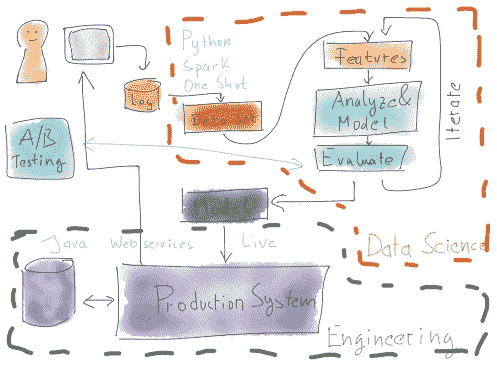

<!--yml

分类：未分类

日期：2024 年 05 月 18 日 05:29:04

-->

# 将数据科学应用于生产 | 来自交易台的故事

> 来源：[`mdavey.wordpress.com/2016/10/19/data-science-into-production/#0001-01-01`](https://mdavey.wordpress.com/2016/10/19/data-science-into-production/#0001-01-01)

## 将数据科学应用于生产

“实践中的数据科学的核心是什么？”是一篇关于将数据科学应用于生产的[文章](https://www.oreilly.com/ideas/what-is-hardcore-data-science-in-practice)。图 5（文章图片由 Mikio Braun 提供）很好地捕捉了两个世界，捕捉了数据科学的探索世界，在这个世界中，“完成”是一个可以在生产中使用的模型。

这篇文章在结论上很到位，不要将数据科学家和工程师孤立起来。我更倾向于让他们都坐在一起，作为一个团队的一部分 🙂

~ 由 mdavey 于 2016 年 10 月 19 日发布。

发布在[敏捷](https://mdavey.wordpress.com/category/agile/)，[数据](https://mdavey.wordpress.com/category/data/)，[未分类](https://mdavey.wordpress.com/category/uncategorized/)中

标签：[人工智能](https://mdavey.wordpress.com/tag/ai/)，[数据分析](https://mdavey.wordpress.com/tag/dataanalysis/)
