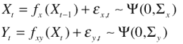
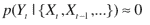
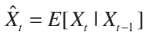
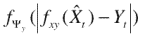

<!--yml

类别：未分类

日期：2024 年 05 月 18 日 15:38:26

-->

# 处理马尔可夫 SDE 中的异常值 | Tr8dr

> 来源：[`tr8dr.wordpress.com/2009/10/31/dealing-with-outliers-in-sde-parameter-estimation/#0001-01-01`](https://tr8dr.wordpress.com/2009/10/31/dealing-with-outliers-in-sde-parameter-estimation/#0001-01-01)

我正在开发类似于 ADS（*Arouba*–*Diebold*–*Scotti* 指数）的状态模型，以提供加拿大市场经济周期的每日指示。新闻来源的经济数据可能特别嘈杂（即数据输入错误等）。在状态系统中我曾遇到过这样的情况：

不稳定性是由于系列中的错误数据点造成的。清理错误数据解决了问题。然而，实时策略中检测到的意外异常值尤为重要。

马尔可夫状态系统，每个状态都依赖于前一个状态，对数据问题尤为敏感。这样的系统通常设置为：

在粒子滤波或卡尔曼滤波中，我们是基于观测来估计隐藏状态，并利用隐藏状态对市场进行说明。异常值的情况如下：

在这种情况下，卡尔曼滤波状态系统将会崩溃，并且在后续迭代中，会得到一个巨大的状态系统峰值，作为尝试最小化扰动的振荡函数。假设“异常值”实际上是正确的数据，则我们的状态系统可能存在以下问题之一：

1.  分布没有适当的尾部

1.  创新的协方差太小，导致系统在存在接近零概率观测时数值不稳定。

处理这种情况的方法有采用加权最小二乘法或贝叶斯加权观测（参见[学习异常值-鲁珀特卡尔曼滤波器](http://www.google.com/url?sa=t&source=web&ct=res&cd=1&ved=0CA0QFjAA&url=http%3A%2F%2Fwww-clmc.usc.edu%2Fpublications%2F%2FT%2FTR-CLMC-2007-1.pdf&ei=rF7sSqvuI4eslAf7rdX_BA&usg=AFQjCNEVtP3NqiOxmV4FbciooUsMFR8UnQ&sig2=heofR9OhJFqzTDVtOgj-Jg "学习异常值-鲁珀特卡尔曼滤波器")）。

然而，在我们的情况下，异常值是数据错误。对于非实时系统，可以清理数据。在实时策略的情况下，我们没有手动清理数据的选择，因此我们可能需要采用一种启发式方法来确定数据是否是“异常值”。

一种启发式方法是确定：

然后评估给定 Xt 的观测 Yt 的概率。这可以通过评估投影与观测残差上的概率密度函数来实现：

如果概率为 0 或接近 0，则数据显然是异常值。估计 Xt 的期望值可以通过估计状态分布来确定。

如何评估 E(X[t] | X[t-1])？一种简单（虽然昂贵）的方法是从创新（误差）分布中抽取噪声样本，评估 Fx(X[t-1],) + Ex，并使用这些样本的鲁棒均值，权重为抽样的概率。当确定期望时，可以通过使用核估计器来减少所需的样本数量。

最后，如果检测到异常值，我们可以将其视为缺失值。信息已经丢失，但至少我们保留了状态系统的稳定性。我认为，这是对偶发性异常值的一个合理处理方法。
