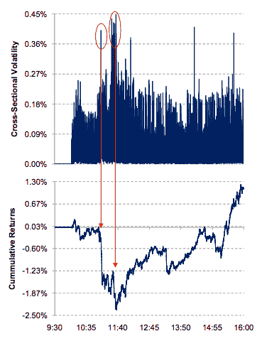
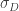
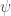
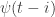
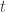
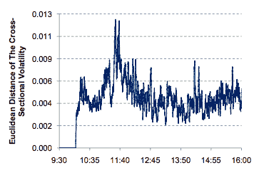
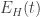
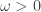
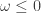
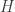

<!--yml

category: 未分类

date: 2024-05-18 13:44:50

-->

# Delay Embedding as Regime Signal | Quantivity

> 来源：[`quantivity.wordpress.com/2011/02/24/delay-embedding-as-regime-signal/#0001-01-01`](https://quantivity.wordpress.com/2011/02/24/delay-embedding-as-regime-signal/#0001-01-01)

Infantino 和 Itzhaki 在他们的 2010 年论文 [Developing High-Frequency Equities Trading Models](http://hdl.handle.net/1721.1/59122) 中，利用基于*时间延迟嵌入*的制度转换信号。这一信号及其在[制度发现](https://quantivity.wordpress.com/2010/02/15/regime-discovery/)中的使用的直觉是出人意料的有趣。

 从概念上讲，他们的信号框架设定在*两状态转换制度*的背景下（在经典技术意义上解释）：“动量”或“均值回归”。通过高频权益组合数据，他们非正式观察到熟悉的*波动率-制度相关性*：高波动率意味着动量（例如，群体效应），低波动率意味着均值回归（例如，市场做市）。

他们的话：“由于短期变化似乎更为显著 —— 在时间序列中标识出非常窄的峰值 —— 基本均值回归策略的累积收益似乎在减少”（第 44 页）。注意是降维回报的交叉部分波动率的测量（即投射在主要 PCA 特征向量上的回报的标准偏差）。此关系在右图中说明。

如何将这种直觉的波动性-制度相关性转化为一个转换信号是有趣的部分。他们将的差异定义为，然后定义以下距离度量（左图说明）：

![E_H (t) = \sqrt{\sum\limits_{i=1}^H{[\psi(t - i)]²}} = \sqrt{\sum\limits_{i=1}^H{[\sigma_D(t - i) - \sigma_D (t - i - 1)]²}} ](img/a791147f939bc1094f96932289a5adeb.png)

这是一个有趣的起点，因为[dynamical systems](http://en.wikipedia.org/wiki/Dynamical_system)提醒我们，是的*相空间重构*，鉴于是离散独立同分布步骤的延迟链，以时间逆向步行。换句话说，以下是从中重建波动性的向量，从中测量每个观察时间的互相距离：

![[ \psi(t - 1), \psi(t - 2), \cdots , \psi(t - H) ] ](img/25fdcccc0ca0f19bd694ec7f3534bcf7.png)

 它们定义了一个*二进制制度信号*，作为的正的一阶差分：

![ \omega = [ E_H(t) - E_H(t - 1) ] > 0 ](img/358a491cf76e06eb79ddc1005231f658.png)

则定义制度切换为： 表示波动率正在增加，从而“动量”制度是适当的。相反， 表示波动率正在减少，因此“均值回归”制度是适当的。

当考虑在几个熟悉的时间序列分析传统的更大背景下，这个信号是非常有趣的：

毫无疑问，作者方便地忽略了他们对嵌入维度 的选择。这很可能是留给读者作为练习，因为选择最佳的嵌入维度确实是重建中最重要的挑战之一。
