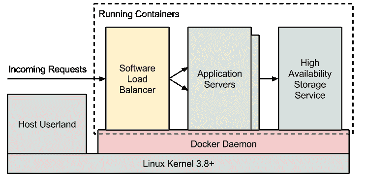

<!--yml

category: 未分类

日期：2024 年 5 月 18 日 05:55:02

-->

# DevOps: Docker – 应用程序交付 | 来自交易台的故事

> 来源：[`mdavey.wordpress.com/2014/01/07/devops-docker/#0001-01-01`](https://mdavey.wordpress.com/2014/01/07/devops-docker/#0001-01-01)

## DevOps: Docker – 应用程序 交付

RelateIQ 提供了有关[Docker](http://www.docker.io/gettingstarted/#1)在[开发](http://blog.relateiq.com/a-docker-dev-environment-in-24-hours-part-2-of-2/)环境中的用法的有趣[阅读](http://blog.relateiq.com/a-docker-dev-environment-in-24-hours-part-1-of-2/)。 如果你使用的是[OSX](http://www.infoq.com/news/2013/03/Docker)，考虑使用[Vagrant](http://docs.vagrantup.com/v2/why-vagrant/index.html)。 devo.ps 提供了关于两者的[阅读](http://devo.ps/blog/2013/09/25/vagrant-docker-and-ansible-wtf.html)，包括 Ansible。

Quay.io 提供了另一个有趣的[阅读](https://medium.com/devops-programming/7f5fd023158f)——什么是 Docker？附有适当的图示，说明了如何将正在[开发](http://www.slideshare.net/dotCloud/why-docker)的应用程序分解为多个容器。

~ 作者 mdavey 于 2014 年 1 月 7 日。

发布在 [敏捷](https://mdavey.wordpress.com/category/agile/)

标签：[Docker](https://mdavey.wordpress.com/tag/docker/)
